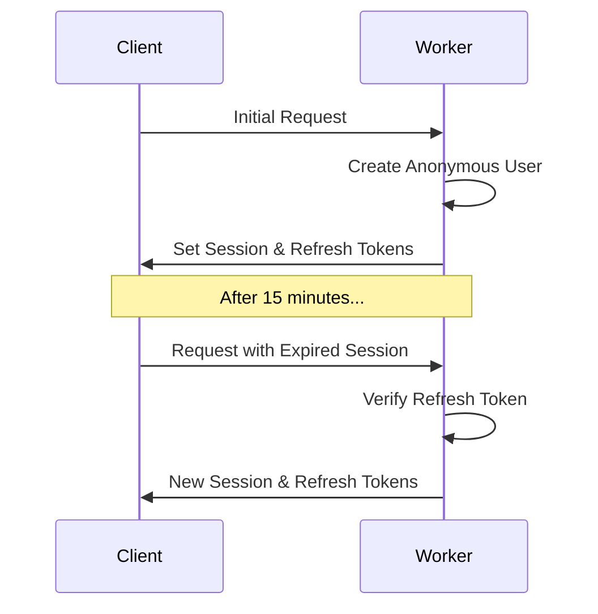

# 🔐 Auth Kit

A full-stack authentication toolkit for React applications. Built on Cloudflare Workers, Auth Kit provides a secure, low-latency authentication system with email verification and token management. Perfect for applications that need a robust auth system with a great developer experience.

## 📚 Table of Contents

- [💾 Installation](#-installation)
- [🌟 Key Features](#-key-features)
- [🛠️ Usage Guide](#️-usage-guide)
  - [1️⃣ Set up Environment Types](#1️⃣-set-up-environment-types)
  - [2️⃣ Set up Worker Entry Point](#2️⃣-set-up-worker-entry-point)
  - [3️⃣ Access Auth in Remix Routes](#3️⃣-access-auth-in-remix-routes)
  - [4️⃣ Configure Worker](#4️⃣-configure-worker)
  - [5️⃣ Set up Auth Client](#5️⃣-set-up-auth-client)
- [🏗️ Architecture](#️-architecture)
- [📖 API Reference](#-api-reference)
  - [🔐 auth-kit/client](#-auth-kitclient)
  - [🖥️ auth-kit/worker](#️-auth-kitworker)
  - [⚛️ auth-kit/react](#️-auth-kitreact)
- [🔑 TypeScript Types](#-typescript-types)

## 💾 Installation

```bash
npm install auth-kit jose
# or
yarn add auth-kit jose
# or
pnpm add auth-kit jose
```

## 🌟 Key Features

- 🎭 **Anonymous-First Auth**: Users start with an anonymous session that can be upgraded to a verified account
- 📧 **Email Verification**: Built-in secure email verification flow with customizable storage and delivery
- 🔐 **JWT-Based Tokens**: Secure session and refresh tokens with automatic refresh
- ⚡️ **Edge-Ready**: Designed for Cloudflare Workers with minimal latency
- 🎯 **Type-Safe**: Full TypeScript support with detailed types
- 🎨 **React Integration**: Ready-to-use hooks and components for auth state
- 🔌 **Customizable**: Bring your own storage and email delivery systems

## 🛠️ Usage Guide

### 1️⃣ Set up Environment Types

First, set up your environment types to include auth-kit's additions to the Remix context:

```typescript
// app/types/env.ts
declare module "@remix-run/cloudflare" {
  interface AppLoadContext {
    env: Env;
    // Added by auth-kit middleware
    userId: string;
    sessionId: string;
  }
}

export interface Env {
  // Required for auth-kit
  AUTH_SECRET: string;
  
  // Storage for users and verification codes
  USERS_KV: KVNamespace;
  CODES_KV: KVNamespace;
  
  // Email service (optional)
  SENDGRID_API_KEY?: string;
  RESEND_API_KEY?: string;
  
  // Your other environment variables
  [key: string]: unknown;
}
```

### 2️⃣ Set up Worker Entry Point

Create your worker entry point that wraps the Remix handler:

```typescript
// src/worker.ts
import { createAuthRouter, withAuth } from "auth-kit/worker";
import { createRequestHandler } from "@remix-run/cloudflare";
import * as build from "@remix-run/dev/server-build";

// Configure your auth hooks
const authHooks = {
  // Required: Look up a user ID by email address
  getUserIdByEmail: async ({ email, env }) => {
    return await env.USERS_KV.get(`email:${email}`);
  },

  // Required: Store a verification code
  storeVerificationCode: async ({ email, code, env }) => {
    await env.CODES_KV.put(`code:${email}`, code, { expirationTtl: 600 });
  },

  // Required: Verify a code
  verifyVerificationCode: async ({ email, code, env }) => {
    const storedCode = await env.CODES_KV.get(`code:${email}`);
    return storedCode === code;
  },

  // Required: Send verification code via email
  sendVerificationCode: async ({ email, code, env }) => {
    try {
      // Example using SendGrid:
      const response = await fetch("https://api.sendgrid.com/v3/mail/send", {
        method: "POST",
        headers: {
          Authorization: `Bearer ${env.SENDGRID_API_KEY}`,
          "Content-Type": "application/json",
        },
        body: JSON.stringify({
          personalizations: [{ to: [{ email }] }],
          from: { email: "auth@yourdomain.com" },
          subject: "Your verification code",
          content: [{ type: "text/plain", value: `Your code is: ${code}` }],
        }),
      });
      return response.ok;
    } catch (error) {
      console.error('Failed to send email:', error);
      return false;
    }
  },

  // Optional: Called when new users are created
  onNewUser: async ({ userId, env }) => {
    await env.USERS_KV.put(`user:${userId}`, JSON.stringify({
      created: new Date().toISOString()
    }));
  },

  // Optional: Called on successful authentication
  onAuthenticate: async ({ userId, email, env }) => {
    await env.USERS_KV.put(`user:${userId}:lastLogin`, new Date().toISOString());
  },

  // Optional: Called when email is verified
  onEmailVerified: async ({ userId, email, env }) => {
    await env.USERS_KV.put(`user:${userId}:verified`, 'true');
    await env.USERS_KV.put(`email:${email}`, userId);
  }
};

// Create request handler with auth middleware
const handleRequest = createRequestHandler(build, process.env.NODE_ENV);

// Export the worker with auth middleware
export default {
  fetch: withAuth(async (request, env) => {
    try {
      // Pass userId and sessionId to Remix loader context
      const loadContext = { env, userId: env.userId, sessionId: env.sessionId };
      return await handleRequest(request, loadContext);
    } catch (error) {
      console.error("Error processing request:", error);
      return new Response("Internal Error", { status: 500 });
    }
  }, { hooks: authHooks })
};
```

### 3️⃣ Access Auth in Remix Routes

Now you can access the authenticated user in your Remix routes:

```typescript
// app/routes/_index.tsx
import type { LoaderFunctionArgs } from "@remix-run/cloudflare";
import { json } from "@remix-run/cloudflare";
import { useLoaderData } from "@remix-run/react";

export async function loader({ context }: LoaderFunctionArgs) {
  // Access userId and sessionId from context
  const { userId, sessionId } = context;
  
  // Example: Fetch user data from KV
  const userData = await context.env.USERS_KV.get(`user:${userId}`);
  
  return json({ 
    userId,
    sessionId,
    userData: userData ? JSON.parse(userData) : null 
  });
}

export default function Index() {
  const { userId, userData } = useLoaderData<typeof loader>();
  
  return (
    <div>
      <h1>Welcome, {userId}!</h1>
      {userData?.verified && <p>✅ Email verified</p>}
    </div>
  );
}
```

### 4️⃣ Configure Worker

Configure your worker in `wrangler.toml`:

```toml
name = "my-remix-app"
main = "src/worker.ts"
compatibility_date = "2024-01-01"

[vars]
NODE_ENV = "development"

# KV Namespaces for auth storage
kv_namespaces = [
  { binding = "USERS_KV", id = "..." },
  { binding = "CODES_KV", id = "..." }
]

# Secrets (use wrangler secret put for production)
# - AUTH_SECRET
# - SENDGRID_API_KEY
```

Deploy your worker:

```bash
wrangler deploy
```

### 5️⃣ Set up Auth Client

```typescript
// app/auth.client.ts
import { createAuthClient } from "auth-kit/client";

export const authClient = createAuthClient({
  baseUrl: "https://your-worker.workers.dev"
});
```

## 🏗️ Architecture

Auth Kit uses a combination of session tokens (15-minute expiry) and refresh tokens (7-day expiry) to manage authentication state. The system follows an anonymous-first approach where new users are automatically created with a session, which can later be associated with an email through verification.

### Token Flow


## 📖 API Reference

### 🔐 auth-kit/client

#### `createAuthClient(config)`
Creates an auth client instance.

```typescript
interface AuthClientConfig {
  baseUrl: string;
  initialState?: Partial<AuthState>;
  onStateChange?: (state: AuthState) => void;
  onError?: (error: Error) => void;
}

const client = createAuthClient(config);
```

#### Client Methods

```typescript
interface AuthClient {
  // State Management
  getState(): AuthState;
  subscribe(callback: (state: AuthState) => void): () => void;

  // Auth Operations
  createAnonymousUser(): Promise<void>;
  requestCode(email: string): Promise<void>;
  verifyEmail(email: string, code: string): Promise<{ success: boolean }>;
  logout(): Promise<void>;
  refresh(): Promise<void>;
}
```

### 🖥️ auth-kit/worker

#### Auth Router Endpoints

##### POST /auth/request-code
Request an email verification code.
```typescript
// Request
{
  email: string;
}

// Response
{
  success: true;
}
```

##### POST /auth/verify
Verify an email with a code.
```typescript
// Request
{
  email: string;
  code: string;
}

// Response
{
  success: true;
}
```

##### POST /auth/refresh
Refresh the session using a refresh token.
```typescript
// Request
Cookie: auth_refresh_token=<token>

// Response
{
  userId: string;
  sessionToken: string;
  refreshToken: string;
}
```

##### POST /auth/logout
Log out the current user.
```typescript
// Response
{
  success: true;
}
// + Cleared cookies
```

#### Middleware
```typescript
const handler = withAuth(requestHandler, {
  hooks?: {
    onNewUser?: (props: { userId: string; env: TEnv; request: Request }) => Promise<void>;
    onEmailVerified?: (props: { userId: string; email: string; env: TEnv; request: Request }) => Promise<void>;
  }
});
```

### ⚛️ auth-kit/react

#### `createAuthContext()`
Creates a React context with hooks and components for auth state management.

```typescript
const AuthContext = createAuthContext();

// Returns:
{
  // Core Provider Component
  Provider: React.FC<{
    children: ReactNode;
    client: AuthClient;
    initializing?: ReactNode;
  }>;

  // Hooks
  useClient(): AuthClient;
  useSelector<T>(selector: (state: AuthState) => T): T;
  useAuth(): AuthState & AuthMethods;

  // State-Based Components
  Loading: React.FC<{ children: ReactNode }>;
  Verified: React.FC<{ children: ReactNode }>;
  Unverified: React.FC<{ children: ReactNode }>;
  Authenticated: React.FC<{ children: ReactNode }>;
}
```

#### Using Selectors
```typescript
// Select specific state values
const userId = AuthContext.useSelector(state => state.userId);
const isVerified = AuthContext.useSelector(state => state.isVerified);

// Select multiple values
const { userId, isVerified } = AuthContext.useSelector(state => ({
  userId: state.userId,
  isVerified: state.isVerified
}));
```

#### Using State Components
```typescript
<AuthContext.Loading>
  <LoadingSpinner />
</AuthContext.Loading>

<AuthContext.Authenticated>
  <AuthContext.Verified>
    <VerifiedUserContent />
  </AuthContext.Verified>
  
  <AuthContext.Unverified>
    <EmailVerificationFlow />
  </AuthContext.Unverified>
</AuthContext.Authenticated>
```

## 🔑 TypeScript Types

### Auth State
```typescript
type AuthState = {
  isInitializing: boolean;
  isLoading: boolean;
  baseUrl: string;
} & (
  | {
      userId: string;
      sessionToken: string;
      refreshToken: string | null;
      isVerified: boolean;
      error?: undefined;
    }
  | {
      userId: null;
      sessionToken: null;
      refreshToken: null;
      isVerified: false;
      error?: string;
    }
);
```

### Environment Types
```typescript
interface Env {
  AUTH_SECRET: string;
  USER: DurableObjectNamespace;
}
```

## Required Hooks

The auth router requires the following hooks for email verification:

```typescript
const authHooks = {
  // Required: Look up a user ID by email address
  getUserIdByEmail: async ({ email, env, request }) => {
    // Return the user ID if found, null if no user exists with this email
    return await env.DB.get(`user:${email}`);
  },

  // Required: Store a verification code for an email address
  storeVerificationCode: async ({ email, code, env, request }) => {
    // Store the code with expiration (e.g. 10 minutes)
    await env.DB.put(`verification:${email}`, code, { expirationTtl: 600 });
  },

  // Required: Verify if a code matches what was stored for an email
  verifyVerificationCode: async ({ email, code, env, request }) => {
    const storedCode = await env.DB.get(`verification:${email}`);
    return storedCode === code;
  },

  // Required: Send a verification code via email
  sendVerificationCode: async ({ email, code, env, request }) => {
    try {
      await sendEmail({
        to: email,
        subject: "Your verification code",
        text: `Your code is: ${code}`
      });
      return true;
    } catch (error) {
      console.error('Failed to send email:', error);
      return false;
    }
  },

  // Optional: Called when a new anonymous user is created
  onNewUser?: async ({ userId, env, request }) => {
    await env.DB.put(`user:${userId}`, { created: new Date() });
  },

  // Optional: Called when a user successfully authenticates with their email code
  onAuthenticate?: async ({ userId, email, env, request }) => {
    await env.DB.put(`user:${userId}:lastLogin`, new Date());
  },

  // Optional: Called when a user verifies their email address for the first time
  onEmailVerified?: async ({ userId, email, env, request }) => {
    await env.DB.put(`user:${userId}:verified`, true);
  }
};

// Create the auth router
const router = createAuthRouter<Env>({ hooks: authHooks });

// ... rest of your code ...
```

// ... rest of existing README content ... 