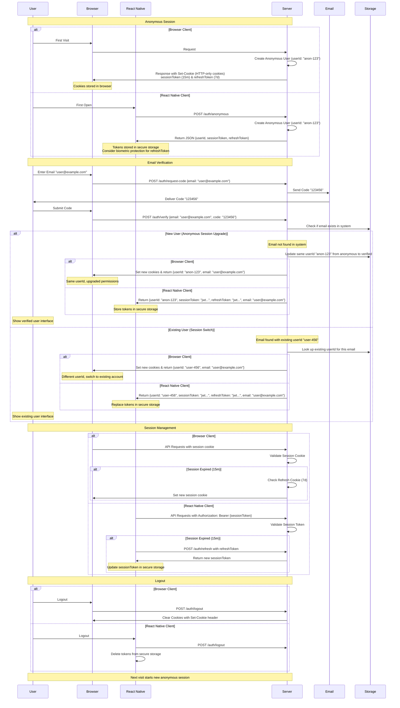
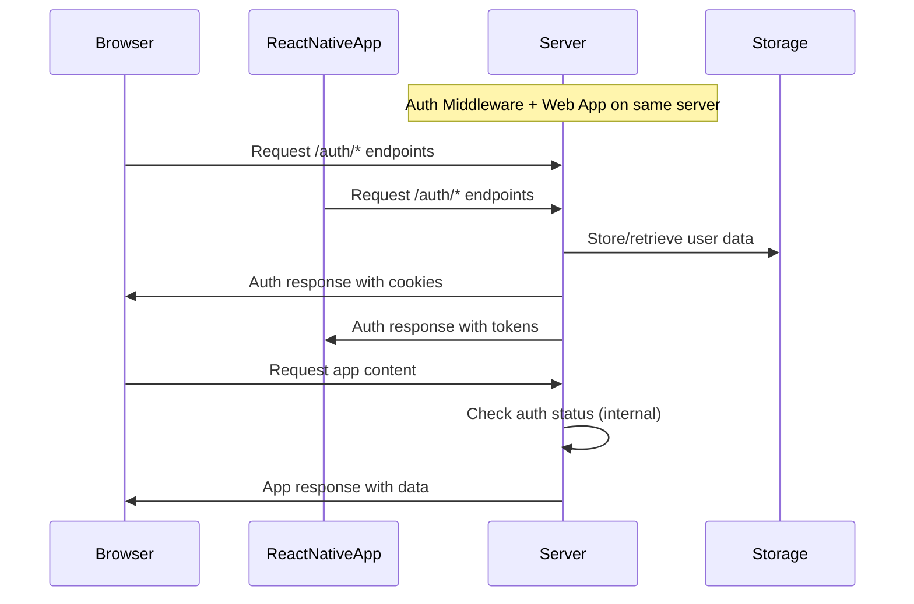
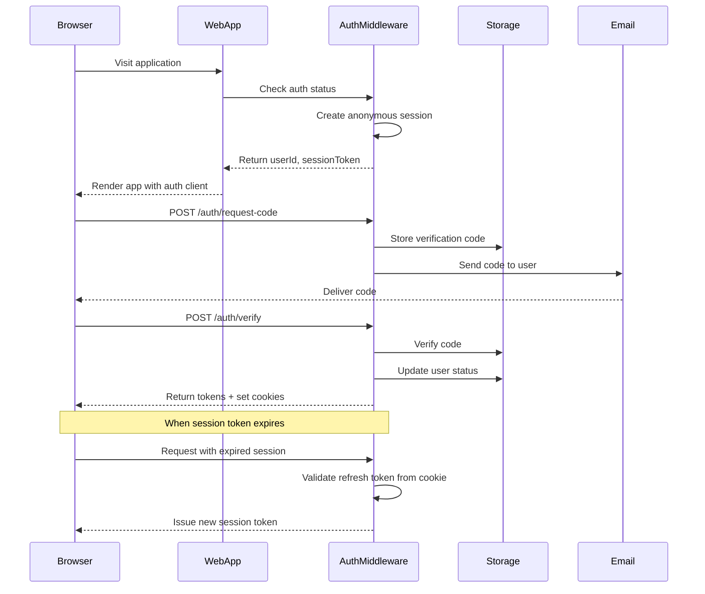
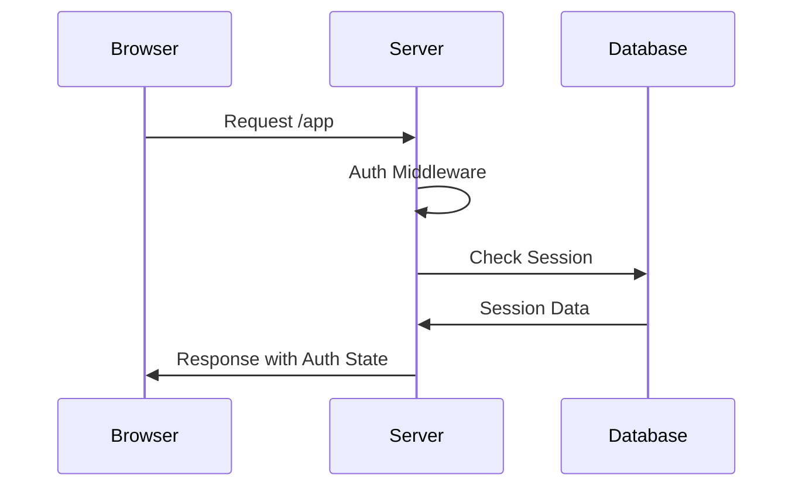

# 🔐 Auth Kit

A headless, isomorphic authentication toolkit that runs seamlessly across server-side, web, and React Native environments. Auth Kit provides a secure, low-latency authentication system with email verification and token management. Perfect for applications that need a robust, platform-agnostic auth system with a great developer experience.

## Table of Contents

- [Installation](#installation)
- [Key Features](#key-features)
- [Authentication Flow](#authentication-flow)
- [Usage Guide](#usage-guide)
  - [1️⃣ Set up Environment and Server](#1️⃣-set-up-environment-and-server)
  - [2️⃣ Access Auth in React Router Routes](#2️⃣-access-auth-in-react-router-routes)
  - [3️⃣ Configure Server](#3️⃣-configure-server)
  - [4️⃣ Set up Auth Client and React Integration](#4️⃣-set-up-auth-client-and-react-integration)
- [Architecture](#architecture)
- [API Reference](#api-reference)
  - [Client API](#client-api)
  - [Server API](#server-api)
  - [React API](#react-api)
  - [Test API](#test-api)
  - [HTTP Endpoints](#http-endpoints)
- [Troubleshooting](#troubleshooting)
- [TypeScript Types](#typescript-types)
- [Testing with Storybook](#testing-with-storybook)

## Installation

```bash
npm install @open-game-collective/auth-kit
# or
yarn add @open-game-collective/auth-kit
# or
pnpm add @open-game-collective/auth-kit
```

## Key Features

- 🌐 **Isomorphic & Headless**: Runs anywhere - server-side, web browsers, or React Native. Bring your own UI components.
- 🎭 **Anonymous-First Auth**: Users start with an anonymous session that can be upgraded to a verified account.
- 📧 **Email Verification**: Secure email verification flow with customizable storage and delivery options.
- 🔐 **JWT-Based Tokens**: Secure session and refresh tokens with automatic refresh.
- ⚡️ **Edge-Ready**: Optimized for Cloudflare Workers for minimal latency.
- 🎯 **Type-Safe**: Full TypeScript support with detailed types.
- 🎨 **React Integration**: Ready-to-use hooks and components for auth state management.
- 🔌 **Customizable**: Integrate with your own storage, email delivery systems, and UI components.
- 📱 **Platform Agnostic**: Same API and behavior across web and mobile platforms.

## Authentication Flow



### User Data in JWT Tokens

Auth Kit uses JWT tokens to securely store and transmit user information. By default, the tokens include minimal data:

1. **Session Tokens** include:
   - `userId`: The unique identifier for the user
   - `sessionId`: A unique identifier for the session
   - `email`: The user's email address (if verified)
   - `aud`: Audience claim set to "SESSION"
   - `exp`: Expiration time (default: 15 minutes)

2. **Refresh Tokens** include:
   - `userId`: The unique identifier for the user
   - `aud`: Audience claim set to "REFRESH"
   - `exp`: Expiration time (default: 7 days for cookies, 1 hour for transient tokens)

You can extend the tokens to include additional user data by modifying the token creation functions:

```typescript
// Example: Including email in session tokens
async function createSessionToken(
  userId: string,
  email: string | null,
  secret: string,
  expiresIn: string = "15m"
): Promise<string> {
  const sessionId = crypto.randomUUID();
  return await new SignJWT({ 
    userId, 
    sessionId,
    email
  })
    .setProtectedHeader({ alg: "HS256" })
    .setAudience("SESSION")
    .setExpirationTime(expiresIn)
    .sign(new TextEncoder().encode(secret));
}
```

**Benefits of storing user data in JWTs:**
- Reduces database lookups for common user information
- Makes user data available on the client without additional API calls
- Simplifies client-side state management

**Considerations:**
- Only include non-sensitive data in tokens
- Keep tokens reasonably sized (avoid large payloads)
- Remember that JWT contents can be read (though not modified) by clients
- Update tokens when user data changes

The Auth Kit client automatically extracts and provides this data to your application through the auth state:

```typescript
const { userId, email } = authClient.getState();
```

### Authentication State

Auth Kit maintains a core state object that represents the current user's authentication status. This state is accessible through the client and can be subscribed to for real-time updates.

The `AuthState` type is defined as:

```typescript
/**
 * The authentication state object that represents the current user's session.
 * This is the core state object used throughout the auth system.
 */
export type AuthState = {
  /**
   * The unique identifier for the current user.
   * For anonymous users, this will be a randomly generated ID.
   * For verified users, this will be their permanent user ID.
   */
  userId: string;

  /**
   * The JWT session token used for authenticated requests.
   * This token has a short expiration (typically 15 minutes) and is
   * automatically refreshed using the refresh token when needed.
   */
  sessionToken: string | null;

  /**
   * The user's verified email address, if they have completed verification.
   * Will be null for anonymous users or users who haven't verified their email.
   * The presence of an email indicates the user is verified.
   */
  email: string | null;

  /**
   * Indicates if an authentication operation is currently in progress.
   * Used to show loading states in the UI during auth operations.
   */
  isLoading: boolean;

  /**
   * Any error that occurred during the last authentication operation.
   * Will be null if no error occurred.
   */
  error: string | null;
};
```

#### Working with Authentication State

You can access the current state at any time:

```typescript
const state = authClient.getState();
console.log(`User ID: ${state.userId}`);
console.log(`Is verified: ${Boolean(state.email)}`);
```

For reactive applications, you can subscribe to state changes:

```typescript
const unsubscribe = authClient.subscribe((state) => {
  console.log('Auth state updated:', state);
  
  if (state.email) {
    // User is verified
    showVerifiedUI();
  } else {
    // User is anonymous
    showAnonymousUI();
  }
  
  if (state.isLoading) {
    // Show loading indicator
    showLoadingSpinner();
  }
  
  if (state.error) {
    // Show error message
    showErrorNotification(state.error);
  }
});

// Later, when you no longer need updates:
unsubscribe();
```

#### React Integration

For React applications, Auth Kit provides components that automatically respond to state changes:

```jsx
import { createAuthContext } from '@open-game-collective/auth-kit/react';

const AuthContext = createAuthContext();

function App() {
  return (
    <AuthContext.Provider client={authClient}>
      <AuthContext.Loading>
        <LoadingSpinner />
      </AuthContext.Loading>
      
      <AuthContext.Verified>
        <VerifiedUserDashboard />
      </AuthContext.Verified>
      
      <AuthContext.Unverified>
        <EmailVerificationForm />
      </AuthContext.Unverified>
    </AuthContext.Provider>
  );
}
```

You can also use the `useSelector` hook to access specific parts of the state:

```jsx
function UserGreeting() {
  const email = AuthContext.useSelector(state => state.email);
  
  return (
    <h1>
      {email 
        ? `Welcome back, ${email}!` 
        : 'Welcome! Please verify your email.'}
    </h1>
  );
}
```

## Usage Guide

### Architecture Overview

Auth Kit is deployed with the auth middleware integrated into your application server:



In this deployment:
- **Browser clients** use HTTP cookies for authentication
- **React Native clients** store tokens in secure storage
- The same Auth API endpoints are used by all clients
- The authentication flow applies consistently across platforms

### Auth Middleware Setup

The Auth middleware handles all authentication routes and token management, integrated with your web application.

```typescript
// auth-server.ts
import { AuthHooks, withAuth, createAuthRouter } from "@open-game-collective/auth-kit/server";
import { Env } from "./env";

// Define your auth hooks - these connect to your storage and email systems
const authHooks: AuthHooks<Env> = {
  getUserIdByEmail: async ({ email, env, request }) => {
    return await env.KV_STORAGE.get(`email:${email}`);
  },

  storeVerificationCode: async ({ email, code, env, request }) => {
    await env.KV_STORAGE.put(`code:${email}`, code, {
      expirationTtl: 600,
    });
  },

  verifyVerificationCode: async ({ email, code, env, request }) => {
    const storedCode = await env.KV_STORAGE.get(`code:${email}`);
    return storedCode === code;
  },

  sendVerificationCode: async ({ email, code, env, request }) => {
    try {
      const response = await fetch("https://api.sendgrid.com/v3/mail/send", {
        method: "POST",
        headers: {
          Authorization: `Bearer ${env.SENDGRID_API_KEY}`,
          "Content-Type": "application/json",
        },
        body: JSON.stringify({
          personalizations: [{ to: [{ email }] }],
          from: { email: "auth@yourdomain.com" },
          subject: "Your verification code",
          content: [{ type: "text/plain", value: `Your code is: ${code}` }],
        }),
      });
      return response.ok;
    } catch (error) {
      console.error("Failed to send email:", error);
      return false;
    }
  },

  onNewUser: async ({ userId, env, request }) => {
    await env.KV_STORAGE.put(
      `user:${userId}`,
      JSON.stringify({
        created: new Date().toISOString(),
      })
    );
  },

  onAuthenticate: async ({ userId, email, env, request }) => {
    await env.KV_STORAGE.put(
      `user:${userId}:lastLogin`,
      new Date().toISOString()
    );
  },

  onEmailVerified: async ({ userId, email, env, request }) => {
    await env.KV_STORAGE.put(`user:${userId}:verified`, "true");
    await env.KV_STORAGE.put(`email:${email}`, userId);
  },
};

// Integrated with application
// This wraps your application handler with auth middleware
export const withAuthMiddleware = <TEnv extends { AUTH_SECRET: string }>(
  appHandler: (
    request: Request,
    env: TEnv,
    context: { userId: string; sessionId: string; sessionToken: string }
  ) => Promise<Response>
) => {
  return withAuth(appHandler, { hooks: authHooks });
};

// Example server
export default {
  async fetch(request: Request, env: Env, ctx: ExecutionContext) {
    // Use the auth middleware to handle all routes
    return withAuthMiddleware(async (request, env, { userId, sessionId, sessionToken }) => {
      // Your application logic here
      const url = new URL(request.url);
      
      // Handle your application routes
      if (url.pathname === '/') {
        return new Response('Welcome to my app!');
      }
      
      // Return 404 for unknown routes
      return new Response('Not Found', { status: 404 });
    })(request, env);
  }
};
```



### Web Application Setup

Your web application integrates the auth middleware directly.

```typescript
// app/server.ts (e.g., for Remix, Next.js, etc.)
import { withAuthMiddleware } from './auth-server';
import { createRequestHandler } from "@remix-run/cloudflare";
import * as build from "@remix-run/dev/server-build";
import { Env } from "./env";

if (process.env.NODE_ENV === "development") {
  logDevReady(build);
}

const handleRemixRequest = createRequestHandler(build);

// Wrap your app handler with auth middleware
const handler = withAuthMiddleware<Env>(
  async (request, env, { userId, sessionId, sessionToken }) => {
    try {
      return await handleRemixRequest(request, {
        env,
        userId,
        sessionId,
        sessionToken,
        requestId: crypto.randomUUID(),
      });
    } catch (error) {
      console.error("Error processing request:", error);
      return new Response("Internal Error", { status: 500 });
    }
  }
);

export default {
  async fetch(request: Request, env: Env, ctx: ExecutionContext) {
    return handler(request, env);
  },
};
```

### React Router 7 Integration

Auth Kit integrates seamlessly with React Router 7, allowing you to access authentication state in your loaders and actions.

```typescript
// app/entry.server.tsx
import { withAuth } from "@open-game-collective/auth-kit/server";
import { createRequestHandler } from "@remix-run/cloudflare";
import * as build from "@remix-run/dev/server-build";
import { authHooks } from "./auth-hooks";

// Create the request handler with auth middleware
export const handler = withAuth(async (request, env, { userId, sessionId, sessionToken }) => {
  // Conditionally log auth information in development mode
  if (process.env.NODE_ENV === 'development') {
    console.log(`Request from user: ${userId}, session: ${sessionId}`);
  }
  
  // Pass auth context to Remix loader context
  return createRequestHandler({
    build,
    mode: process.env.NODE_ENV,
    getLoadContext() {
      return { 
        env, 
        auth: { 
          userId, 
          sessionId, 
          sessionToken 
        } 
      };
    },
  })(request);
}, {
  hooks: authHooks
});

// app/root.tsx
import { createAuthClient } from "@open-game-collective/auth-kit/client";
import { createAuthContext } from "@open-game-collective/auth-kit/react";
import {
  Links,
  Meta,
  Outlet,
  Scripts,
  ScrollRestoration,
  useLoaderData
} from "@remix-run/react";
import { json } from "@remix-run/cloudflare";

// Create auth context for React components
const AuthContext = createAuthContext();

// Root loader provides auth state to client
export async function loader({ request, context }) {
  const { auth } = context;
  
  return json({
    auth: {
      userId: auth.userId,
      sessionToken: auth.sessionToken
    }
  });
}

export default function App() {
  const { auth } = useLoaderData<typeof loader>();
  const [authClient] = useState(() => 
    createAuthClient({
      host: window.location.host,
      userId: auth.userId,
      sessionToken: auth.sessionToken
    })
  );

  return (
    <html lang="en">
      <head>
        <Meta />
        <Links />
      </head>
      <body>
        <AuthContext.Provider client={authClient}>
          <Outlet />
        </AuthContext.Provider>
        <ScrollRestoration />
        <Scripts />
      </body>
    </html>
  );
}

// app/routes/profile.tsx
import { AuthContext } from "~/root";
import { json, redirect } from "@remix-run/cloudflare";
import { useLoaderData, Form } from "@remix-run/react";

// Protect routes with loader
export async function loader({ request, context }) {
  const { auth } = context;
  
  // Get email from context (if user is verified)
  const email = await context.env.KV_STORAGE.get(`user:${auth.userId}:email`);
  
  // If not verified, redirect to verification page
  if (!email) {
    return redirect("/verify");
  }
  
  // Load user profile data
  const profile = await context.env.KV_STORAGE.get(`user:${auth.userId}:profile`);
  
  return json({
    email,
    profile: profile ? JSON.parse(profile) : null
  });
}

// Handle form submissions with action
export async function action({ request, context }) {
  const { auth } = context;
  const formData = await request.formData();
  const name = formData.get("name");
  
  // Update user profile
  await context.env.KV_STORAGE.put(
    `user:${auth.userId}:profile`,
    JSON.stringify({ name })
  );
  
  return json({ success: true });
}

export default function Profile() {
  const { email, profile } = useLoaderData<typeof loader>();
  const client = AuthContext.useClient();
  const isLoading = AuthContext.useSelector(state => state.isLoading);
  
  const handleLogout = async () => {
    await client.logout();
    window.location.href = "/";
  };
  
  return (
    <div>
      <h1>Profile</h1>
      <p>Email: {email}</p>
      
      <Form method="post">
        <label>
          Name:
          <input 
            name="name" 
            defaultValue={profile?.name || ""} 
          />
        </label>
        <button type="submit" disabled={isLoading}>
          {isLoading ? "Saving..." : "Save"}
        </button>
      </Form>
      
      <button onClick={handleLogout}>Logout</button>
    </div>
  );
}

// app/routes/verify.tsx
import { AuthContext } from "~/root";
import { useState } from "react";
import { useNavigate } from "@remix-run/react";

export default function Verify() {
  const [email, setEmail] = useState("");
  const [code, setCode] = useState("");
  const [codeSent, setCodeSent] = useState(false);
  const client = AuthContext.useClient();
  const isLoading = AuthContext.useSelector(state => state.isLoading);
  const navigate = useNavigate();
  
  const requestCode = async (e) => {
    e.preventDefault();
    try {
      await client.requestCode(email);
      setCodeSent(true);
    } catch (error) {
      console.error("Failed to send code:", error);
    }
  };
  
  const verifyCode = async (e) => {
    e.preventDefault();
    try {
      const result = await client.verifyEmail(email, code);
      if (result.success) {
        navigate("/profile");
      }
    } catch (error) {
      console.error("Failed to verify code:", error);
    }
  };
  
  return (
    <div>
      <h1>Verify Your Email</h1>
      
      {!codeSent ? (
        <form onSubmit={requestCode}>
          <label>
            Email:
            <input 
              type="email" 
              value={email} 
              onChange={(e) => setEmail(e.target.value)} 
              required 
            />
          </label>
          <button type="submit" disabled={isLoading}>
            {isLoading ? "Sending..." : "Send Verification Code"}
          </button>
        </form>
      ) : (
        <form onSubmit={verifyCode}>
          <p>We sent a code to {email}</p>
          <label>
            Verification Code:
            <input 
              type="text" 
              value={code} 
              onChange={(e) => setCode(e.target.value)} 
              required 
            />
          </label>
          <button type="submit" disabled={isLoading}>
            {isLoading ? "Verifying..." : "Verify Code"}
          </button>
        </form>
      )}
    </div>
  );
}
```

This setup provides:

1. **Server-side Authentication**:
   - The `withAuth` middleware automatically handles authentication for all routes
   - Auth state is passed to loaders and actions via the context
   - Protected routes can check auth state and redirect if needed

2. **Client-side Integration**:
   - Auth state is hydrated from the server via the root loader
   - The auth client is created once and provided to all components
   - Components can access auth state via hooks and conditional components

3. **Form Handling**:
   - React Router's Form component works with auth-protected actions
   - Client-side auth state updates automatically after form submissions
   - Loading states are handled via the auth context

4. **Navigation**:
   - Auth-based redirects work both server-side and client-side
   - After verification, users are redirected to protected routes
   - After logout, users are redirected to public routes

You can use Auth Kit with:
- Next.js: In API routes or server components
- React Router: In loaders or actions
- TanStack Router: In route handlers
- Vite SSR: In server entry point

The only requirement is implementing the auth hooks for your chosen storage and email delivery solutions.

### Mobile Applications (React Native)

For mobile applications, you'll need to explicitly manage user creation and token storage. For enhanced security, we recommend using biometric authentication to protect the refresh token:

```typescript
// app/auth.ts
import { createAnonymousUser, createAuthClient } from "@open-game-collective/auth-kit/client";
import AsyncStorage from '@react-native-async-storage/async-storage';
import * as LocalAuthentication from 'expo-local-authentication';
import * as SecureStore from 'expo-secure-store';

// Keys for different storage mechanisms
const AUTH_KEYS = {
  // Regular storage for non-sensitive data
  USER_ID: 'auth_user_id',
  SESSION_TOKEN: 'auth_session_token',
  
  // Secure storage for sensitive data
  REFRESH_TOKEN: 'auth_refresh_token'
} as const;

// Check if biometric authentication is available
async function isBiometricAvailable() {
  const compatible = await LocalAuthentication.hasHardwareAsync();
  const enrolled = await LocalAuthentication.isEnrolledAsync();
  return compatible && enrolled;
}

// Store refresh token with biometric protection if available
async function storeRefreshToken(token: string) {
  if (await isBiometricAvailable()) {
    // Use biometric authentication before storing the token
    const result = await LocalAuthentication.authenticateAsync({
      promptMessage: 'Authenticate to secure your session',
      fallbackLabel: 'Use passcode'
    });
    
    if (result.success) {
      // Store in secure storage after biometric authentication
      await SecureStore.setItemAsync(AUTH_KEYS.REFRESH_TOKEN, token);
      return true;
    } else {
      console.warn('Biometric authentication failed, using fallback storage');
      // Fallback to regular secure storage
      await AsyncStorage.setItem(AUTH_KEYS.REFRESH_TOKEN, token);
      return false;
    }
  } else {
    // Fallback to regular secure storage if biometrics not available
    await AsyncStorage.setItem(AUTH_KEYS.REFRESH_TOKEN, token);
    return false;
  }
}

// Retrieve refresh token, requiring biometric auth if it was stored that way
async function getRefreshToken() {
  if (await isBiometricAvailable()) {
    try {
      // Try to get from secure storage first (requires biometrics on some devices)
      return await SecureStore.getItemAsync(AUTH_KEYS.REFRESH_TOKEN);
    } catch (error) {
      // Fallback to AsyncStorage
      return await AsyncStorage.getItem(AUTH_KEYS.REFRESH_TOKEN);
    }
  } else {
    // Use regular storage if biometrics not available
    return await AsyncStorage.getItem(AUTH_KEYS.REFRESH_TOKEN);
  }
}

async function clearAuthTokens() {
  await Promise.all([
    AsyncStorage.removeItem(AUTH_KEYS.USER_ID),
    AsyncStorage.removeItem(AUTH_KEYS.SESSION_TOKEN),
    // Clear from both storage mechanisms
    AsyncStorage.removeItem(AUTH_KEYS.REFRESH_TOKEN),
    SecureStore.deleteItemAsync(AUTH_KEYS.REFRESH_TOKEN)
  ]);
}

export async function initializeAuth() {
  // Try to load existing tokens
  const [userId, sessionToken, refreshToken] = await Promise.all([
    AsyncStorage.getItem(AUTH_KEYS.USER_ID),
    AsyncStorage.getItem(AUTH_KEYS.SESSION_TOKEN),
    getRefreshToken() // Use our helper that handles biometric auth
  ]);

  // If we have existing tokens, create client with them
  if (userId && sessionToken) {
    return createAuthClient({
      host: "your-worker.workers.dev",
      userId,
      sessionToken,
      refreshToken // Include refresh token for mobile
    });
  }

  // Otherwise create a new anonymous user with longer refresh token for mobile
  const tokens = await createAnonymousUser({
    host: "your-worker.workers.dev",
    refreshTokenExpiresIn: '30d', // Longer refresh token for mobile
    sessionTokenExpiresIn: '1h'   // Longer session token for mobile
  });
  
  // Store the tokens
  await Promise.all([
    AsyncStorage.setItem(AUTH_KEYS.USER_ID, tokens.userId),
    AsyncStorage.setItem(AUTH_KEYS.SESSION_TOKEN, tokens.sessionToken),
    storeRefreshToken(tokens.refreshToken) // Use our helper for biometric protection
  ]);

  // Create and return the client
  return createAuthClient({
    host: "your-worker.workers.dev",
    userId: tokens.userId,
    sessionToken: tokens.sessionToken,
    refreshToken: tokens.refreshToken // Include refresh token for mobile
  });
}

// App.tsx
import { AuthContext } from "./auth.context";
import { useState, useEffect, useCallback } from "react";
import { Button } from "react-native";
import { NavigationContainer } from "@react-navigation/native";

export default function App() {
  const [client, setClient] = useState<AuthClient | null>(null);
  const [isLoading, setIsLoading] = useState(true);
  const [isLoggingOut, setIsLoggingOut] = useState(false);

  useEffect(() => {
    initializeAuth()
      .then(setClient)
      .finally(() => setIsLoading(false));
  }, []);

  const handleLogout = useCallback(async () => {
    if (!client || isLoggingOut) return;
    
    // Immediately set logging out state and clear client
    setIsLoggingOut(true);
    setClient(null);

    try {
      // Call client logout to clear server-side session
      await client.logout();
      
      // Clear stored tokens
      await clearAuthTokens();
      
      // Create new anonymous session
      const newClient = await initializeAuth();
      setClient(newClient);
    } finally {
      setIsLoggingOut(false);
    }
  }, [client, isLoggingOut]);

  if (isLoading || isLoggingOut || !client) {
    return <LoadingScreen />;
  }

  return (
    <AuthContext.Provider client={client}>
      <NavigationContainer>
        <YourApp />
        <Button 
          title="Logout" 
          onPress={handleLogout}
          disabled={isLoggingOut} 
        />
      </NavigationContainer>
    </AuthContext.Provider>
  );
}

// Usage in components
function ProfileScreen() {
  const client = AuthContext.useClient();
  const email = AuthContext.useSelector(state => state.email);

  const verifyEmail = async () => {
    await client.requestCode('user@example.com');
    // Show verification code input...
  };

  return (
    <View>
      {!email ? (
        <Button title="Verify Email" onPress={verifyEmail} />
      ) : (
        <Text>Welcome back, {email}!</Text>
      )}
    </View>
  );
}
```

This implementation provides several security enhancements:

1. **Biometric Authentication**: Uses device biometrics (fingerprint/face recognition) to protect the refresh token
2. **Secure Storage Tiers**: 
   - Regular tokens (session token, user ID) in AsyncStorage
   - Sensitive tokens (refresh token) in SecureStore with biometric protection
3. **Graceful Fallbacks**: Falls back to regular secure storage if biometrics aren't available
4. **Token Separation**: Keeps session and refresh tokens separate for better security
5. **Longer-lived Tokens**: Uses longer expiration times for mobile to reduce authentication frequency
6. **Proper Cleanup**: Ensures tokens are removed from all storage locations on logout

### Mobile-to-Web Authentication

Auth Kit provides a secure way to authenticate mobile app users in web views using signed JWTs. This is useful for scenarios where you want to:
- Open authenticated web content from your mobile app
- Share authentication state between mobile and web
- Provide a hybrid mobile-web experience

Here's how the flow works:

1. **Mobile App**: Generate a signed JWT auth code
   ```typescript
   // Mobile App: Request a signed JWT auth code
   const { code, expiresIn } = await client.getWebAuthCode();
   ```
   The server:
   - Verifies the mobile session token
   - Creates a signed JWT containing the user's ID
   - Sets a short expiration (5 minutes)
   - Signs it with the same secret used for other tokens

2. **Open Web View**: Use the JWT to authenticate
   ```typescript
   // Option 1: Using Expo WebBrowser
   import * as WebBrowser from 'expo-web-browser';
   await WebBrowser.openAuthSessionAsync(
     `https://your-web-app.com?code=${code}`
   );
   
   // Option 2: Using React Native's Linking
   import { Linking } from 'react-native';
   await Linking.openURL(
     `https://your-web-app.com?code=${code}`
   );
   
   // Option 3: Using React Native WebView
   import { WebView } from 'react-native-webview';
   return (
     <WebView 
       source={{ uri: `https://your-web-app.com?code=${code}` }}
       // Security configuration
       incognito={true}
       sharedCookiesEnabled={false}
       thirdPartyCookiesEnabled={false}
     />
   );
   ```

3. **Server Middleware**: Automatic JWT verification
   The `withAuth` middleware automatically:
   1. Detects the JWT auth code in the URL
   2. Verifies the JWT signature and expiration
   3. Extracts the user ID from the verified JWT
   4. Creates new web session tokens with the same user ID
   5. Sets HTTP-only cookies for the web session
   6. Redirects to remove the code from URL

Security features:
- JWTs are cryptographically signed
- Short expiration (5 minutes)
- Audience claim verification ("WEB_AUTH")
- No server-side storage needed
- All communication requires HTTPS
- Web sessions use HTTP-only cookies
- Mobile app verifies web app origin
- Session tokens are never exposed in URLs

This approach is more secure than OAuth for first-party applications because:
- No need for complex OAuth flows
- Direct session transfer using signed JWTs
- No server-side storage required
- Reduced attack surface (no callback URLs)
- Better UX (no consent screens)
- Same user ID maintained across platforms

Example JWT verification:
```typescript
// Inside withAuth middleware
const webAuthCode = url.searchParams.get('code');
if (webAuthCode) {
  try {
    // Verify the JWT signature and claims
    const verified = await jwtVerify(
      webAuthCode, 
      new TextEncoder().encode(env.AUTH_SECRET),
      { audience: "WEB_AUTH" }
    );
    
    const payload = verified.payload as { userId: string };
    if (payload.userId) {
      // Create new web session with same user ID
      const sessionId = crypto.randomUUID();
      const newSessionToken = await createSessionToken(
        payload.userId, // Same user ID as mobile
        env.AUTH_SECRET
      );
      const newRefreshToken = await createRefreshToken(
        payload.userId,
        env.AUTH_SECRET
      );

      // Redirect and set cookies...
    }
  } catch (error) {
    // JWT verification failed
    console.error('Failed to verify web auth code:', error);
  }
}
```

The web session maintains the same user identity as the mobile app while using its own session tokens, allowing for independent session management on each platform.

## Architecture

Auth Kit is comprised of three core components:

1. **Server Middleware (`@open-game-collective/auth-kit/server`)**
   - Handles all `/auth/*` routes automatically.
   - Manages JWT-based session tokens (15 minutes) and refresh tokens (7 days).
   - Creates anonymous users when no valid session exists.
   - Supplies `userId` and `sessionId` to your React Router loaders.

2. **Auth Client (`@open-game-collective/auth-kit/client`)**
   - Manages client-side auth state.
   - Automatically refreshes tokens.
   - Provides methods for email verification and logout.
   - Supports state subscriptions and pub/sub updates.

3. **React Integration (`@open-game-collective/auth-kit/react`)**
   - Offers hooks for accessing auth state.
   - Provides conditional components for loading, authentication, and verification states.
   - Leverages Suspense for efficient UI updates.

Auth Kit is designed to be deployed with your application server. The auth middleware is integrated into your server, handling authentication for all routes.



### Auth Middleware Setup

The auth middleware is the core of Auth Kit. It handles:
1. Session validation and renewal
2. Anonymous user creation
3. JWT verification
4. Cookie management

```typescript
// server.ts
import { withAuth } from "@open-game-collective/auth-kit/server";

// Example showing conditional logging based on NODE_ENV
const handler = withAuth(async (request, env, { userId, sessionId }) => {
  // Conditionally log auth information in development mode
  if (process.env.NODE_ENV === 'development') {
    console.log(`Auth request from user: ${userId}`);
    console.log(`Session ID: ${sessionId}`);
    console.log(`Request path: ${new URL(request.url).pathname}`);
  }
  
  // Your application logic here
  const url = new URL(request.url);
  
  if (url.pathname === '/api/protected-data') {
    // This route is automatically protected by auth middleware
    return new Response(JSON.stringify({ 
      data: 'This is protected data',
      userId 
    }));
  }
  
  // Serve your application
  return fetch(request);
}, {
  hooks: {
    // Your auth hooks implementation
    getUserIdByEmail: async ({ email }) => {
      // In development, log email verification attempts
      if (process.env.NODE_ENV === 'development') {
        console.log(`Looking up user ID for email: ${email}`);
      }
      return db.getUserIdByEmail(email);
    },
    // Other required hooks...
  }
});

export default {
  fetch: handler
};
```

For production, you might want to use a more sophisticated logging solution:

```typescript
// logger.ts
export const logger = {
  debug: (message: string, ...args: any[]) => {
    if (process.env.NODE_ENV === 'development') {
      console.log(`[DEBUG] ${message}`, ...args);
    }
  },
  info: (message: string, ...args: any[]) => {
    console.log(`[INFO] ${message}`, ...args);
  },
  warn: (message: string, ...args: any[]) => {
    console.warn(`[WARN] ${message}`, ...args);
  },
  error: (message: string, error?: Error, ...args: any[]) => {
    console.error(`[ERROR] ${message}`, error, ...args);
    
    // In production, you might want to send errors to a monitoring service
    if (process.env.NODE_ENV === 'production' && typeof process.env.SENTRY_DSN === 'string') {
      // Send to error monitoring
    }
  }
};

// Usage in auth hooks
const hooks = {
  verifyVerificationCode: async ({ email, code }) => {
    logger.debug('Verifying code', { email, codeLength: code.length });
    // Verification logic...
  }
};
```

## API Reference

### Client API

The client provides methods for managing authentication:

```typescript
interface AuthClient {
  // Core authentication methods
  getState(): AuthState;
  subscribe(callback: (state: AuthState) => void): () => void;
  requestCode(email: string): Promise<void>;
  verifyEmail(email: string, code: string): Promise<{ success: boolean }>;
  logout(): Promise<void>;
  refresh(): Promise<void>;

  // Mobile-to-web authentication (mobile only)
  getWebAuthCode(): Promise<{ code: string; expiresIn: number }>;
}
```

**Core Methods:**

- `getState()`: Get current authentication state
- `subscribe(callback)`: Subscribe to state changes
- `requestCode(email)`: Request email verification code
- `verifyEmail(email, code)`: Verify email with code
- `logout()`: Clear session and tokens
- `refresh()`: Refresh session using refresh token

**Mobile-to-Web Method:**

- `getWebAuthCode()`: Generate a one-time code for web authentication (mobile only)
  ```typescript
  const { code, expiresIn } = await client.getWebAuthCode();
  // code: One-time auth code
  // expiresIn: Expiration time in seconds (e.g. 300 for 5 minutes)
  ```

### Server API

The server provides two main exports:

1. `createAuthRouter`: Creates an auth router that handles all `/auth/*` endpoints
2. `withAuth`: Middleware that integrates authentication with your app

**Auth Router Endpoints:**

- `POST /auth/anonymous`: Create anonymous user
- `POST /auth/request-code`: Request email verification code
- `POST /auth/verify`: Verify email code
- `POST /auth/refresh`: Refresh session token
- `POST /auth/logout`: Clear session
- `POST /auth/web-code`: Generate one-time web auth code

**Detailed Endpoint Descriptions:**

1. `POST /auth/anonymous`
   - Creates new anonymous user
   - Returns: `{ userId, sessionToken, refreshToken }`
   - Optional body: `{ refreshTokenExpiresIn, sessionTokenExpiresIn }`

2. `POST /auth/request-code`
   - Requests email verification code
   - Body: `{ email }`
   - Returns: `{ success: boolean }`

3. `POST /auth/verify`
   - Verifies email code
   - Body: `{ email, code }`
   - Returns: `{ success, userId, sessionToken, refreshToken }`

4. `POST /auth/refresh`
   - Refreshes session token using refresh token
   - No body required (uses refresh token from cookie or header)
   - Returns: `{ sessionToken }`

5. `POST /auth/logout`
   - Clears session and refresh tokens
   - No body required
   - Returns: `{ success: boolean }`

6. `POST /auth/web-code`
   - Generates one-time web auth code for mobile-to-web authentication
   - No body required (uses session token)
   - Returns: `{ code, expiresIn }`

The middleware automatically handles:
- Token validation and refresh
- Session management
- Error handling
- Cookie management (for web)
- Mobile-to-web auth code verification
- CORS and security headers

**Mobile-to-Web Authentication:**
For details on the mobile-to-web authentication flow, see the [Mobile-to-Web Authentication](#mobile-to-web-authentication) section above.

For information on security features and benefits compared to OAuth, see the Security Features section in [Mobile-to-Web Authentication](#mobile-to-web-authentication).

For an example of JWT verification code, see the JWT verification example in [Mobile-to-Web Authentication](#mobile-to-web-authentication).

### React API

`createAuthContext()`

Creates a React context for auth state management, providing:
- A Provider for passing down the auth client.
- Hooks: `useClient` and `useSelector` for accessing and subscribing to state.
- Conditional components: `<Loading>`, `<Authenticated>`, `<Verified>`, and `<Unverified>`.

### Test API

`createAuthMockClient(config)`

Creates a mock auth client for testing. This is useful for testing UI components that depend on auth state without needing a real server.

Example:
```typescript
import { createAuthMockClient } from "@open-game-collective/auth-kit/test";

it('shows verified content when user is verified', () => {
  const mockClient = createAuthMockClient({
    initialState: {
      isLoading: false,
      userId: 'test-user',
      sessionToken: 'test-session',
      email: 'user@example.com' // non-null email indicates verified
    }
  });

  render(
    <AuthContext.Provider client={mockClient}>
      <YourComponent />
    </AuthContext.Provider>
  );

  // Test that verified content is shown
  expect(screen.getByText('Welcome back!')).toBeInTheDocument();
});

it('handles email verification flow', async () => {
  const mockClient = createAuthMockClient({
    initialState: {
      isLoading: false,
      userId: 'test-user',
      sessionToken: 'test-session',
      email: null // null email indicates unverified
    }
  });

  render(
    <AuthContext.Provider client={mockClient}>
      <VerificationComponent />
    </AuthContext.Provider>
  );

  // Simulate verification flow
  await userEvent.click(screen.getByText('Verify Email'));
  
  // Check that requestCode was called
  expect(mockClient.requestCode).toHaveBeenCalledWith('test@example.com');
  
  // Update mock state to simulate loading
  mockClient.produce(draft => {
    draft.isLoading = true;
  });
  
  expect(screen.getByText('Sending code...')).toBeInTheDocument();
  
  // Update mock state to simulate success
  mockClient.produce(draft => {
    draft.isLoading = false;
    draft.email = 'test@example.com';
  });
  
  expect(screen.getByText('Email verified!')).toBeInTheDocument();
});
```

The mock client provides additional testing utilities:

- `produce(recipe)`: Update the mock client state using a recipe function
- `getState()`: Get current state
- All client methods are Vitest spies for tracking calls
- State changes are synchronous for easier testing
- No actual network requests are made

## Cookie Domain Options

Auth Kit supports cross-domain cookie functionality through the `useTopLevelDomain` flag:

- `useTopLevelDomain`: When set to `true`, cookies will be set for the top-level domain (e.g., for "api.example.com", cookies will work across "*.example.com"). Defaults to `false`, which means cookies will only work on the exact domain.

This option can be passed to both `createAuthRouter` and `withAuth` functions:

```typescript
// Example: Using the top-level domain for cookies
const authRouter = createAuthRouter({
  hooks,
  useTopLevelDomain: true // Enables cookies to work across subdomains
});
```

Note: When using `useTopLevelDomain`, the domain is automatically derived from the request. For localhost and IP addresses, no domain attribute is set on cookies.