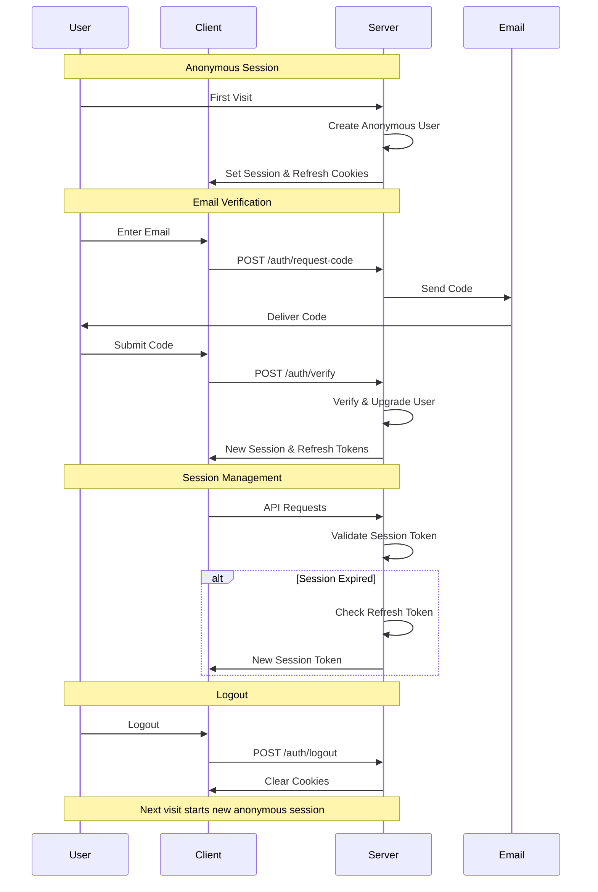

# 🔐 Auth Kit

A headless, isomorphic authentication toolkit that runs seamlessly across server-side, web, and React Native environments. Auth Kit provides a secure, low-latency authentication system with email verification and token management. Perfect for applications that need a robust, platform-agnostic auth system with a great developer experience.

## Table of Contents

- [Installation](#installation)
- [Key Features](#key-features)
- [Authentication Flow](#authentication-flow)
- [Usage Guide](#usage-guide)
  - [1️⃣ Set up Environment and Server](#1️⃣-set-up-environment-and-server)
  - [2️⃣ Access Auth in React Router Routes](#2️⃣-access-auth-in-react-router-routes)
  - [3️⃣ Configure Server](#3️⃣-configure-server)
  - [4️⃣ Set up Auth Client and React Integration](#4️⃣-set-up-auth-client-and-react-integration)
- [Architecture](#architecture)
- [API Reference](#api-reference)
  - [Client API](#client-api)
  - [Server API](#server-api)
  - [React API](#react-api)
  - [Test API](#test-api)
  - [HTTP Endpoints](#http-endpoints)
- [Troubleshooting](#troubleshooting)
- [TypeScript Types](#typescript-types)
- [Testing with Storybook](#testing-with-storybook)

## Installation

```bash
npm install @open-game-collective/auth-kit
# or
yarn add @open-game-collective/auth-kit
# or
pnpm add @open-game-collective/auth-kit
```

## Key Features

- 🌐 **Isomorphic & Headless**: Runs anywhere - server-side, web browsers, or React Native. Bring your own UI components.
- 🎭 **Anonymous-First Auth**: Users start with an anonymous session that can be upgraded to a verified account.
- 📧 **Email Verification**: Secure email verification flow with customizable storage and delivery options.
- 🔐 **JWT-Based Tokens**: Secure session and refresh tokens with automatic refresh.
- ⚡️ **Edge-Ready**: Optimized for Cloudflare Workers for minimal latency.
- 🎯 **Type-Safe**: Full TypeScript support with detailed types.
- 🎨 **React Integration**: Ready-to-use hooks and components for auth state management.
- 🔌 **Customizable**: Integrate with your own storage, email delivery systems, and UI components.
- 📱 **Platform Agnostic**: Same API and behavior across web and mobile platforms.

## Authentication Flow



Here's the typical flow from anonymous user to authenticated and back:

### 1. Anonymous Session Creation
- **First Visit**: When a user first visits your app, they automatically get an anonymous session
- **Server Action**: `withAuth` middleware creates a new anonymous user
- **Cookies Set**:
  - `auth_session_token` (15m expiry)
  - `auth_refresh_token` (7d expiry)
- **State**: User has anonymous session with valid userId but is not verified

### 2. Email Verification
1. **Request Code**
   - **Client Call**: `client.requestCode('user@example.com')`
   - **API**: `POST /auth/request-code`
   - **Action**: Sends verification code to email
   - **Cookies**: Unchanged

2. **Verify Code**
   - **Client Call**: `client.verifyEmail('user@example.com', '123456')`
   - **API**: `POST /auth/verify`
   - **Action**: Verifies code and upgrades anonymous user
   - **Cookies Updated**:
     - New `auth_session_token`
     - New `auth_refresh_token`
   - **State**: User is now verified and authenticated

### 3. Session Management
- **Token Refresh**
  - **Trigger**: Session token expires (15m)
  - **Server Action**: Uses refresh token to issue new session
  - **Cookies Updated**:
    - New `auth_session_token`
    - Refresh token unchanged
  - **State**: Seamless session continuation

### 4. Logout
- **Client Call**: `client.logout()`
- **API**: `POST /auth/logout`
- **Cookies Cleared**:
  - `auth_session_token` removed
  - `auth_refresh_token` removed
- **Next Visit**: New anonymous session created

### Example Flow

```typescript
// 1. App starts with anonymous session (automatic)
const client = createAuthClient({
  host: "api.example.com",
  userId: "anon-123",      // From server
  sessionToken: "abc..."   // From cookie
});

// 2. User initiates email verification
await client.requestCode("user@example.com");
// -> Sends email with code

// 3. User submits verification code
await client.verifyEmail("user@example.com", "123456");
// -> Anonymous session upgraded to verified
// -> New session & refresh tokens set in cookies

// 4. Session management (automatic)
// When session token expires, server uses refresh token
// to create new session token

// 5. User logs out
await client.logout();
// -> Cookies cleared
// -> Next visit starts new anonymous session
```

## Usage Guide

### Web Applications

Auth Kit is directly compatible with all major React server frameworks including Next.js, Remix, React Router, TanStack Router, Vite, and more. While this example uses Remix and Cloudflare Workers, the library works seamlessly with any server-side React setup:

```typescript
// app/server.ts
import { AuthHooks, withAuth } from "@open-game-collective/auth-kit/server";
import { createRequestHandler, logDevReady } from "@remix-run/cloudflare";
import * as build from "@remix-run/dev/server-build";
import { Env } from "./env";

if (process.env.NODE_ENV === "development") {
  logDevReady(build);
}

const handleRemixRequest = createRequestHandler(build);

const authHooks: AuthHooks<Env> = {
  getUserIdByEmail: async ({ email, env, request }) => {
    return await env.KV_STORAGE.get(`email:${email}`);
  },

  storeVerificationCode: async ({ email, code, env, request }) => {
    await env.KV_STORAGE.put(`code:${email}`, code, {
      expirationTtl: 600,
    });
  },

  verifyVerificationCode: async ({ email, code, env, request }) => {
    const storedCode = await env.KV_STORAGE.get(`code:${email}`);
    return storedCode === code;
  },

  sendVerificationCode: async ({ email, code, env, request }) => {
    try {
      const response = await fetch("https://api.sendgrid.com/v3/mail/send", {
        method: "POST",
        headers: {
          Authorization: `Bearer ${env.SENDGRID_API_KEY}`,
          "Content-Type": "application/json",
        },
        body: JSON.stringify({
          personalizations: [{ to: [{ email }] }],
          from: { email: "auth@yourdomain.com" },
          subject: "Your verification code",
          content: [{ type: "text/plain", value: `Your code is: ${code}` }],
        }),
      });
      return response.ok;
    } catch (error) {
      console.error("Failed to send email:", error);
      return false;
    }
  },

  onNewUser: async ({ userId, env, request }) => {
    await env.KV_STORAGE.put(
      `user:${userId}`,
      JSON.stringify({
        created: new Date().toISOString(),
      })
    );
  },

  onAuthenticate: async ({ userId, email, env, request }) => {
    await env.KV_STORAGE.put(
      `user:${userId}:lastLogin`,
      new Date().toISOString()
    );
  },

  onEmailVerified: async ({ userId, email, env, request }) => {
    await env.KV_STORAGE.put(`user:${userId}:verified`, "true");
    await env.KV_STORAGE.put(`email:${email}`, userId);
  },
};

const handler = withAuth<Env>(
  async (request, env, { userId, sessionId, sessionToken }) => {
    try {
      return await handleRemixRequest(request, {
        env,
        userId,
        sessionId,
        sessionToken,
        requestId: crypto.randomUUID(),
      });
    } catch (error) {
      console.error("Error processing request:", error);
      return new Response("Internal Error", { status: 500 });
    }
  },
  { hooks: authHooks }
);

export default {
  async fetch(request: Request, env: Env, ctx: ExecutionContext) {
    return handler(request, env);
  },
};

// app/root.tsx
import { createAuthClient } from "@open-game-collective/auth-kit/client";
import type { LoaderFunctionArgs } from "@remix-run/cloudflare";
import {
  json,
  Links,
  Meta,
  Outlet,
  Scripts,
  ScrollRestoration,
  useLoaderData,
} from "@remix-run/react";
import { useState } from "react";
import { AuthProvider } from "./context/auth-context";

interface LoaderData {
  userId: string;
  sessionToken: string;
  host: string;
}

export async function loader({ request, context }: LoaderFunctionArgs) {
  return json<LoaderData>({
    userId: context.userId,
    sessionToken: context.sessionToken,
    host: context.env.WEB_HOST,
  });
}

export default function App() {
  const { userId, sessionToken, host } = useLoaderData<typeof loader>();

  const [authClient] = useState(
    createAuthClient({
      host,
      userId,
      sessionToken,
    })
  );

  return (
    <html lang="en">
      <head>
        <meta charSet="utf-8" />
        <meta name="viewport" content="width=device-width, initial-scale=1" />
        <Meta />
        <Links />
      </head>
      <body>
        <AuthProvider client={authClient}>
          <Outlet />
        </AuthProvider>
        <ScrollRestoration />
        <Scripts />
      </body>
    </html>
  );
}
```

The setup above demonstrates:
1. Server setup with auth hooks for KV storage and email verification (can be adapted for any storage solution)
2. Root component that initializes the auth client with user context from the loader
3. Integration with server-side data loading

You can use Auth Kit with:
- Next.js: In API routes or server components
- React Router: In loaders or actions
- TanStack Router: In route handlers
- Vite SSR: In server entry point

The only requirement is implementing the auth hooks for your chosen storage and email delivery solutions.

### Mobile Applications (React Native)

For mobile applications, you'll need to explicitly manage user creation and token storage:

```typescript
// app/auth.ts
import { createAnonymousUser, createAuthClient } from "@open-game-collective/auth-kit/client";
import AsyncStorage from '@react-native-async-storage/async-storage';

const AUTH_KEYS = {
  USER_ID: 'auth_user_id',
  SESSION_TOKEN: 'auth_session_token',
  REFRESH_TOKEN: 'auth_refresh_token'
} as const;

async function clearAuthTokens() {
  await Promise.all([
    AsyncStorage.removeItem(AUTH_KEYS.USER_ID),
    AsyncStorage.removeItem(AUTH_KEYS.SESSION_TOKEN),
    AsyncStorage.removeItem(AUTH_KEYS.REFRESH_TOKEN)
  ]);
}

export async function initializeAuth() {
  // Try to load existing tokens
  const [userId, sessionToken, refreshToken] = await Promise.all([
    AsyncStorage.getItem(AUTH_KEYS.USER_ID),
    AsyncStorage.getItem(AUTH_KEYS.SESSION_TOKEN),
    AsyncStorage.getItem(AUTH_KEYS.REFRESH_TOKEN)
  ]);

  // If we have existing tokens, create client with them
  if (userId && sessionToken) {
    return createAuthClient({
      host: "your-worker.workers.dev",
      userId,
      sessionToken
    });
  }

  // Otherwise create a new anonymous user with longer refresh token for mobile
  const tokens = await createAnonymousUser({
    host: "your-worker.workers.dev",
    refreshTokenExpiresIn: '30d', // Longer refresh token for mobile
    sessionTokenExpiresIn: '1h'   // Longer session token for mobile
  });
  
  // Store the tokens
  await Promise.all([
    AsyncStorage.setItem(AUTH_KEYS.USER_ID, tokens.userId),
    AsyncStorage.setItem(AUTH_KEYS.SESSION_TOKEN, tokens.sessionToken),
    AsyncStorage.setItem(AUTH_KEYS.REFRESH_TOKEN, tokens.refreshToken)
  ]);

  // Create and return the client
  return createAuthClient({
    host: "your-worker.workers.dev",
    userId: tokens.userId,
    sessionToken: tokens.sessionToken,
    refreshToken: tokens.refreshToken // Include refresh token for mobile
  });
}

// App.tsx
import { AuthContext } from "./auth.context";

export default function App() {
  const [client, setClient] = useState<AuthClient | null>(null);
  const [isLoading, setIsLoading] = useState(true);
  const [isLoggingOut, setIsLoggingOut] = useState(false);

  useEffect(() => {
    initializeAuth()
      .then(setClient)
      .finally(() => setIsLoading(false));
  }, []);

  const handleLogout = useCallback(async () => {
    if (!client || isLoggingOut) return;
    
    // Immediately set logging out state and clear client
    setIsLoggingOut(true);
    setClient(null);

    try {
      // Call client logout to clear server-side session
      await client.logout();
      
      // Clear stored tokens
      await clearAuthTokens();
      
      // Create new anonymous session
      const newClient = await initializeAuth();
      setClient(newClient);
    } finally {
      setIsLoggingOut(false);
    }
  }, [client, isLoggingOut]);

  if (isLoading || isLoggingOut || !client) {
    return <LoadingScreen />;
  }

  return (
    <AuthContext.Provider client={client}>
      <NavigationContainer>
        <YourApp />
        <Button 
          title="Logout" 
          onPress={handleLogout}
          disabled={isLoggingOut} 
        />
      </NavigationContainer>
    </AuthContext.Provider>
  );
}

// Usage in components
function ProfileScreen() {
  const client = AuthContext.useClient();
  const isVerified = AuthContext.useSelector(state => state.isVerified);

  const verifyEmail = async () => {
    await client.requestCode('user@example.com');
    // Show verification code input...
  };

  return (
    <View>
      <AuthContext.Unverified>
        <Button title="Verify Email" onPress={verifyEmail} />
      </AuthContext.Unverified>
      <AuthContext.Verified>
        <Text>Welcome back!</Text>
      </AuthContext.Verified>
    </View>
  );
}
```

The key differences between web and mobile implementations:

1. **Web Applications**
   - Use `withAuth` middleware for automatic token management
   - Tokens are stored in HTTP-only cookies
   - Anonymous users are created automatically

2. **Mobile Applications**
   - Use `createAnonymousUser` for explicit user creation
   - Tokens are stored in secure storage (e.g., AsyncStorage)
   - Need to handle token persistence manually
   - Refresh token can be used for longer sessions

### Mobile-to-Web Authentication

Auth Kit provides a secure way to authenticate mobile app users in web views using signed JWTs. This is useful for scenarios where you want to:
- Open authenticated web content from your mobile app
- Share authentication state between mobile and web
- Provide a hybrid mobile-web experience

Here's how the flow works:

1. **Mobile App**: Generate a signed JWT auth code
   ```typescript
   // Mobile App: Request a signed JWT auth code
   const { code, expiresIn } = await client.getWebAuthCode();
   ```
   The server:
   - Verifies the mobile session token
   - Creates a signed JWT containing the user's ID
   - Sets a short expiration (5 minutes)
   - Signs it with the same secret used for other tokens

2. **Open Web View**: Use the JWT to authenticate
   ```typescript
   // Option 1: Using Expo WebBrowser
   import * as WebBrowser from 'expo-web-browser';
   await WebBrowser.openAuthSessionAsync(
     `https://your-web-app.com?code=${code}`
   );
   
   // Option 2: Using React Native's Linking
   import { Linking } from 'react-native';
   await Linking.openURL(
     `https://your-web-app.com?code=${code}`
   );
   
   // Option 3: Using React Native WebView
   import { WebView } from 'react-native-webview';
   return (
     <WebView 
       source={{ uri: `https://your-web-app.com?code=${code}` }}
       // Security configuration
       incognito={true}
       sharedCookiesEnabled={false}
       thirdPartyCookiesEnabled={false}
     />
   );
   ```

3. **Server Middleware**: Automatic JWT verification
   The `withAuth` middleware automatically:
   1. Detects the JWT auth code in the URL
   2. Verifies the JWT signature and expiration
   3. Extracts the user ID from the verified JWT
   4. Creates new web session tokens with the same user ID
   5. Sets HTTP-only cookies for the web session
   6. Redirects to remove the code from URL

Security features:
- JWTs are cryptographically signed
- Short expiration (5 minutes)
- Audience claim verification ("WEB_AUTH")
- No server-side storage needed
- All communication requires HTTPS
- Web sessions use HTTP-only cookies
- Mobile app verifies web app origin
- Session tokens are never exposed in URLs

This approach is more secure than OAuth for first-party applications because:
- No need for complex OAuth flows
- Direct session transfer using signed JWTs
- No server-side storage required
- Reduced attack surface (no callback URLs)
- Better UX (no consent screens)
- Same user ID maintained across platforms

Example JWT verification:
```typescript
// Inside withAuth middleware
const webAuthCode = url.searchParams.get('code');
if (webAuthCode) {
  try {
    // Verify the JWT signature and claims
    const verified = await jwtVerify(
      webAuthCode, 
      new TextEncoder().encode(env.AUTH_SECRET),
      { audience: "WEB_AUTH" }
    );
    
    const payload = verified.payload as { userId: string };
    if (payload.userId) {
      // Create new web session with same user ID
      const sessionId = crypto.randomUUID();
      const newSessionToken = await createSessionToken(
        payload.userId, // Same user ID as mobile
        env.AUTH_SECRET
      );
      const newRefreshToken = await createRefreshToken(
        payload.userId,
        env.AUTH_SECRET
      );

      // Redirect and set cookies...
    }
  } catch (error) {
    // JWT verification failed
    console.error('Failed to verify web auth code:', error);
  }
}
```

The web session maintains the same user identity as the mobile app while using its own session tokens, allowing for independent session management on each platform.

## Architecture

Auth Kit is comprised of three core components:

1. **Server Middleware (`@open-game-collective/auth-kit/server`)**
   - Handles all `/auth/*` routes automatically.
   - Manages JWT-based session tokens (15 minutes) and refresh tokens (7 days).
   - Creates anonymous users when no valid session exists.
   - Supplies `userId` and `sessionId` to your React Router loaders.

2. **Auth Client (`@open-game-collective/auth-kit/client`)**
   - Manages client-side auth state.
   - Automatically refreshes tokens.
   - Provides methods for email verification and logout.
   - Supports state subscriptions and pub/sub updates.

3. **React Integration (`@open-game-collective/auth-kit/react`)**
   - Offers hooks for accessing auth state.
   - Provides conditional components for loading, authentication, and verification states.
   - Leverages Suspense for efficient UI updates.

## API Reference

### Client API

The client provides methods for managing authentication:

```typescript
interface AuthClient {
  // Core authentication methods
  getState(): AuthState;
  subscribe(callback: (state: AuthState) => void): () => void;
  requestCode(email: string): Promise<void>;
  verifyEmail(email: string, code: string): Promise<{ success: boolean }>;
  logout(): Promise<void>;
  refresh(): Promise<void>;

  // Mobile-to-web authentication (mobile only)
  getWebAuthCode(): Promise<{ code: string; expiresIn: number }>;
}
```

**Core Methods:**

- `getState()`: Get current authentication state
- `subscribe(callback)`: Subscribe to state changes
- `requestCode(email)`: Request email verification code
- `verifyEmail(email, code)`: Verify email with code
- `logout()`: Clear session and tokens
- `refresh()`: Refresh session using refresh token

**Mobile-to-Web Method:**

- `getWebAuthCode()`: Generate a one-time code for web authentication (mobile only)
  ```typescript
  const { code, expiresIn } = await client.getWebAuthCode();
  // code: One-time auth code
  // expiresIn: Expiration time in seconds (e.g. 300 for 5 minutes)
  ```

### Server API

The server provides two main exports:

1. `createAuthRouter`: Creates an auth router that handles all `/auth/*` endpoints
2. `withAuth`: Middleware that integrates authentication with your app

**Auth Router Endpoints:**

- `POST /auth/anonymous`: Create anonymous user
- `POST /auth/request-code`: Request email verification code
- `POST /auth/verify`: Verify email code
- `POST /auth/refresh`: Refresh session token
- `POST /auth/logout`: Clear session
- `POST /auth/web-code`: Generate one-time web auth code

The middleware automatically handles:
- Token validation and refresh
- Session management
- Error handling
- Cookie management (for web)
- Mobile-to-web auth code verification
- CORS and security headers

**Mobile-to-Web Authentication Flow:**

1. Mobile app gets auth code:
```typescript
// Mobile app
const { code } = await client.getWebAuthCode();
const url = `https://your-web-app.com?code=${code}`;
WebBrowser.openAuthSessionAsync(url);
```

2. Web app automatically handles the code:
```typescript
// Web app - no special code needed!
// The withAuth middleware automatically:
// 1. Detects auth code in URL
// 2. Verifies the code
// 3. Sets up the web session with the mobile user's session
// 4. Redirects to the app
```

### React API

`createAuthContext()`

Creates a React context for auth state management, providing:
- A Provider for passing down the auth client.
- Hooks: `useClient` and `useSelector` for accessing and subscribing to state.
- Conditional components: `<Loading>`, `<Authenticated>`, `<Verified>`, and `<Unverified>`.

### Test API

`createAuthMockClient(config)`

Creates a mock auth client for testing. This is useful for testing UI components that depend on auth state without needing a real server.

Example:
```typescript
import { createAuthMockClient } from "@open-game-collective/auth-kit/test";

it('shows verified content when user is verified', () => {
  const mockClient = createAuthMockClient({
    initialState: {
      isLoading: false,
      host: 'test.com',
      userId: 'test-user',
      sessionToken: 'test-session',
      refreshToken: null,
      isVerified: true
    }
  });

  render(
    <AuthContext.Provider client={mockClient}>
      <YourComponent />
    </AuthContext.Provider>
  );

  // Test that verified content is shown
  expect(screen.getByText('Welcome back!')).toBeInTheDocument();
});

it('handles email verification flow', async () => {
  const mockClient = createAuthMockClient({
    initialState: {
      isLoading: false,
      host: 'test.com',
      userId: 'test-user',
      sessionToken: 'test-session',
      refreshToken: null,
      isVerified: false
    }
  });

  render(
    <AuthContext.Provider client={mockClient}>
      <VerificationComponent />
    </AuthContext.Provider>
  );

  // Simulate verification flow
  await userEvent.click(screen.getByText('Verify Email'));
  
  // Check that requestCode was called
  expect(mockClient.requestCode).toHaveBeenCalledWith('test@example.com');
  
  // Update mock state to simulate loading
  mockClient.setState({
    isLoading: true
  });
  
  expect(screen.getByText('Sending code...')).toBeInTheDocument();
  
  // Update mock state to simulate success
  mockClient.setState({
    isLoading: false,
    isVerified: true
  });
  
  expect(screen.getByText('Email verified!')).toBeInTheDocument();
});
```

The mock client provides additional testing utilities:

- `setState(partial)`: Update the mock client state
- `getState()`: Get current state
- All client methods are Jest spies for tracking calls
- State changes are synchronous for easier testing
- No actual network requests are made

### HTTP Endpoints

The following endpoints are available when using the Auth Kit server middleware:

#### No Authentication Required

1. `POST /auth/anonymous`
   - Creates new anonymous user
   - Returns: `{ userId, sessionToken, refreshToken }`
   - Optional body: `{ refreshTokenExpiresIn, sessionTokenExpiresIn }`

2. `POST /auth/verify`
   - Verifies email code
   - Body: `{ email, code }`
   - Returns: `{ success, userId, sessionToken, refreshToken }`

3. `POST /auth/request-code`
   - Requests email verification code
   - Body: `{ email }`
   - Returns: `{ success, message, expiresIn }`

4. `POST /auth/logout`
   - Clears session cookies
   - Returns: `{ success }`
   - Note: No auth required since it just clears cookies

#### Authentication Required

5. `POST /auth/refresh`
   - Requires: `Authorization: Bearer <refresh_token>`
   - Returns: `{ success, sessionToken, refreshToken }`
   - Error: 401 if missing or invalid token

6. `POST /auth/web-code`
   - Requires: `Authorization: Bearer <session_token>`
   - Returns: `{ code, expiresIn }`
   - Error: 401 if missing or invalid token
   - Used for mobile-to-web authentication

#### Security Notes

- All endpoints require HTTPS in production
- Tokens are JWT-based with appropriate expiration
- Session tokens expire in 15 minutes by default
- Refresh tokens expire in 7 days by default
- Web auth codes expire in 5 minutes
- All tokens are cryptographically signed
- Cookies are HTTP-only, Secure, and SameSite=Strict

## Troubleshooting

- Ensure that environment variables (`AUTH_SECRET`, `SENDGRID_API_KEY`, etc.) are correctly set.
- Verify that the Cloudflare Worker and KV namespace configurations are correct.
- Make sure that cookies are being set and sent with requests appropriately.
- Check browser console logs or Cloudflare Worker logs for debug messages.
- For further assistance, please open an issue on our GitHub repository.

## TypeScript Types

Example types:
```typescript
export interface Env {
  AUTH_SECRET: string;
  SENDGRID_API_KEY: string;
  KV_STORAGE: KVNamespace;
  [key: string]: unknown;
}

export type AuthState = {
  isLoading: boolean;
  host: string;
  userId: string;
  sessionToken: string;
  refreshToken: string | null;
  isVerified: boolean;
  error?: string;
};
```

Detailed API types are available within the package for full type-safety.

## Testing with Storybook

The mock client is particularly useful for testing components in Storybook, especially for verifying complex interactions and state changes.

### Basic Story with Mock Client

```typescript
import type { Meta, StoryObj } from '@storybook/react';
import { createAuthMockClient } from "@open-game-collective/auth-kit/test";
import { AuthContext } from "@open-game-collective/auth-kit/react";

const meta: Meta<typeof ProfilePage> = {
  component: ProfilePage,
};

export default meta;
type Story = StoryObj<typeof ProfilePage>;

export const UnverifiedUser: Story = {
  render: () => {
    const mockClient = createAuthMockClient({
      initialState: {
        isLoading: false,
        host: 'test.com',
        userId: 'test-user',
        sessionToken: 'test-session',
        refreshToken: null,
        isVerified: false
      }
    });

    return (
      <AuthContext.Provider client={mockClient}>
        <ProfilePage />
      </AuthContext.Provider>
    );
  }
};
```

### Testing Complex Interactions

```typescript
export const EmailVerificationFlow: Story = {
  play: async ({ canvasElement, mount }) => {
    // Create mock client with spy methods
    const mockClient = createAuthMockClient({
      initialState: {
        isLoading: false,
        host: 'test.com',
        userId: 'test-user',
        sessionToken: 'test-session',
        refreshToken: null,
        isVerified: false
      }
    });

    // Spy on the requestCode method
    const requestCodeSpy = vi.spyOn(mockClient, 'requestCode');
    const verifyEmailSpy = vi.spyOn(mockClient, 'verifyEmail');

    await mount(
      <AuthContext.Provider client={mockClient}>
        <ProfilePage />
      </AuthContext.Provider>
    );

    const canvas = within(canvasElement);

    // Fill out email form
    await userEvent.type(
      await canvas.findByLabelText('Email'),
      'test@example.com'
    );

    // Click verify button
    await userEvent.click(canvas.getByText('Verify Email'));

    // Verify requestCode was called with correct email
    expect(requestCodeSpy).toHaveBeenCalledWith('test@example.com');

    // Simulate loading state
    mockClient.setState({ isLoading: true });
    expect(canvas.getByText('Sending code...')).toBeInTheDocument();

    // Simulate code sent
    mockClient.setState({ isLoading: false });

    // Enter verification code
    await userEvent.type(
      await canvas.findByLabelText('Verification Code'),
      '123456'
    );

    // Submit code
    await userEvent.click(canvas.getByText('Submit Code'));

    // Verify verifyEmail was called with correct parameters
    expect(verifyEmailSpy).toHaveBeenCalledWith('test@example.com', '123456');

    // Verify the final success state
    mockClient.setState({ isVerified: true });
    expect(canvas.getByText('Email verified!')).toBeInTheDocument();
  }
};
```

### Testing Error States

```typescript
export const EmailVerificationError: Story = {
  play: async ({ canvasElement, mount }) => {
    const mockClient = createAuthMockClient({
      initialState: {
        isLoading: false,
        host: 'test.com',
        userId: 'test-user',
        sessionToken: 'test-session',
        refreshToken: null,
        isVerified: false
      }
    });

    await mount(
      <AuthContext.Provider client={mockClient}>
        <ProfilePage />
      </AuthContext.Provider>
    );

    const canvas = within(canvasElement);

    // Simulate an error state
    mockClient.setState({
      error: 'Invalid verification code'
    });

    // Verify error is displayed
    expect(canvas.getByText('Invalid verification code')).toBeInTheDocument();

    // Test error dismissal
    await userEvent.click(canvas.getByText('Try Again'));
    
    // Verify error is cleared
    mockClient.setState({ error: undefined });
    expect(canvas.queryByText('Invalid verification code')).not.toBeInTheDocument();
  }
};
```

The mock client makes it easy to:
- Test different initial states
- Verify method calls with spies
- Simulate loading and error states
- Test complex user interactions
- Validate state transitions

### Testing Mobile Logout Scenarios

```typescript
import { render, screen, waitFor } from '@testing-library/react-native';
import { createAuthMockClient } from "@open-game-collective/auth-kit/test";
import AsyncStorage from '@react-native-async-storage/async-storage';
import App from './App';

// Mock AsyncStorage
jest.mock('@react-native-async-storage/async-storage', () => ({
  removeItem: jest.fn(() => Promise.resolve()),
  getItem: jest.fn(),
  setItem: jest.fn()
}));

describe('Mobile App Logout', () => {
  beforeEach(() => {
    // Clear all mocks before each test
    jest.clearAllMocks();
  });

  it('handles successful logout flow', async () => {
    // Setup initial mock client
    const mockClient = createAuthMockClient({
      initialState: {
        isLoading: false,
        host: 'test.com',
        userId: 'test-user',
        sessionToken: 'test-session',
        refreshToken: 'test-refresh',
        isVerified: true
      }
    });

    // Mock successful initializeAuth for new anonymous session
    const newMockClient = createAuthMockClient({
      initialState: {
        isLoading: false,
        host: 'test.com',
        userId: 'anon-user',
        sessionToken: 'anon-session',
        refreshToken: 'anon-refresh',
        isVerified: false
      }
    });

    // Mock the initializeAuth function
    jest.mock('./auth', () => ({
      initializeAuth: jest.fn()
        .mockResolvedValueOnce(mockClient)      // First call returns initial client
        .mockResolvedValueOnce(newMockClient),  // Second call returns anonymous client
    }));

    const { getByText } = render(<App />);

    // Wait for initial render
    await waitFor(() => {
      expect(getByText('Welcome back!')).toBeTruthy(); // Verified user content
    });

    // Trigger logout
    const logoutButton = getByText('Logout');
    fireEvent.press(logoutButton);

    // Verify loading state shows
    expect(getByText('Loading...')).toBeTruthy();

    // Verify client.logout was called
    expect(mockClient.logout).toHaveBeenCalled();

    // Verify AsyncStorage tokens were cleared
    expect(AsyncStorage.removeItem).toHaveBeenCalledWith('auth_user_id');
    expect(AsyncStorage.removeItem).toHaveBeenCalledWith('auth_session_token');
    expect(AsyncStorage.removeItem).toHaveBeenCalledWith('auth_refresh_token');

    // Verify new anonymous session is created
    await waitFor(() => {
      expect(getByText('Verify Email')).toBeTruthy(); // Unverified user content
    });
  });

  it('handles logout when client is already null', () => {
    const { getByText } = render(<App />);
    
    // Set client to null
    const logoutButton = getByText('Logout');
    fireEvent.press(logoutButton);
    fireEvent.press(logoutButton); // Press again while client is null
    
    // Should not throw and should show loading
    expect(getByText('Loading...')).toBeTruthy();
  });

  it('handles logout during loading state', () => {
    const mockClient = createAuthMockClient({
      initialState: {
        isLoading: true,
        host: 'test.com',
        userId: 'test-user',
        sessionToken: 'test-session',
        refreshToken: null,
        isVerified: false
      }
    });

    const { getByText } = render(<App />);
    
    const logoutButton = getByText('Logout');
    fireEvent.press(logoutButton);
    
    // Button should be disabled
    expect(logoutButton).toBeDisabled();
  });

  it('handles failed logout gracefully', async () => {
    const mockClient = createAuthMockClient({
      initialState: {
        isLoading: false,
        host: 'test.com',
        userId: 'test-user',
        sessionToken: 'test-session',
        refreshToken: null,
        isVerified: true
      }
    });

    // Make logout fail
    mockClient.logout.mockRejectedValueOnce(new Error('Network error'));

    // Mock AsyncStorage.removeItem to fail
    (AsyncStorage.removeItem as jest.Mock).mockRejectedValueOnce(new Error('Storage error'));

    const { getByText } = render(<App />);

    const logoutButton = getByText('Logout');
    fireEvent.press(logoutButton);

    // Should still show loading initially
    expect(getByText('Loading...')).toBeTruthy();

    // Should recover and show error state
    await waitFor(() => {
      expect(getByText('Error logging out. Please try again.')).toBeTruthy();
    });

    // isLoggingOut should be reset
    expect(logoutButton).not.toBeDisabled();
  });

  it('preserves logout button disabled state while logging out', async () => {
    const mockClient = createAuthMockClient({
      initialState: {
        isLoading: false,
        host: 'test.com',
        userId: 'test-user',
        sessionToken: 'test-session',
        refreshToken: null,
        isVerified: true
      }
    });

    // Add delay to logout
    mockClient.logout.mockImplementation(() => new Promise(resolve => setTimeout(resolve, 1000)));

    const { getByText } = render(<App />);

    const logoutButton = getByText('Logout');
    fireEvent.press(logoutButton);

    // Button should be immediately disabled
    expect(logoutButton).toBeDisabled();

    // Should stay disabled during the logout process
    await waitFor(() => {
      expect(logoutButton).toBeDisabled();
    }, { timeout: 500 });

    // Complete logout
    await waitFor(() => {
      expect(getByText('Verify Email')).toBeTruthy();
    });
  });

  it('handles rapid logout attempts', async () => {
    const mockClient = createAuthMockClient({
      initialState: {
        isLoading: false,
        host: 'test.com',
        userId: 'test-user',
        sessionToken: 'test-session',
        refreshToken: null,
        isVerified: true
      }
    });

    const { getByText } = render(<App />);

    const logoutButton = getByText('Logout');
    
    // Attempt multiple rapid logout clicks
    fireEvent.press(logoutButton);
    fireEvent.press(logoutButton);
    fireEvent.press(logoutButton);

    // Verify logout was only called once
    expect(mockClient.logout).toHaveBeenCalledTimes(1);
  });
});
```

These tests demonstrate:
- Complete coverage of the logout flow
- Handling of edge cases and error states
- Proper state management during logout
- AsyncStorage interaction testing
- Loading and disabled states
- Race condition prevention
- Error recovery

Key testing patterns shown:
- Mocking both success and failure cases
- Testing async operations with `waitFor`
- Verifying UI state transitions
- Checking proper cleanup of resources
- Testing user interactions
- Validating error handling
- Ensuring proper loading states