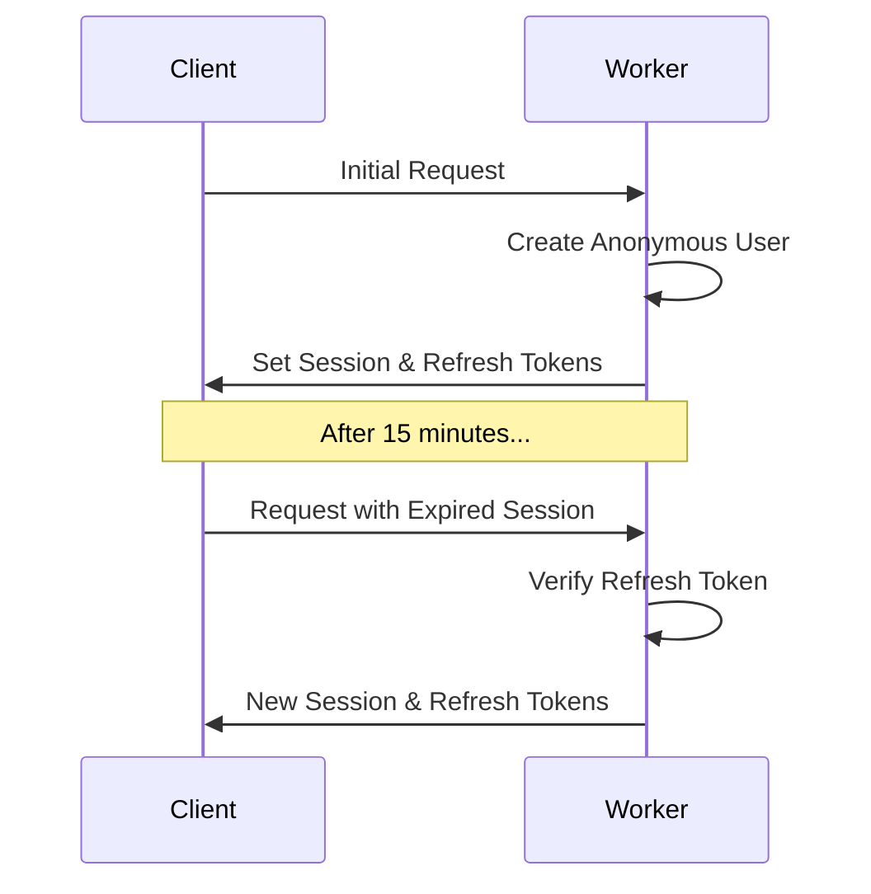

# 🔐 Auth Kit

A full-stack authentication toolkit for React applications. Built on Cloudflare Workers, Auth Kit provides a secure, low-latency authentication system with email verification and token management. Perfect for applications that need a robust auth system with a great developer experience.

## 📚 Table of Contents

- [💾 Installation](#-installation)
- [🌟 Key Features](#-key-features)
- [🛠️ Usage Guide](#️-usage-guide)
  - [1️⃣ Set up Shared Auth Hooks](#1️⃣-set-up-shared-auth-hooks)
  - [2️⃣ Configure Auth Router](#2️⃣-configure-auth-router)
  - [3️⃣ Set up Auth Client](#3️⃣-set-up-auth-client)
  - [4️⃣ Use React Hooks](#4️⃣-use-react-hooks)
- [🏗️ Architecture](#️-architecture)
- [📖 API Reference](#-api-reference)
  - [🔐 auth-kit/client](#-auth-kitclient)
  - [🖥️ auth-kit/worker](#️-auth-kitworker)
  - [⚛️ auth-kit/react](#️-auth-kitreact)
- [🔑 TypeScript Types](#-typescript-types)

## 💾 Installation

```bash
npm install auth-kit jose
# or
yarn add auth-kit jose
# or
pnpm add auth-kit jose
```

## 🌟 Key Features

- 🎭 **Anonymous-First Auth**: Users start with an anonymous session that can be upgraded to a verified account
- 📧 **Email Verification**: Built-in secure email verification flow with customizable storage and delivery
- 🔐 **JWT-Based Tokens**: Secure session and refresh tokens with automatic refresh
- ⚡️ **Edge-Ready**: Designed for Cloudflare Workers with minimal latency
- 🎯 **Type-Safe**: Full TypeScript support with detailed types
- 🎨 **React Integration**: Ready-to-use hooks and components for auth state
- 🔌 **Customizable**: Bring your own storage and email delivery systems

## 🛠️ Usage Guide

### 1️⃣ Set up Shared Auth Hooks

```typescript
// app/auth.server.ts
import type { AuthHooks } from "auth-kit/worker";
import type { Env } from "./env";

export const authHooks: AuthHooks<Env> = {
  onNewUser: async ({ userId, env, request }) => {
    // Initialize user in Durable Object when created
    const id = env.USER.idFromName(userId);
    await env.USER.get(id).spawn();
  },
  onEmailVerified: async ({ userId, email, env, request }) => {
    // Update user's verified status
    const id = env.USER.idFromName(userId);
    await env.USER.get(id).send({
      type: "CLAIM",
      email
    });
  }
};
```

### 2️⃣ Configure Auth Router

```typescript
// app/worker.ts
import { createAuthRouter, withAuth } from "auth-kit/worker";
import { authHooks } from "./auth.server";

// Create the auth router
const router = createAuthRouter<Env>({
  hooks: {
    // Look up a user ID by email address
    getUserIdByEmail: async ({ email, env, request }) => {
      // Return the user ID if found, null if no user exists with this email
      return await env.DB.get(`user:${email}`);
    },

    // Store a verification code for an email address
    storeVerificationCode: async ({ email, code, env, request }) => {
      // Store the code with expiration (e.g. 10 minutes)
      await env.DB.put(`verification:${email}`, code, { expirationTtl: 600 });
    },

    // Verify if a code matches what was stored for an email
    verifyVerificationCode: async ({ email, code, env, request }) => {
      const storedCode = await env.DB.get(`verification:${email}`);
      return storedCode === code;
    },

    // Send a verification code via email
    sendVerificationCode: async ({ email, code, env, request }) => {
      try {
        await sendEmail({
          to: email,
          subject: "Your verification code",
          text: `Your code is: ${code}`
        });
        return true;
      } catch (error) {
        console.error('Failed to send email:', error);
        return false;
      }
    },

    // Optional: Called when a new anonymous user is created
    onNewUser: async ({ userId, env, request }) => {
      await env.DB.put(`user:${userId}`, { created: new Date() });
    },

    // Optional: Called when a user successfully authenticates with their email code
    onAuthenticate: async ({ userId, email, env, request }) => {
      await env.DB.put(`user:${userId}:lastLogin`, new Date());
    },

    // Optional: Called when a user verifies their email address for the first time
    onEmailVerified: async ({ userId, email, env, request }) => {
      await env.DB.put(`user:${userId}:verified`, true);
    }
  }
});

// Wrap your request handler with auth middleware
export default {
  fetch: withAuth(async (request, env) => {
    if (request.url.includes("/auth/")) {
      return router(request, env);
    }
    return new Response("Not Found", { status: 404 });
  }, { hooks: authHooks })
};
```

### 3️⃣ Set up Auth Client

```typescript
// app/auth.client.ts
import { createAuthClient } from "auth-kit/client";

export const authClient = createAuthClient({
  baseUrl: "https://your-worker.workers.dev"
});
```

### 4️⃣ Use React Hooks and Components

```typescript
// app/auth.context.ts
import { createAuthContext } from "auth-kit/react";

export const AuthContext = createAuthContext();

// app/routes/profile.tsx
import { AuthContext } from "../auth.context";

export default function Profile() {
  // Use the useSelector hook for fine-grained state updates
  const userId = AuthContext.useSelector(state => state.userId);
  const isVerified = AuthContext.useSelector(state => state.isVerified);
  
  // Or use the useAuth hook for all auth state and methods
  const { requestCode, verifyEmail } = AuthContext.useAuth();

  const handleVerify = async (email: string, code: string) => {
    await verifyEmail(email, code);
  };

  return (
    <div>
      <h1>Profile</h1>
      
      <AuthContext.Loading>
        <div>Loading...</div>
      </AuthContext.Loading>

      <AuthContext.Authenticated>
        <p>User ID: {userId}</p>
        
        <AuthContext.Verified>
          <p>✅ Email verified</p>
        </AuthContext.Verified>
        
        <AuthContext.Unverified>
          <EmailVerificationForm onVerify={handleVerify} />
        </AuthContext.Unverified>
      </AuthContext.Authenticated>
    </div>
  );
}
```

## 🏗️ Architecture

Auth Kit uses a combination of session tokens (15-minute expiry) and refresh tokens (7-day expiry) to manage authentication state. The system follows an anonymous-first approach where new users are automatically created with a session, which can later be associated with an email through verification.

### Token Flow


## 📖 API Reference

### 🔐 auth-kit/client

#### `createAuthClient(config)`
Creates an auth client instance.

```typescript
interface AuthClientConfig {
  baseUrl: string;
  initialState?: Partial<AuthState>;
  onStateChange?: (state: AuthState) => void;
  onError?: (error: Error) => void;
}

const client = createAuthClient(config);
```

#### Client Methods

```typescript
interface AuthClient {
  // State Management
  getState(): AuthState;
  subscribe(callback: (state: AuthState) => void): () => void;

  // Auth Operations
  createAnonymousUser(): Promise<void>;
  requestCode(email: string): Promise<void>;
  verifyEmail(email: string, code: string): Promise<{ success: boolean }>;
  logout(): Promise<void>;
  refresh(): Promise<void>;
}
```

### 🖥️ auth-kit/worker

#### Auth Router Endpoints

##### POST /auth/request-code
Request an email verification code.
```typescript
// Request
{
  email: string;
}

// Response
{
  success: true;
}
```

##### POST /auth/verify
Verify an email with a code.
```typescript
// Request
{
  email: string;
  code: string;
}

// Response
{
  success: true;
}
```

##### POST /auth/refresh
Refresh the session using a refresh token.
```typescript
// Request
Cookie: auth_refresh_token=<token>

// Response
{
  userId: string;
  sessionToken: string;
  refreshToken: string;
}
```

##### POST /auth/logout
Log out the current user.
```typescript
// Response
{
  success: true;
}
// + Cleared cookies
```

#### Middleware
```typescript
const handler = withAuth(requestHandler, {
  hooks?: {
    onNewUser?: (props: { userId: string; env: TEnv; request: Request }) => Promise<void>;
    onEmailVerified?: (props: { userId: string; email: string; env: TEnv; request: Request }) => Promise<void>;
  }
});
```

### ⚛️ auth-kit/react

#### `createAuthContext()`
Creates a React context with hooks and components for auth state management.

```typescript
const AuthContext = createAuthContext();

// Returns:
{
  // Core Provider Component
  Provider: React.FC<{
    children: ReactNode;
    client: AuthClient;
    initializing?: ReactNode;
  }>;

  // Hooks
  useClient(): AuthClient;
  useSelector<T>(selector: (state: AuthState) => T): T;
  useAuth(): AuthState & AuthMethods;

  // State-Based Components
  Loading: React.FC<{ children: ReactNode }>;
  Verified: React.FC<{ children: ReactNode }>;
  Unverified: React.FC<{ children: ReactNode }>;
  Authenticated: React.FC<{ children: ReactNode }>;
}
```

#### Using Selectors
```typescript
// Select specific state values
const userId = AuthContext.useSelector(state => state.userId);
const isVerified = AuthContext.useSelector(state => state.isVerified);

// Select multiple values
const { userId, isVerified } = AuthContext.useSelector(state => ({
  userId: state.userId,
  isVerified: state.isVerified
}));
```

#### Using State Components
```typescript
<AuthContext.Loading>
  <LoadingSpinner />
</AuthContext.Loading>

<AuthContext.Authenticated>
  <AuthContext.Verified>
    <VerifiedUserContent />
  </AuthContext.Verified>
  
  <AuthContext.Unverified>
    <EmailVerificationFlow />
  </AuthContext.Unverified>
</AuthContext.Authenticated>
```

## 🔑 TypeScript Types

### Auth State
```typescript
type AuthState = {
  isInitializing: boolean;
  isLoading: boolean;
  baseUrl: string;
} & (
  | {
      userId: string;
      sessionToken: string;
      refreshToken: string | null;
      isVerified: boolean;
      error?: undefined;
    }
  | {
      userId: null;
      sessionToken: null;
      refreshToken: null;
      isVerified: false;
      error?: string;
    }
);
```

### Environment Types
```typescript
interface Env {
  AUTH_SECRET: string;
  USER: DurableObjectNamespace;
}
```

## Required Hooks

The auth router requires the following hooks for email verification:

```typescript
const authHooks = {
  // Required: Look up a user ID by email address
  getUserIdByEmail: async ({ email, env, request }) => {
    // Return the user ID if found, null if no user exists with this email
    return await env.DB.get(`user:${email}`);
  },

  // Required: Store a verification code for an email address
  storeVerificationCode: async ({ email, code, env, request }) => {
    // Store the code with expiration (e.g. 10 minutes)
    await env.DB.put(`verification:${email}`, code, { expirationTtl: 600 });
  },

  // Required: Verify if a code matches what was stored for an email
  verifyVerificationCode: async ({ email, code, env, request }) => {
    const storedCode = await env.DB.get(`verification:${email}`);
    return storedCode === code;
  },

  // Required: Send a verification code via email
  sendVerificationCode: async ({ email, code, env, request }) => {
    try {
      await sendEmail({
        to: email,
        subject: "Your verification code",
        text: `Your code is: ${code}`
      });
      return true;
    } catch (error) {
      console.error('Failed to send email:', error);
      return false;
    }
  },

  // Optional: Called when a new anonymous user is created
  onNewUser?: async ({ userId, env, request }) => {
    await env.DB.put(`user:${userId}`, { created: new Date() });
  },

  // Optional: Called when a user successfully authenticates with their email code
  onAuthenticate?: async ({ userId, email, env, request }) => {
    await env.DB.put(`user:${userId}:lastLogin`, new Date());
  },

  // Optional: Called when a user verifies their email address for the first time
  onEmailVerified?: async ({ userId, email, env, request }) => {
    await env.DB.put(`user:${userId}:verified`, true);
  }
};

// Create the auth router
const router = createAuthRouter<Env>({ hooks: authHooks });

// ... rest of your code ...
```

// ... rest of existing README content ... 