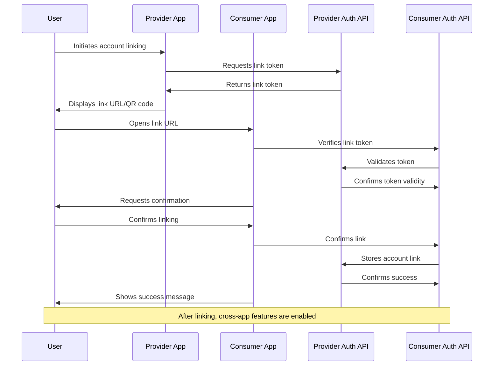
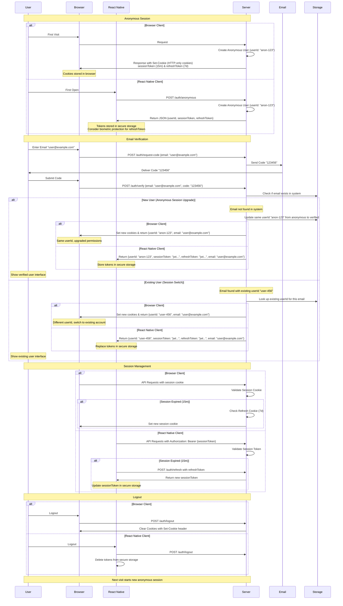
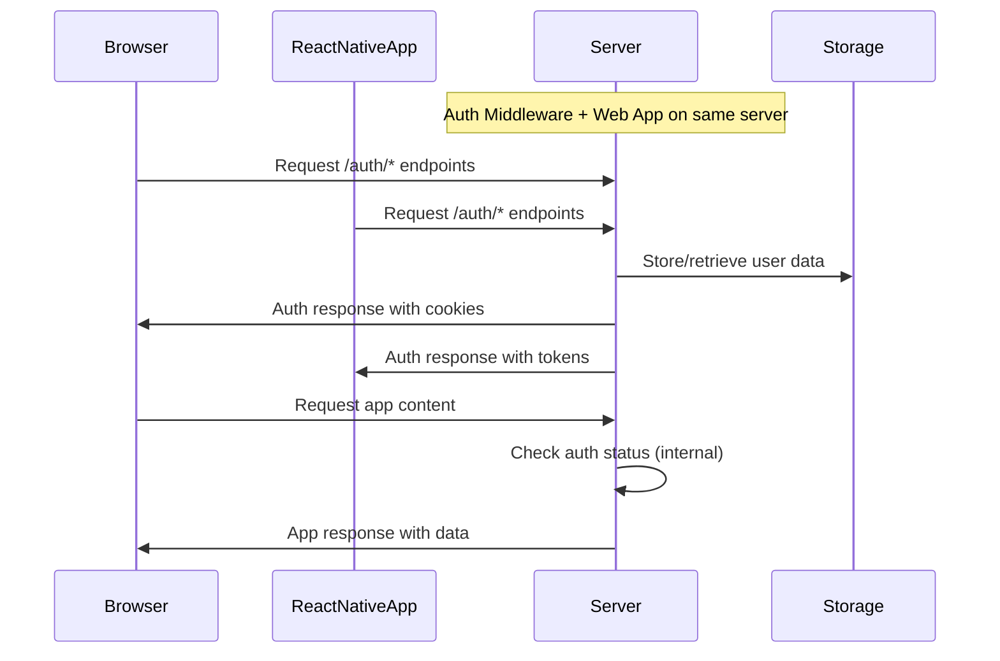

# 🔐 Auth Kit

A headless, isomorphic authentication toolkit that runs seamlessly across server-side, web, and React Native environments. Auth Kit provides a secure, low-latency authentication system with email verification and token management. Perfect for applications that need a robust, platform-agnostic auth system with a great developer experience.

## Table of Contents

- [Installation](#installation)
- [Key Features](#key-features)
- [Account Linking](#account-linking)
  - [Provider-Consumer Model](#provider-consumer-model)
  - [Account Linking Flow](#account-linking-flow)
  - [Implementation](#implementation)
  - [Security Considerations](#security-considerations)
  - [Benefits](#benefits)
- [Authentication Flow](#authentication-flow)
- [Usage Guide](#usage-guide)
  - [1️⃣ Set up Environment and Server](#1️⃣-set-up-environment-and-server)
  - [2️⃣ Access Auth in React Router Routes](#2️⃣-access-auth-in-react-router-routes)
  - [3️⃣ Configure Server](#3️⃣-configure-server)
  - [4️⃣ Set up Auth Client and React Integration](#4️⃣-set-up-auth-client-and-react-integration)
- [Architecture](#architecture)
- [API Reference](#api-reference)
  - [Client API](#client-api)
  - [Provider Client API](#provider-client-api)
  - [Consumer Client API](#consumer-client-api)
  - [Server API](#server-api)
  - [React API](#react-api)
  - [Test API](#test-api)
  - [HTTP Endpoints](#http-endpoints)
- [Troubleshooting](#troubleshooting)
- [TypeScript Types](#typescript-types)
- [Testing with Storybook](#testing-with-storybook)
- [Package Structure](#package-structure)
- [Recent Changes](#recent-changes)

## Installation

```bash
npm install @open-game-collective/auth-kit
# or
yarn add @open-game-collective/auth-kit
# or
pnpm add @open-game-collective/auth-kit
```

## Key Features

- 🌐 **Isomorphic & Headless**: Runs anywhere - server-side, web browsers, or React Native. Bring your own UI components.
- 🎭 **Anonymous-First Auth**: Users start with an anonymous session that can be upgraded to a verified account.
- 📧 **Email Verification**: Secure email verification flow with customizable storage and delivery options.
- 🔐 **JWT-Based Tokens**: Secure session and refresh tokens with automatic refresh.
- ⚡️ **Edge-Ready**: Optimized for Cloudflare Workers for minimal latency.
- 🎯 **Type-Safe**: Full TypeScript support with detailed types.
- 🎨 **React Integration**: Ready-to-use hooks and components for auth state management.
- 🔌 **Customizable**: Integrate with your own storage, email delivery systems, and UI components.
- 📱 **Platform Agnostic**: Same API and behavior across web and mobile platforms.
- 🔗 **Account Linking**: Securely link user accounts across different applications to enable cross-application features like push notifications.

## Account Linking

Auth Kit provides a robust account linking system that allows applications to connect user accounts across the Open Game ecosystem. This enables rich cross-application features such as push notifications, achievement sharing, and synchronized experiences, while maintaining each application's independent authentication system.

### Provider-Consumer Model

Account linking follows a provider-consumer model:

- **Provider** (e.g., OpenGame): The central identity provider that manages user accounts
- **Consumer** (e.g., Game applications): Applications that integrate with the provider for feature sharing

Account linking is not about authentication delegation, but rather about enabling cross-application features such as:

- Push notifications from the provider app for events in consumer apps
- Profile and achievement sharing across applications
- Synchronized preferences and settings
- Cross-application rewards and progression
- Unified social features and friend connections

Each application maintains its own authentication system, but linking accounts allows for a richer, connected user experience across the ecosystem.

### Account Linking Flow

The following diagram illustrates how accounts are linked between the provider (OpenGame) and consumer applications (games), enabling cross-application features while maintaining separate authentication systems:


```mermaid
sequenceDiagram
    participant User
    participant OGApp as Provider App
    participant GameApp as Consumer App
    participant ProviderAuth as Provider Auth API
    participant ConsumerAuth as Consumer Auth API
    
    User->>OGApp: Initiates account linking
    OGApp->>ProviderAuth: Requests link token
    ProviderAuth->>OGApp: Returns link token
    OGApp->>User: Displays link URL/QR code
    User->>GameApp: Opens link URL
    GameApp->>ConsumerAuth: Verifies link token
    ConsumerAuth->>ProviderAuth: Validates token
    ProviderAuth->>ConsumerAuth: Confirms token validity
    GameApp->>User: Requests confirmation
    User->>GameApp: Confirms linking
    GameApp->>ConsumerAuth: Confirms link
    ConsumerAuth->>ProviderAuth: Stores account link
    ProviderAuth->>ConsumerAuth: Confirms success
    GameApp->>User: Shows success message
    Note over User, ConsumerAuth: After linking, cross-app features are enabled
```

Once accounts are linked, the provider application can send push notifications about events in the consumer application, share profile information between applications, and enable other cross-application features - all while each application maintains its own independent authentication system.

### Implementation

Auth Kit provides specialized APIs for both providers and consumers:

#### Provider Implementation

```typescript
// Server-side setup
import { createProviderAuthRouter } from "@open-game-collective/auth-kit/provider/server";

const providerRouter = createProviderAuthRouter({
  hooks: {
    // Base auth hooks
    getUserIdByEmail: async ({ email, env }) => { /* ... */ },
    // ... other base hooks
    
    // Provider-specific hooks
    getGameIdFromApiKey: async ({ apiKey, env }) => { /* ... */ },
    storeAccountLink: async ({ openGameUserId, gameId, gameUserId, env }) => { /* ... */ },
    getLinkedAccounts: async ({ openGameUserId, env }) => { /* ... */ },
    removeAccountLink: async ({ openGameUserId, gameId, env }) => { /* ... */ },
  },
  useTopLevelDomain: true, // Optional
  basePath: "/auth" // Optional, defaults to "/auth"
});

// Client-side implementation
import { createProviderAuthClient } from "@open-game-collective/auth-kit/provider/client";
import { createProviderAuthContext } from "@open-game-collective/auth-kit/provider/react";

const ProviderAuthContext = createProviderAuthContext();
const providerClient = createProviderAuthClient({
  host: "your-api.example.com",
  userId: "provider-123",
  sessionToken: "jwt-token"
});

function AccountLinkingUI() {
  return (
    <ProviderAuthContext.Provider client={providerClient}>
      <ProviderAuthContext.LinkedAccounts>
        <h2>Your Linked Accounts</h2>
        
        <ProviderAuthContext.LinkedAccountsList>
          {({ accounts, onUnlink }) => (
            <ul>
              {accounts.map(account => (
                <li key={account.gameId}>
                  {account.gameId}
                  <button onClick={() => onUnlink(account.gameId)}>
                    Unlink
                  </button>
                </li>
              ))}
            </ul>
          )}
        </ProviderAuthContext.LinkedAccountsList>
      </ProviderAuthContext.LinkedAccounts>
      
      <ProviderAuthContext.InitiateLinking>
        {({ onInitiate, isInitiating, error }) => (
          <button 
            onClick={async () => {
              const { linkToken } = await onInitiate();
              console.log(`Link URL: https://game.example.com/link?token=${linkToken}`);
            }} 
            disabled={isInitiating}
          >
            Link New Account
          </button>
        )}
      </ProviderAuthContext.InitiateLinking>
    </ProviderAuthContext.Provider>
  );
}
```

#### Consumer Implementation

```typescript
// Server-side setup
import { createConsumerAuthRouter } from "@open-game-collective/auth-kit/consumer/server";

const consumerRouter = createConsumerAuthRouter({
  hooks: {
    // Base auth hooks
    getUserIdByEmail: async ({ email, env }) => { /* ... */ },
    // ... other base hooks
    
    // Consumer-specific hooks
    storeOpenGameLink: async ({ gameUserId, openGameUserId, env }) => { /* ... */ },
    getOpenGameUserId: async ({ gameUserId, env }) => { /* ... */ },
    getOpenGameProfile: async ({ openGameUserId, env }) => { /* ... */ },
  },
  gameId: "your-game-id", // Required for consumer router
  useTopLevelDomain: true, // Optional
  basePath: "/auth" // Optional, defaults to "/auth"
});

// Client-side implementation
import { createConsumerAuthClient } from "@open-game-collective/auth-kit/consumer/client";
import { createConsumerAuthContext } from "@open-game-collective/auth-kit/consumer/react";

const ConsumerAuthContext = createConsumerAuthContext();
const consumerClient = createConsumerAuthClient({
  host: "your-api.example.com",
  userId: "game-user-123",
  sessionToken: "jwt-token",
  gameId: "your-game-id" // Required for consumer client
});

function LinkVerificationUI({ linkToken }) {
  return (
    <ConsumerAuthContext.Provider value={consumerClient}>
      <ConsumerAuthContext.VerifyLinkToken token={linkToken}>
        {({ isVerifying, isValid, openGameUserId, email, error }) => (
          <div>
            {isVerifying ? (
              <p>Verifying link...</p>
            ) : isValid ? (
              <ConsumerAuthContext.ConfirmLink 
                token={linkToken} 
                gameUserId="game-user-123"
              >
                {({ onConfirm, isConfirming, isConfirmed, error }) => (
                  <div>
                    <p>Link your account with {email}?</p>
                    <button 
                      onClick={onConfirm} 
                      disabled={isConfirming || isConfirmed}
                    >
                      {isConfirming ? "Linking..." : 
                       isConfirmed ? "Linked!" : "Confirm Link"}
                    </button>
                  </div>
                )}
              </ConsumerAuthContext.ConfirmLink>
            ) : (
              <p>Invalid or expired link token</p>
            )}
          </div>
        )}
      </ConsumerAuthContext.VerifyLinkToken>
    </ConsumerAuthContext.Provider>
  );
}
```

### Security Considerations

The account linking system includes several security features to ensure secure cross-application communication:

1. **JWT-Based Link Tokens**: Cryptographically signed tokens with short expiration times ensure secure linking process
2. **API Key Authentication**: Server-to-server communication secured with API keys for trusted application verification
3. **User Confirmation**: Explicit user consent required before enabling cross-application features
4. **Secure Storage**: Account links stored securely on both provider and consumer sides
5. **Unlinking Capability**: Users can disable cross-application features by unlinking accounts at any time
6. **Limited Data Sharing**: Only necessary data is shared between applications, with clear user consent
7. **Independent Authentication**: Each application maintains its own authentication system, with no credential sharing

### Benefits

- **Connected Ecosystem**: Enable rich interactions between different applications in the ecosystem
- **Enhanced User Experience**: Provide seamless cross-application features without requiring users to manually connect accounts
- **Push Notifications**: Allow the provider app to send notifications about events in linked consumer apps
- **Feature Sharing**: Share profiles, achievements, and other data across applications with user consent
- **Independent Authentication**: Each application maintains its own authentication while still enabling connected experiences
- **Secure Communication**: All communication between applications is secured with API keys and JWT tokens
- **User Control**: Users can link and unlink accounts at any time, maintaining control over their connected experience

For detailed implementation guidance, see the [Account Linking Implementation Guide](docs/account-linking.md).

## Authentication Flow


```mermaid
sequenceDiagram
    participant U as User
    participant B as Browser
    participant RN as React Native
    participant S as Server
    participant E as Email
    participant DB as Storage

    Note over U,S: Anonymous Session
    
    alt Browser Client
        U->>B: First Visit
        B->>S: Request
        S->>S: Create Anonymous User (userId: "anon-123")
        S->>B: Response with Set-Cookie (HTTP-only cookies)<br>sessionToken (15m) & refreshToken (7d)
        Note over B: Cookies stored in browser
    else React Native Client
        U->>RN: First Open
        RN->>S: POST /auth/anonymous
        S->>S: Create Anonymous User (userId: "anon-123")
        S->>RN: Return JSON {userId, sessionToken, refreshToken}
        Note over RN: Tokens stored in secure storage<br>Consider biometric protection for refreshToken
    end
    
    Note over U,S: Email Verification
    U->>B: Enter Email "user@example.com"
    B->>S: POST /auth/request-code {email: "user@example.com"}
    S->>E: Send Code "123456"
    E->>U: Deliver Code "123456"
    U->>B: Submit Code
    B->>S: POST /auth/verify {email: "user@example.com", code: "123456"}
    S->>DB: Check if email exists in system
    
    alt New User (Anonymous Session Upgrade)
        Note over S: Email not found in system
        S->>DB: Update same userId "anon-123" from anonymous to verified
        
        alt Browser Client
            S->>B: Set new cookies & return {userId: "anon-123", email: "user@example.com"}
            Note over B: Same userId, upgraded permissions
        else React Native Client
            S->>RN: Return {userId: "anon-123", sessionToken: "jwt...", refreshToken: "jwt...", email: "user@example.com"}
            Note over RN: Store tokens in secure storage
        end
        
        Note over U: Show verified user interface
    else Existing User (Session Switch)
        Note over S: Email found with existing userId "user-456"
        S->>DB: Look up existing userId for this email
        
        alt Browser Client
            S->>B: Set new cookies & return {userId: "user-456", email: "user@example.com"}
            Note over B: Different userId, switch to existing account
        else React Native Client
            S->>RN: Return {userId: "user-456", sessionToken: "jwt...", refreshToken: "jwt...", email: "user@example.com"}
            Note over RN: Replace tokens in secure storage
        end
        
        Note over U: Show existing user interface
    end
    
    Note over U,S: Session Management
    
    alt Browser Client
        B->>S: API Requests with session cookie
        S->>S: Validate Session Cookie
        alt Session Expired (15m)
            S->>S: Check Refresh Cookie (7d)
            S->>B: Set new session cookie
        end
    else React Native Client
        RN->>S: API Requests with Authorization: Bearer {sessionToken}
    S->>S: Validate Session Token
        alt Session Expired (15m)
            RN->>S: POST /auth/refresh with refreshToken
            S->>RN: Return new sessionToken
            Note over RN: Update sessionToken in secure storage
        end
    end
    
    Note over U,S: Logout
    
    alt Browser Client
        U->>B: Logout
        B->>S: POST /auth/logout
        S->>B: Clear Cookies with Set-Cookie header
    else React Native Client
        U->>RN: Logout
        RN->>S: POST /auth/logout
        RN->>RN: Delete tokens from secure storage
    end
    
    Note over U,S: Next visit starts new anonymous session
```

### User Data in JWT Tokens

Auth Kit uses JWT tokens to securely store and transmit user information. By default, the tokens include minimal data:

1. **Session Tokens** include:
   - `userId`: The unique identifier for the user
   - `sessionId`: A unique identifier for the session
   - `email`: The user's email address (if verified)
   - `aud`: Audience claim set to "SESSION"
   - `exp`: Expiration time (default: 15 minutes)

2. **Refresh Tokens** include:
   - `userId`: The unique identifier for the user
   - `aud`: Audience claim set to "REFRESH"
   - `exp`: Expiration time (default: 7 days for cookies, 1 hour for transient tokens)

You can extend the tokens to include additional user data by modifying the token creation functions:

```typescript
// Example: Including email in session tokens
async function createSessionToken(
  userId: string,
  email: string | null,
  secret: string,
  expiresIn: string = "15m"
): Promise<string> {
  const sessionId = crypto.randomUUID();
  return await new SignJWT({ 
    userId, 
    sessionId,
    email
  })
    .setProtectedHeader({ alg: "HS256" })
    .setAudience("SESSION")
    .setExpirationTime(expiresIn)
    .sign(new TextEncoder().encode(secret));
}
```

**Benefits of storing user data in JWTs:**
- Reduces database lookups for common user information
- Makes user data available on the client without additional API calls
- Simplifies client-side state management

**Considerations:**
- Only include non-sensitive data in tokens
- Keep tokens reasonably sized (avoid large payloads)
- Remember that JWT contents can be read (though not modified) by clients
- Update tokens when user data changes

The Auth Kit client automatically extracts and provides this data to your application through the auth state:

```typescript
const { userId, email } = authClient.getState();
```

### Authentication State

Auth Kit maintains a core state object that represents the current user's authentication status. This state is accessible through the client and can be subscribed to for real-time updates.

The `AuthState` type is defined as:

```typescript
/**
 * The authentication state object that represents the current user's session.
 * This is the core state object used throughout the auth system.
 */
export type AuthState = {
  /**
   * The unique identifier for the current user.
   * For anonymous users, this will be a randomly generated ID.
   * For verified users, this will be their permanent user ID.
   */
  userId: string;

  /**
   * The JWT session token used for authenticated requests.
   * This token has a short expiration (typically 15 minutes) and is
   * automatically refreshed using the refresh token when needed.
   */
  sessionToken: string | null;

  /**
   * The user's verified email address, if they have completed verification.
   * Will be null for anonymous users or users who haven't verified their email.
   * The presence of an email indicates the user is verified.
   */
  email: string | null;

  /**
   * Indicates if an authentication operation is currently in progress.
   * Used to show loading states in the UI during auth operations.
   */
  isLoading: boolean;

  /**
   * Any error that occurred during the last authentication operation.
   * Will be null if no error occurred.
   */
  error: string | null;
};
```

#### Working with Authentication State

You can access the current state at any time:

```typescript
const state = authClient.getState();
console.log(`User ID: ${state.userId}`);
console.log(`Is verified: ${Boolean(state.email)}`);
```

For reactive applications, you can subscribe to state changes:

```typescript
const unsubscribe = authClient.subscribe((state) => {
  console.log('Auth state updated:', state);
  
  if (state.email) {
    // User is verified
    showVerifiedUI();
  } else {
    // User is anonymous
    showAnonymousUI();
  }
  
  if (state.isLoading) {
    // Show loading indicator
    showLoadingSpinner();
  }
  
  if (state.error) {
    // Show error message
    showErrorNotification(state.error);
  }
});

// Later, when you no longer need updates:
unsubscribe();
```

#### React Integration

For React applications, Auth Kit provides components that automatically respond to state changes:

```jsx
import { createAuthContext } from '@open-game-collective/auth-kit/react';

const AuthContext = createAuthContext();

function App() {
  return (
    <AuthContext.Provider client={authClient}>
      <AuthContext.Loading>
        <LoadingSpinner />
      </AuthContext.Loading>
      
      <AuthContext.Verified>
        <VerifiedUserDashboard />
      </AuthContext.Verified>
      
      <AuthContext.Unverified>
        <EmailVerificationForm />
      </AuthContext.Unverified>
    </AuthContext.Provider>
  );
}
```

You can also use the `useSelector` hook to access specific parts of the state:

```jsx
function UserGreeting() {
  const email = AuthContext.useSelector(state => state.email);
  
  return (
    <h1>
      {email 
        ? `Welcome back, ${email}!` 
        : 'Welcome! Please verify your email.'}
    </h1>
  );
}
```

## Usage Guide

### Architecture Overview

Auth Kit is deployed with the auth middleware integrated into your application server:


```mermaid
sequenceDiagram
    participant Browser
    participant ReactNativeApp
    participant Server
    participant Storage
    
    Note over Server: Auth Middleware + Web App on same server
    
    Browser->>Server: Request /auth/* endpoints
    ReactNativeApp->>Server: Request /auth/* endpoints
    Server->>Storage: Store/retrieve user data
    Server->>Browser: Auth response with cookies
    Server->>ReactNativeApp: Auth response with tokens
    
    Browser->>Server: Request app content
    Server->>Server: Check auth status (internal)
    Server->>Browser: App response with data
```

In this deployment:
- **Browser clients** use HTTP cookies for authentication
- **React Native clients** store tokens in secure storage
- The same Auth API endpoints are used by all clients
- The authentication flow applies consistently across platforms

### Auth Middleware Setup

The Auth middleware handles all authentication routes and token management, integrated with your web application.

There are two main approaches to setting up authentication in your application:

#### Approach 1: Using `withAuth` (Recommended for Most Cases)

The `withAuth` middleware provides a complete solution that:
1. Handles all standard auth routes (like `/auth/verify`, `/auth/request-code`, etc.)
2. Adds authentication to your custom routes
3. Manages session validation, token refresh, and anonymous user creation

This is the simplest approach for most applications:

```typescript
// app/worker.ts (e.g., for Remix, Next.js, etc.)
import { withAuth } from "@open-game-collective/auth-kit/server";
import { Env } from "./env";
import { createRequestHandler } from "@remix-run/cloudflare";
import * as build from "@remix-run/dev/server-build";
import { WorkerEntrypoint } from "@cloudflare/workers-types";

// Define hooks outside the worker class - they're only defined once when the module is loaded
const authHooks = {
  getUserIdByEmail: async ({ email, env }) => {
    try {
      const userIdKey = `email:${email}`;
      return await env.AUTH_KV.get(userIdKey);
    } catch (error) {
      console.error("Error getting userId by email:", error);
      return null;
    }
  },
  
  // ... other hooks implementation ...
};

// Create the auth middleware once when the module is loaded
// This handles BOTH auth routes AND your application routes
const authMiddleware = withAuth(
  async (request: Request, env: Env, { userId, sessionId, sessionToken }) => {
    // This handler runs for non-auth routes
    // Auth routes like /auth/* are handled automatically by the middleware
    
    const url = new URL(request.url);
    
    if (url.pathname === '/dashboard') {
      return new Response(`Hello, user ${userId}! This is your dashboard.`);
    }
    
    if (url.pathname === '/profile') {
      return new Response(`Hello, user ${userId}! This is your profile.`);
    }
    
    // Default route
    return new Response(`Hello, user ${userId}!`);
  },
  {
    hooks: authHooks,
    useTopLevelDomain: true,
    basePath: "/auth"
  }
);

// Export the worker
export default {
  async fetch(request: Request, env: Env, ctx: ExecutionContext): Promise<Response> {
    // All requests go through the auth middleware
    return authMiddleware(request, env, ctx);
  }
} satisfies WorkerEntrypoint;
```

#### Approach 2: Separate Auth Router (For More Control)

If you need more control over how auth routes are handled, you can create a separate auth router:

```typescript
// app/worker.ts (e.g., for Remix, Next.js, etc.)
import { AuthHooks, createAuthRouter } from "@open-game-collective/auth-kit/server";
import { Env } from "./env";
import { createRequestHandler } from "@remix-run/cloudflare";
import * as build from "@remix-run/dev/server-build";
import { WorkerEntrypoint } from "@cloudflare/workers-types";

// Define hooks outside the worker class - they're only defined once when the module is loaded
const authHooks: AuthHooks<Env> = {
  // ... hooks implementation ...
};

// Create the auth router once when the module is loaded
const authRouter = createAuthRouter({
  hooks: authHooks,
  useTopLevelDomain: true,
  basePath: "/auth"
});

// Export the worker
export default {
  async fetch(request: Request, env: Env, ctx: ExecutionContext): Promise<Response> {
    const url = new URL(request.url);
    
    // Handle auth routes
    if (url.pathname.startsWith('/auth/')) {
      return authRouter(request, env, ctx);
    }
    
    // Handle app routes with Remix
    const remixHandler = createRequestHandler({
      build,
      mode: process.env.NODE_ENV,
      getLoadContext: () => ({ env })
    });
    
    return remixHandler(request, env, ctx);
  }
} satisfies WorkerEntrypoint;
```

This approach requires you to manually handle authentication for your application routes if needed.

### Using the withAuth Middleware

The `withAuth` middleware provides a convenient way to add authentication to any request handler. It automatically handles:

1. **Auth Routes**: All standard auth endpoints like `/auth/verify`, `/auth/request-code`, etc.
2. **Session Validation**: Verifies session tokens and refreshes them when needed
3. **Anonymous Users**: Creates anonymous users for new visitors
4. **Auth Context**: Passes authentication information to your handler

Here are examples for different types of applications:

#### Base Auth withAuth

```typescript
import { withAuth } from "@open-game-collective/auth-kit/server";
import { Env } from "./env";

// Define your hooks
const authHooks = { /* ... */ };

// Create the middleware once when the module is loaded
const authMiddleware = withAuth(
  async (request: Request, env: Env, { userId, sessionId, sessionToken }) => {
    // This handler runs for non-auth routes
    // Auth routes like /auth/* are handled automatically by the middleware
    
    const url = new URL(request.url);
    
    if (url.pathname === '/dashboard') {
      return new Response(`Hello, user ${userId}! This is your dashboard.`);
    }
    
    if (url.pathname === '/profile') {
      return new Response(`Hello, user ${userId}! This is your profile.`);
    }
    
    // Default route
    return new Response(`Hello, user ${userId}!`);
  },
  {
    hooks: authHooks,
    useTopLevelDomain: true,
    basePath: "/auth"
  }
);

// Use in your fetch handler
export default {
  async fetch(request: Request, env: Env, ctx: ExecutionContext): Promise<Response> {
    // All requests go through the auth middleware
    return authMiddleware(request, env, ctx);
  }
};
```

#### Provider Auth withAuth

For provider applications that need account linking functionality:

```typescript
import { withAuth } from "@open-game-collective/auth-kit/provider/server";
import { Env } from "./env";

// Define provider hooks
const providerHooks = {
  // Base auth hooks
  getUserIdByEmail: async ({ email, env }) => { /* ... */ },
  storeVerificationCode: async ({ email, code, expiresAt, env }) => { /* ... */ },
  verifyVerificationCode: async ({ email, code, env }) => { /* ... */ },
  sendVerificationCode: async ({ email, code, env }) => { /* ... */ },
  
  // Provider-specific hooks
  getGameIdFromApiKey: async ({ apiKey, env }) => { /* ... */ },
  storeAccountLink: async ({ openGameUserId, gameId, gameUserId, env }) => { /* ... */ },
  getLinkedAccounts: async ({ openGameUserId, env }) => { /* ... */ },
  removeAccountLink: async ({ openGameUserId, gameId, env }) => { /* ... */ }
};

// Create the middleware once when the module is loaded
const providerAuthMiddleware = withAuth(
  async (request: Request, env: Env, { userId, sessionId, sessionToken }) => {
    // This handler runs for non-auth routes
    // Auth routes like /auth/* are handled automatically by the middleware
    
    const url = new URL(request.url);
    
    if (url.pathname === '/provider/dashboard') {
      // You can get linked accounts for this user
      const linkedAccounts = await providerHooks.getLinkedAccounts({ 
        openGameUserId: userId, 
        env 
      });
      
      return new Response(`Hello, provider user ${userId}! You have ${linkedAccounts.length} linked accounts.`);
    }
    
    // Default route
    return new Response(`Hello, provider user ${userId}!`);
  },
  {
    hooks: providerHooks,
    useTopLevelDomain: true,
    basePath: "/auth"
  }
);

// Use in your fetch handler
export default {
  async fetch(request: Request, env: Env, ctx: ExecutionContext): Promise<Response> {
    // All requests go through the provider auth middleware
    // - Provider auth routes like /auth/linked-accounts are handled automatically
    // - Other routes get authentication and are passed to your handler
    return providerAuthMiddleware(request, env, ctx);
  }
};
```

#### Consumer Auth withAuth

For consumer applications that need to link with a provider:

```typescript
import { withAuth } from "@open-game-collective/auth-kit/consumer/server";
import { Env } from "./env";

// Define consumer hooks
const consumerHooks = {
  // Base auth hooks
  getUserIdByEmail: async ({ email, env }) => { /* ... */ },
  storeVerificationCode: async ({ email, code, expiresAt, env }) => { /* ... */ },
  verifyVerificationCode: async ({ email, code, env }) => { /* ... */ },
  sendVerificationCode: async ({ email, code, env }) => { /* ... */ },
  
  // Consumer-specific hooks
  storeOpenGameLink: async ({ gameUserId, openGameUserId, env }) => { /* ... */ },
  getOpenGameUserId: async ({ gameUserId, env }) => { /* ... */ },
  getOpenGameProfile: async ({ openGameUserId, env }) => { /* ... */ }
};

// Create the middleware once when the module is loaded
const consumerAuthMiddleware = withAuth(
  async (request: Request, env: Env, { userId, sessionId, sessionToken }) => {
    // This handler runs for non-auth routes
    // Auth routes like /auth/* are handled automatically by the middleware
    
    const url = new URL(request.url);
    
    if (url.pathname === '/game/profile') {
      // You can check if this user is linked with OpenGame
      const openGameUserId = await consumerHooks.getOpenGameUserId({ 
        gameUserId: userId, 
        env 
      });
      
      if (openGameUserId) {
        const profile = await consumerHooks.getOpenGameProfile?.({ 
          openGameUserId, 
          env 
        }) || null;
        
        return new Response(`Hello, game user ${userId}! You're linked with OpenGame user ${openGameUserId}.`);
      }
      
      return new Response(`Hello, game user ${userId}! You're not linked with OpenGame yet.`);
    }
    
    // Default route
    return new Response(`Hello, game user ${userId}!`);
  },
  {
    hooks: consumerHooks,
    gameId: "your-game-id", // Required for consumer
    useTopLevelDomain: true,
    basePath: "/auth"
  }
);

// Use in your fetch handler
export default {
  async fetch(request: Request, env: Env, ctx: ExecutionContext): Promise<Response> {
    // All requests go through the consumer auth middleware
    // - Consumer auth routes like /auth/opengame-link are handled automatically
    // - Other routes get authentication and are passed to your handler
    return consumerAuthMiddleware(request, env, ctx);
  }
};
```

This approach offers several advantages:

1. **Simplified Structure**: No need for a separate `AuthWorker` class.
2. **Initialization Efficiency**: Hooks are defined only once when the module is loaded, not on every request.
3. **Direct Integration**: Auth router is created and used directly in the main application entrypoint.
4. **Reduced Complexity**: Fewer moving parts and clearer flow of execution.
5. **Same Benefits**: Still maintains all the benefits of the previous approach.

### Configuring Cloudflare KV

To use KV with your worker, you need to configure your `wrangler.toml` file:

```toml
name = "auth-kit-example"
main = "src/index.ts"
compatibility_date = "2023-10-30"

# Define the KV namespace
[[kv_namespaces]]
binding = "AUTH_KV"
id = "your-kv-namespace-id"
preview_id = "your-preview-kv-namespace-id"
```

Then, define your environment interface:

```typescript
// env.ts
export interface Env {
  AUTH_KV: KVNamespace;
  AUTH_SECRET: string;
  SENDGRID_API_KEY: string;
  GAME_ID?: string; // For consumer apps
  GAME_NAMES: Record<string, string>; // For provider apps
}
```

For production, you might want to use a more sophisticated logging solution:

```typescript
// logger.ts
export const logger = {
  debug: (message: string, ...args: any[]) => {
    if (process.env.NODE_ENV === 'development') {
      console.log(`[DEBUG] ${message}`, ...args);
    }
  },
  info: (message: string, ...args: any[]) => {
    console.log(`[INFO] ${message}`, ...args);
  },
  warn: (message: string, ...args: any[]) => {
    console.warn(`[WARN] ${message}`, ...args);
  },
  error: (message: string, error?: Error, ...args: any[]) => {
    console.error(`[ERROR] ${message}`, error, ...args);
    
    // In production, you might want to send errors to a monitoring service
    if (process.env.NODE_ENV === 'production' && typeof process.env.SENTRY_DSN === 'string') {
      // Send to error monitoring
    }
  }
};

// Usage in auth hooks
const hooks = {
  verifyVerificationCode: async ({ email, code, env }) => {
    logger.debug('Verifying code', { email, codeLength: code.length });
    // Verification logic...
  }
};
```

### Key Structure for KV

When using KV for auth data, a good key structure helps organize your data:

- `user:{userId}` - User data
- `email:{email}` - Maps email to userId
- `verification:{email}` - Verification codes
- `accountLink:{openGameUserId}:{gameId}` - Account links from provider perspective
- `gameLink:{gameId}:{gameUserId}` - Account links from consumer perspective
- `apiKey:{apiKey}` - Maps API keys to game IDs

This structure makes it easy to find and manage related data.

For provider or consumer-specific functionality, you would use the corresponding router:

```typescript
// For provider functionality
import { createProviderAuthRouter } from "@open-game-collective/auth-kit/provider/server";

// Define provider-specific hooks...
const providerHooks = {
  // Base auth hooks...
  
  // Provider-specific hooks
  getGameIdFromApiKey: async ({ apiKey, env }) => { /* ... */ },
  storeAccountLink: async ({ openGameUserId, gameId, gameUserId, env }) => { /* ... */ },
  getLinkedAccounts: async ({ openGameUserId, env }) => { /* ... */ },
  removeAccountLink: async ({ openGameUserId, gameId, env }) => { /* ... */ }
};

// In your fetch handler
if (url.pathname.startsWith('/auth/')) {
  return createProviderAuthRouter({
    hooks: providerHooks,
    useTopLevelDomain: true,
    basePath: "/auth"
  })(request, env, ctx);
}
```

```typescript
// For consumer functionality
import { createConsumerAuthRouter } from "@open-game-collective/auth-kit/consumer/server";

// Define consumer-specific hooks...
const consumerHooks = {
  // Base auth hooks...
  
  // Consumer-specific hooks
  storeOpenGameLink: async ({ gameUserId, openGameUserId, env }) => { /* ... */ },
  getOpenGameUserId: async ({ gameUserId, env }) => { /* ... */ },
  getOpenGameProfile: async ({ openGameUserId, env }) => { /* ... */ }
};

// In your fetch handler
if (url.pathname.startsWith('/auth/')) {
  return createConsumerAuthRouter({
    hooks: consumerHooks,
    gameId: env.GAME_ID, // Required for consumer router
    useTopLevelDomain: true,
    basePath: "/auth"
  })(request, env, ctx);
}
```

**Auth Endpoints:**

- `POST /auth/anonymous`: Create anonymous user
- `POST /auth/request-code`: Request email verification code
- `POST /auth/verify`: Verify email code
- `POST /auth/refresh`: Refresh session token
- `POST /auth/logout`: Clear session
- `POST /auth/web-code`: Generate one-time web auth code

**Provider Endpoints:**

- `GET /auth/linked-accounts`: Get linked accounts
- `POST /auth/account-link-token`: Create account link token
- `DELETE /auth/linked-accounts/:gameId`: Unlink account
- `POST /auth/verify-link-token`: Verify link token from consumer
- `POST /auth/confirm-link`: Confirm account link

**Consumer Endpoints:**

- `GET /auth/opengame-link`: Get OpenGame link status
- `POST /auth/verify-link-token`: Verify link token
- `POST /auth/confirm-link`: Confirm account link

### React API

`createAuthContext()`

Creates a React context for auth state management, providing:
- A Provider for passing down the auth client.
- Hooks: `useClient` and `useSelector` for accessing and subscribing to state.
- Conditional components: `<Loading>`, `<Authenticated>`, `<Verified>`, and `<Unverified>`.

```typescript
import { createAuthContext } from '@open-game-collective/auth-kit/react';
import { createAuthClient } from '@open-game-collective/auth-kit/client';

const AuthContext = createAuthContext();
const client = createAuthClient({
  host: 'your-api.example.com',
  userId: 'user-123',
  sessionToken: 'jwt-token'
});

function App() {
  return (
    <AuthContext.Provider client={client}>
      <AuthContext.Loading>
        <LoadingSpinner />
      </AuthContext.Loading>
      
      <AuthContext.Verified>
        <VerifiedUserDashboard />
      </AuthContext.Verified>
      
      <AuthContext.Unverified>
        <EmailVerificationForm />
      </AuthContext.Unverified>
    </AuthContext.Provider>
  );
}
```

**Using the useSelector Hook:**

```typescript
function UserGreeting() {
  const email = AuthContext.useSelector(state => state.email);
  
  return (
    <h1>
      {email 
        ? `Welcome back, ${email}!` 
        : 'Welcome! Please verify your email.'}
    </h1>
  );
}
```

#### Provider React API

`createProviderAuthContext()`

Creates a React context specifically for provider authentication, providing:
- A Provider for passing down the provider auth client.
- Hooks: `useClient` and `useSelector` for accessing and subscribing to provider state.
- Components for managing linked accounts:
  - `<LinkedAccounts>`: Renders children when user has linked accounts
  - `<NoLinkedAccounts>`: Renders children when user has no linked accounts
  - `<LinkedAccountsList>`: Renders a function child with linked accounts data
  - `<InitiateLinking>`: Renders a function child with account linking functionality
  - `<UnlinkAccount>`: Renders a function child with account unlinking functionality

#### Consumer React API

`createConsumerAuthContext()`

Creates a React context specifically for consumer (game) authentication, providing:
- A Provider for passing down the consumer auth client.
- Hooks: `useClient` and `useSelector` for accessing and subscribing to consumer state.
- Components for managing open game linking:
  - `<LinkedWithOpenGame>`: Renders children when user is linked with an open game
  - `<NotLinkedWithOpenGame>`: Renders children when user is not linked with an open game
  - `<OpenGameProfile>`: Renders a function child with open game profile data
  - `<VerifyLinkToken>`: Renders a function child with link token verification functionality
  - `<ConfirmLink>`: Renders a function child with link confirmation functionality

### Test API

`createAuthMockClient(config)`

Creates a mock auth client for testing. This is useful for testing UI components that depend on auth state without needing a real server.

```typescript
import { createAuthMockClient } from '@open-game-collective/auth-kit/test';

it('shows verified content when user is verified', () => {
  const mockClient = createAuthMockClient({
    initialState: {
      isLoading: false,
      userId: 'test-user',
      sessionToken: 'test-session',
      email: 'user@example.com' // non-null email indicates verified
    }
  });

  render(
    <AuthContext.Provider client={mockClient}>
      <YourComponent />
    </AuthContext.Provider>
  );

  // Test that verified content is shown
  expect(screen.getByText('Welcome back!')).toBeInTheDocument();
});
```

**Provider and Consumer Mock Clients:**

```typescript
import { 
  createProviderAuthMockClient,
  createConsumerAuthMockClient
} from '@open-game-collective/auth-kit/test';

// Provider mock client
const providerMockClient = createProviderAuthMockClient({
  initialState: {
    linkedAccounts: [
      { gameId: 'game-123', gameUserId: 'user-456', linkedAt: '2023-01-01T00:00:00Z' }
    ]
  }
});

// Consumer mock client
const consumerMockClient = createConsumerAuthMockClient({
  initialState: {
    openGameLink: {
      openGameUserId: 'og-123',
      linkedAt: '2023-01-01T00:00:00Z'
    }
  }
});
```

The mock clients provide additional testing utilities:

- `produce(recipe)`: Update the mock client state using a recipe function
- `getState()`: Get current state
- All client methods are test spies for tracking calls
- State changes are synchronous for easier testing
- No actual network requests are made

## Package Structure

Auth Kit is organized into several modules to provide a clean separation of concerns:

```
@open-game-collective/auth-kit/
├── client                 # Base client for authentication
├── react                  # React integration for base auth
├── server                 # Base server for authentication
├── test                   # Testing utilities
├── provider/
│   ├── client             # Provider-specific client
│   ├── react              # Provider-specific React integration
│   └── server             # Provider-specific server
└── consumer/
    ├── client             # Consumer-specific client
    ├── react              # Consumer-specific React integration
    └── server             # Consumer-specific server
```

This structure allows you to import only what you need for your specific use case:

```typescript
// Base authentication
import { createAuthClient } from '@open-game-collective/auth-kit/client';
import { createAuthContext } from '@open-game-collective/auth-kit/react';
import { createAuthRouter } from '@open-game-collective/auth-kit/server';

// Provider-specific (OpenGame)
import { createProviderAuthClient } from '@open-game-collective/auth-kit/provider/client';
import { createProviderAuthContext } from '@open-game-collective/auth-kit/provider/react';
import { createProviderAuthRouter } from '@open-game-collective/auth-kit/provider/server';

// Consumer-specific (Games)
import { createConsumerAuthClient } from '@open-game-collective/auth-kit/consumer/client';
import { createConsumerAuthContext } from '@open-game-collective/auth-kit/consumer/react';
import { createConsumerAuthRouter } from '@open-game-collective/auth-kit/consumer/server';
```

## Recent Changes

### v0.0.11

- **Code Organization**: Improved code structure with better separation of concerns
  - Moved provider-specific code to `provider-server.ts`
  - Moved consumer-specific code to `consumer-server.ts`
  - Kept base authentication code in `server.ts`
  - Shared helper functions are exported from `server.ts` and imported into other files

- **Package Exports**: Added explicit exports for provider and consumer modules
  - Added exports for `./provider/server` pointing to `provider-server.ts`
  - Added exports for `./consumer/server` pointing to `consumer-server.ts`
  - Maintained backward compatibility with existing imports

- **Bug Fixes**:
  - Fixed JWT token handling in tests to properly mock the SignJWT class
  - Improved error handling in the `createLinkToken` function
  - Fixed unused variables and parameters
  - Removed unnecessary else clauses for cleaner code
  - Standardized code formatting

- **Testing Improvements**:
  - Enhanced test mocks for better reliability
  - Fixed test failures related to account linking
  - Added special handling for test environments in token creation

These changes improve the maintainability of the codebase, reduce duplication, and ensure that all tests pass successfully.

## API Reference

### Client API

The client provides methods for managing authentication:

```typescript
interface AuthClient {
  // Core authentication methods
  getState(): AuthState;
  subscribe(callback: (state: AuthState) => void): () => void;
  requestCode(email: string): Promise<void>;
  verifyEmail(email: string, code: string): Promise<{ success: boolean }>;
  logout(): Promise<void>;
  refresh(): Promise<void>;

  // Mobile-to-web authentication (mobile only)
  getWebAuthCode(): Promise<{ code: string; expiresIn: number }>;
}
```

**Core Methods:**

- `getState()`: Get current authentication state
- `subscribe(callback)`: Subscribe to state changes
- `requestCode(email)`: Request email verification code
- `verifyEmail(email, code)`: Verify email with code
- `logout()`: Clear session and tokens
- `refresh()`: Refresh session using refresh token

**Mobile-to-Web Method:**

- `getWebAuthCode()`: Generate a one-time code for web authentication (mobile only)
  ```typescript
  const { code, expiresIn } = await client.getWebAuthCode();
  // code: One-time auth code
  // expiresIn: Expiration time in seconds (e.g. 300 for 5 minutes)
  ```

**Creating a Client:**

```typescript
import { createAuthClient } from '@open-game-collective/auth-kit/client';

const client = createAuthClient({
  host: 'your-api.example.com',
  userId: 'user-123',
  sessionToken: 'jwt-token',
  // Optional initial state
  initialState: {
    email: 'user@example.com',
    isLoading: false,
    error: null
  }
});
```

**Creating an Anonymous User:**

```typescript
import { createAnonymousUser } from '@open-game-collective/auth-kit/client';

const { userId, sessionToken } = await createAnonymousUser({
  host: 'your-api.example.com',
  // Optional parameters
  refreshTokenExpiresIn: '7d',
  sessionTokenExpiresIn: '15m'
});
```

### Provider Client API

The provider client extends the base client with methods for managing linked accounts:

```typescript
interface ProviderAuthClient extends AuthClient {
  getLinkedAccounts(): Promise<LinkedAccount[]>;
  initiateAccountLinking(gameId: string): Promise<{ linkToken: string; expiresAt: string }>;
  unlinkAccount(gameId: string): Promise<boolean>;
  getState(): ProviderAuthState;
  subscribe(callback: (state: ProviderAuthState) => void): () => void;
}
```

**Provider-Specific Methods:**

- `getLinkedAccounts()`: Get list of accounts linked to the provider account
- `initiateAccountLinking(gameId)`: Generate a link token for a specific game
- `unlinkAccount(gameId)`: Remove link between provider account and game account

**Creating a Provider Client:**

```typescript
import { createProviderAuthClient } from '@open-game-collective/auth-kit/provider/client';

const providerClient = createProviderAuthClient({
  host: 'your-api.example.com',
  userId: 'provider-123',
  sessionToken: 'jwt-token',
  // Optional initial state
  initialState: {
    linkedAccounts: [],
    requests: {}
  }
});
```

### Consumer Client API

The consumer client extends the base client with methods for managing links with the provider:

```typescript
interface ConsumerAuthClient extends AuthClient {
  getOpenGameLinkStatus(): Promise<{
    isLinked: boolean;
    openGameUserId?: string;
    linkedAt?: string;
    profile?: Record<string, any>;
  }>;
  verifyLinkToken(token: string): Promise<{
    valid: boolean;
    openGameUserId?: string;
    email?: string;
  }>;
  confirmLink(token: string, gameUserId: string): Promise<boolean>;
  getState(): ConsumerAuthState;
  subscribe(callback: (state: ConsumerAuthState) => void): () => void;
}
```

**Consumer-Specific Methods:**

- `getOpenGameLinkStatus()`: Check if the consumer account is linked with a provider account
- `verifyLinkToken(token)`: Verify a link token from a provider
- `confirmLink(token, gameUserId)`: Confirm linking between consumer and provider accounts

**Creating a Consumer Client:**

```typescript
import { createConsumerAuthClient } from '@open-game-collective/auth-kit/consumer/client';

const consumerClient = createConsumerAuthClient({
  host: 'your-api.example.com',
  userId: 'game-user-123',
  sessionToken: 'jwt-token',
  gameId: 'your-game-id', // Required for consumer client
  // Optional initial state
  initialState: {
    openGameLink: undefined,
    requests: {}
  }
});
```

### Server API

The server provides three main exports for each type of server (base, provider, and consumer):

1. **Router Creation**:
   - `createAuthRouter`: Creates a base auth router that handles all auth endpoints
   - `createProviderAuthRouter`: Creates a provider auth router for account linking
   - `createConsumerAuthRouter`: Creates a consumer auth router for OpenGame linking

2. **Authentication Middleware**:
   - `withAuth` (from `/server`): Middleware that integrates base authentication with your app
   - `withAuth` (from `/provider/server`): Middleware for provider authentication
   - `withAuth` (from `/consumer/server`): Middleware for consumer authentication

**Important**: The `withAuth` middleware handles both auth routes (like `/auth/*`) AND your custom routes. In most cases, you only need to use `withAuth` without a separate auth router.

**Creating an Auth Router (When You Need Separate Control):**

```typescript
import { createAuthRouter } from '@open-game-collective/auth-kit/server';

// Create the router once when the module is loaded
const authRouter = createAuthRouter({
  hooks: {
    // Required hooks
    getUserIdByEmail: async ({ email, env }) => { /* ... */ },
    storeVerificationCode: async ({ email, code, expiresAt, env }) => { /* ... */ },
    verifyVerificationCode: async ({ email, code, env }) => { /* ... */ },
    sendVerificationCode: async ({ email, code, env }) => { /* ... */ },
    
    // Optional hooks
    onNewUser: async ({ userId, env }) => { /* ... */ },
    onAuthenticate: async ({ userId, env }) => { /* ... */ },
    onEmailVerified: async ({ userId, email, env }) => { /* ... */ },
    getUserEmail: async ({ userId, env }) => { /* ... */ }
  },
  useTopLevelDomain: true, // Optional, enables cookies to work across subdomains
  basePath: "/auth" // Optional, defaults to "/auth", customize the base URL path for all auth endpoints
});

// Use the router in your fetch handler
async function handleRequest(request: Request, env: Env, ctx: ExecutionContext) {
  const url = new URL(request.url);
  
  // Only handle auth routes with the router
  if (url.pathname.startsWith('/auth/')) {
    return authRouter(request, env, ctx);
  }
  
  // Handle app routes separately
  // Note: These routes won't have authentication
  return new Response('Hello World');
}
```

**Using the withAuth Middleware (Recommended):**

```typescript
import { withAuth } from '@open-game-collective/auth-kit/server';

// Create the middleware once when the module is loaded
const authMiddleware = withAuth(
  async (request, env, { userId, sessionId, sessionToken }) => {
    // This handler runs for non-auth routes
    // Auth routes like /auth/* are handled automatically by the middleware
    
    const url = new URL(request.url);
    
    if (url.pathname === '/dashboard') {
      return new Response(`Hello, user ${userId}! This is your dashboard.`);
    }
    
    // Default route
    return new Response(`Hello, user ${userId}!`);
  },
  {
    hooks: {
      // Same hooks as createAuthRouter
      getUserIdByEmail: async ({ email, env }) => { /* ... */ },
      // ... other hooks
    },
    useTopLevelDomain: true, // Optional
    basePath: "/auth" // Optional, defaults to "/auth"
  }
);

// Use the middleware in your fetch handler
async function handleRequest(request, env, ctx) {
  // All requests go through the auth middleware
  // - Auth routes like /auth/* are handled automatically
  // - Other routes get authentication and are passed to your handler
  return authMiddleware(request, env, ctx);
}
```

**Provider Router and Middleware:**

```typescript
import { createProviderAuthRouter, withAuth } from '@open-game-collective/auth-kit/provider/server';

// Option 1: Create a separate provider router (when you need separate control)
const providerRouter = createProviderAuthRouter({
  hooks: {
    // Base auth hooks
    // ...
    
    // Provider-specific hooks
    getGameIdFromApiKey: async ({ apiKey, env }) => { /* ... */ },
    storeAccountLink: async ({ openGameUserId, gameId, gameUserId, env }) => { /* ... */ },
    getLinkedAccounts: async ({ openGameUserId, env }) => { /* ... */ },
    removeAccountLink: async ({ openGameUserId, gameId, env }) => { /* ... */ }
  },
  useTopLevelDomain: true, // Optional
  basePath: "/auth" // Optional
});

// Option 2: Create provider-specific authenticated middleware (recommended)
const providerAuthMiddleware = withAuth(
  async (request, env, { userId, sessionId, sessionToken }) => {
    // This handler runs for non-auth routes
    // Auth routes like /auth/* are handled automatically by the middleware
    
    const url = new URL(request.url);
    
    if (url.pathname === '/dashboard') {
      return new Response(`Hello, provider user ${userId}!`);
    }
    
    // Default route
    return new Response('Hello World');
  },
  {
    hooks: {
      // Same hooks as createProviderAuthRouter
    },
    useTopLevelDomain: true, // Optional
    basePath: "/auth" // Optional
  }
);

// Use in your fetch handler
async function handleRequest(request, env, ctx) {
  // Option 1: Use separate router
  // const url = new URL(request.url);
  // if (url.pathname.startsWith('/auth/')) {
  //   return providerRouter(request, env, ctx);
  // }
  
  // Option 2: Use middleware for everything (recommended)
  return providerAuthMiddleware(request, env, ctx);
}
```

**Consumer Router and Middleware:**

```typescript
import { createConsumerAuthRouter, withAuth } from '@open-game-collective/auth-kit/consumer/server';

// Option 1: Create a separate consumer router (when you need separate control)
const consumerRouter = createConsumerAuthRouter({
  hooks: {
    // Base auth hooks
    // ...
    
    // Consumer-specific hooks
    storeOpenGameLink: async ({ gameUserId, openGameUserId, env }) => { /* ... */ },
    getOpenGameUserId: async ({ gameUserId, env }) => { /* ... */ },
    getOpenGameProfile: async ({ openGameUserId, env }) => { /* ... */ }
  },
  gameId: "your-game-id", // Required for consumer router
  useTopLevelDomain: true, // Optional
  basePath: "/auth" // Optional
});

// Option 2: Create consumer-specific authenticated middleware (recommended)
const consumerAuthMiddleware = withAuth(
  async (request, env, { userId, sessionId, sessionToken }) => {
    // This handler runs for non-auth routes
    // Auth routes like /auth/* are handled automatically by the middleware
    
    const url = new URL(request.url);
    
    if (url.pathname === '/profile') {
      return new Response(`Hello, game user ${userId}!`);
    }
    
    // Default route
    return new Response('Hello World');
  },
  {
    hooks: {
      // Same hooks as createConsumerAuthRouter
    },
    gameId: "your-game-id", // Required for consumer
    useTopLevelDomain: true, // Optional
    basePath: "/auth" // Optional
  }
);

// Use in your fetch handler
async function handleRequest(request, env, ctx) {
  // Option 1: Use separate router
  // const url = new URL(request.url);
  // if (url.pathname.startsWith('/auth/')) {
  //   return consumerRouter(request, env, ctx);
  // }
  
  // Option 2: Use middleware for everything (recommended)
  return consumerAuthMiddleware(request, env, ctx);
}
```

**Auth Endpoints:**

- `POST /auth/anonymous`: Create anonymous user
- `POST /auth/request-code`: Request email verification code
- `POST /auth/verify`: Verify email code
- `POST /auth/refresh`: Refresh session token
- `POST /auth/logout`: Clear session
- `POST /auth/web-code`: Generate one-time web auth code

**Provider Endpoints:**

- `GET /auth/linked-accounts`: Get linked accounts
- `POST /auth/account-link-token`: Create account link token
- `DELETE /auth/linked-accounts/:gameId`: Unlink account
- `POST /auth/verify-link-token`: Verify link token from consumer
- `POST /auth/confirm-link`: Confirm account link

**Consumer Endpoints:**

- `GET /auth/opengame-link`: Get OpenGame link status
- `POST /auth/verify-link-token`: Verify link token
- `POST /auth/confirm-link`: Confirm account link

### Using withAuth with Hono

[Hono](https://hono.dev/) is a popular lightweight web framework for Cloudflare Workers. Here's how to integrate Auth Kit's `withAuth` with Hono:

```typescript
import { Hono } from 'hono';
import { withAuth } from "@open-game-collective/auth-kit/server";
import { Env } from "./env";

// Define your hooks
const authHooks = {
  getUserIdByEmail: async ({ email, env }) => { /* ... */ },
  // ... other hooks
};

// Create a Hono app
const app = new Hono<{ Bindings: Env, Variables: { auth?: { userId: string, sessionId: string, sessionToken: string } } }>();

// Create the auth handler
const authHandler = withAuth(
  async (request, env, authInfo) => {
    // Return a response with auth info in headers
    // This is just to pass the auth info to our middleware
    const response = new Response(null, { status: 200 });
    response.headers.set('X-Auth-Info', JSON.stringify(authInfo));
    return response;
  },
  {
    hooks: authHooks,
    useTopLevelDomain: true,
    basePath: "/auth"
  }
);

// Auth middleware for Hono
app.use('*', async (c, next) => {
  const { req, env } = c;
  
  // Check if this is an auth route
  const url = new URL(req.url);
  if (url.pathname.startsWith('/auth/')) {
    // Handle auth routes directly
    return authHandler(req.raw, env);
  }
  
  try {
    // Process the request through the auth handler
    const authResponse = await authHandler(req.raw, env);
    
    // If auth was successful, extract the auth info
    if (authResponse.ok) {
      const authInfoStr = authResponse.headers.get('X-Auth-Info');
      if (authInfoStr) {
        const authInfo = JSON.parse(authInfoStr);
        // Store auth info in Hono's context
        c.set('auth', authInfo);
      }
    }
    
    // Continue to the next middleware/route handler
    return next();
  } catch (error) {
    // If there's an error in auth processing, return an error response
    return new Response(JSON.stringify({ error: 'Authentication error' }), {
      status: 401,
      headers: { 'Content-Type': 'application/json' }
    }));
  }
});

// Create a middleware function that adds auth info to the request object
function createAuthMiddleware() {
  // Create the withAuth handler
  const authHandler = withAuth(
    async (request, env, authInfo) => {
      // Store auth info in a custom property on the request object
      // We'll use a WeakMap to avoid modifying the Request object directly
      const requestExt = new Request(request);
      requestMap.set(requestExt, { 
        auth: authInfo,
        originalRequest: request
      });
      
      // Return the extended request to be used by the next middleware
      return requestExt;
    },
    {
      hooks: authHooks,
      useTopLevelDomain: true,
      basePath: "/auth"
    }
  );
  
  // Return the middleware function
  return async (request: Request, env: Env, ctx: ExecutionContext, next: (req: Request) => Promise<Response>) => {
    // Check if this is an auth route
    const url = new URL(request.url);
    if (url.pathname.startsWith('/auth/')) {
      // Handle auth routes directly
      return authHandler(request, env, ctx);
    }
    
    try {
      // Process the request through the auth handler
      const extendedRequest = await authHandler(request, env, ctx) as Request;
      
      // Call the next middleware with the extended request
      return await next(extendedRequest);
    } catch (error) {
      // If there's an error in auth processing, return an error response
      return new Response(JSON.stringify({ error: 'Authentication error' }), {
        status: 401,
        headers: { 'Content-Type': 'application/json' }
      });
    }
  };
}

// WeakMap to store auth info without modifying Request objects
const requestMap = new WeakMap<Request, { auth: any, originalRequest: Request }>();

// Helper to get auth info from a request
export function getAuthInfo(request: Request) {
  const info = requestMap.get(request);
  if (!info) {
    throw new Error('Request has not been processed by auth middleware');
  }
  return info.auth;
}

// Example usage with an Express-like middleware stack
const router = {
  async fetch(request: Request, env: Env, ctx: ExecutionContext) {
    // Create middleware stack
    const middlewares = [
      createAuthMiddleware(),
      async (request: Request, env: Env, ctx: ExecutionContext, next: (req: Request) => Promise<Response>) => {
        console.log('Request received:', new URL(request.url).pathname);
        return next(request);
      },
      // Add more middlewares as needed
    ];
    
    // Final handler
    const finalHandler = async (request: Request) => {
      const url = new URL(request.url);
      
      if (url.pathname === '/dashboard') {
        // Get auth info from the request
        const { userId } = getAuthInfo(request);
        return new Response(`Hello, user ${userId}! This is your dashboard.`);
      }
      
      return new Response('Hello World');
    };
    
    // Execute middleware chain
    let currentHandler = finalHandler;
    
    // Build the middleware chain in reverse
    for (const middleware of [...middlewares].reverse()) {
      const next = currentHandler;
      currentHandler = (request) => middleware(request, env, ctx, next);
    }
    
    // Start the middleware chain
    return currentHandler(request);
  }
};

// Export the worker
export default router;
```

This approach allows you to:

1. Use `withAuth` in an Express-style middleware pattern
2. Automatically handle auth routes (`/auth/*`)
3. Add authentication information to requests for other routes
4. Access auth information in subsequent middleware or route handlers
5. Maintain the chain of middleware execution

You can also adapt this pattern for provider and consumer authentication by using the appropriate `withAuth` function:

```typescript
import { withAuth } from "@open-game-collective/auth-kit/provider/server";
// or
import { withAuth } from "@open-game-collective/auth-kit/consumer/server";

// Then follow the same pattern as above
```

### Configuring Cloudflare KV

To use KV with your worker, you need to configure your `wrangler.toml` file:

```toml
name = "auth-kit-example"
main = "src/index.ts"
compatibility_date = "2023-10-30"

# Define the KV namespace
[[kv_namespaces]]
binding = "AUTH_KV"
id = "your-kv-namespace-id"
preview_id = "your-preview-kv-namespace-id"
```

Then, define your environment interface:

```typescript
// env.ts
export interface Env {
  AUTH_KV: KVNamespace;
  AUTH_SECRET: string;
  SENDGRID_API_KEY: string;
  GAME_ID?: string; // For consumer apps
  GAME_NAMES: Record<string, string>; // For provider apps
}
```

For production, you might want to use a more sophisticated logging solution:

```typescript
// logger.ts
export const logger = {
  debug: (message: string, ...args: any[]) => {
    if (process.env.NODE_ENV === 'development') {
      console.log(`[DEBUG] ${message}`, ...args);
    }
  },
  info: (message: string, ...args: any[]) => {
    console.log(`[INFO] ${message}`, ...args);
  },
  warn: (message: string, ...args: any[]) => {
    console.warn(`[WARN] ${message}`, ...args);
  },
  error: (message: string, error?: Error, ...args: any[]) => {
    console.error(`[ERROR] ${message}`, error, ...args);
    
    // In production, you might want to send errors to a monitoring service
    if (process.env.NODE_ENV === 'production' && typeof process.env.SENTRY_DSN === 'string') {
      // Send to error monitoring
    }
  }
};

// Usage in auth hooks
const hooks = {
  verifyVerificationCode: async ({ email, code, env }) => {
    logger.debug('Verifying code', { email, codeLength: code.length });
    // Verification logic...
  }
};
```

### Key Structure for KV

When using KV for auth data, a good key structure helps organize your data:

- `user:{userId}` - User data
- `email:{email}` - Maps email to userId
- `verification:{email}` - Verification codes
- `accountLink:{openGameUserId}:{gameId}` - Account links from provider perspective
- `gameLink:{gameId}:{gameUserId}` - Account links from consumer perspective
- `apiKey:{apiKey}` - Maps API keys to game IDs

This structure makes it easy to find and manage related data.

For provider or consumer-specific functionality, you would use the corresponding router:

```typescript
// For provider functionality
import { createProviderAuthRouter } from "@open-game-collective/auth-kit/provider/server";

// Define provider-specific hooks...
const providerHooks = {
  // Base auth hooks...
  
  // Provider-specific hooks
  getGameIdFromApiKey: async ({ apiKey, env }) => { /* ... */ },
  storeAccountLink: async ({ openGameUserId, gameId, gameUserId, env }) => { /* ... */ },
  getLinkedAccounts: async ({ openGameUserId, env }) => { /* ... */ },
  removeAccountLink: async ({ openGameUserId, gameId, env }) => { /* ... */ }
};

// In your fetch handler
if (url.pathname.startsWith('/auth/')) {
  return createProviderAuthRouter({
    hooks: providerHooks,
    useTopLevelDomain: true,
    basePath: "/auth"
  })(request, env, ctx);
}
```

```typescript
// For consumer functionality
import { createConsumerAuthRouter } from "@open-game-collective/auth-kit/consumer/server";

// Define consumer-specific hooks...
const consumerHooks = {
  // Base auth hooks...
  
  // Consumer-specific hooks
  storeOpenGameLink: async ({ gameUserId, openGameUserId, env }) => { /* ... */ },
  getOpenGameUserId: async ({ gameUserId, env }) => { /* ... */ },
  getOpenGameProfile: async ({ openGameUserId, env }) => { /* ... */ }
};

// In your fetch handler
if (url.pathname.startsWith('/auth/')) {
  return createConsumerAuthRouter({
    hooks: consumerHooks,
    gameId: env.GAME_ID, // Required for consumer router
    useTopLevelDomain: true,
    basePath: "/auth"
  })(request, env, ctx);
}
```

**Auth Endpoints:**

- `POST /auth/anonymous`: Create anonymous user
- `POST /auth/request-code`: Request email verification code
- `POST /auth/verify`: Verify email code
- `POST /auth/refresh`: Refresh session token
- `POST /auth/logout`: Clear session
- `POST /auth/web-code`: Generate one-time web auth code

**Provider Endpoints:**

- `GET /auth/linked-accounts`: Get linked accounts
- `POST /auth/account-link-token`: Create account link token
- `DELETE /auth/linked-accounts/:gameId`: Unlink account
- `POST /auth/verify-link-token`: Verify link token from consumer
- `POST /auth/confirm-link`: Confirm account link

**Consumer Endpoints:**

- `GET /auth/opengame-link`: Get OpenGame link status
- `POST /auth/verify-link-token`: Verify link token
- `POST /auth/confirm-link`: Confirm account link