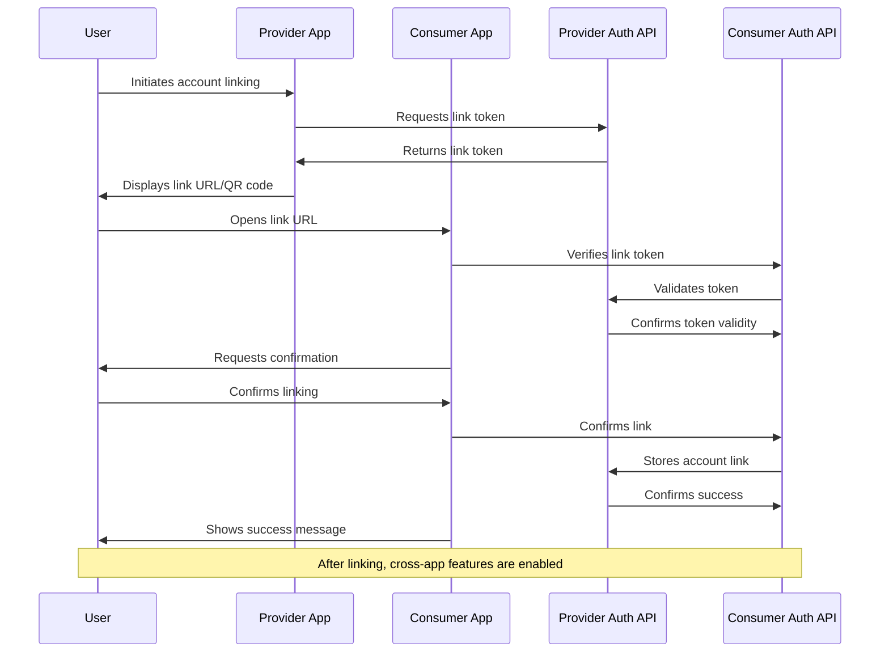
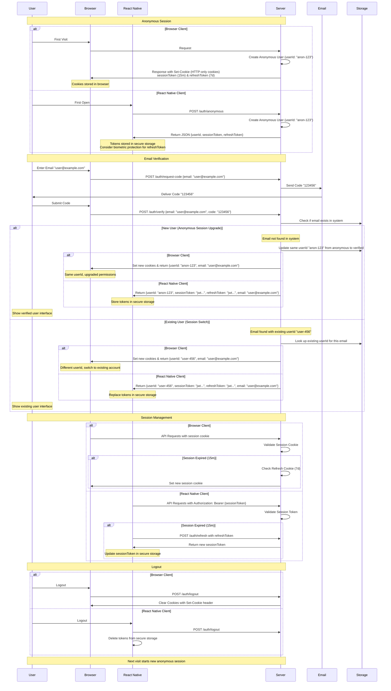
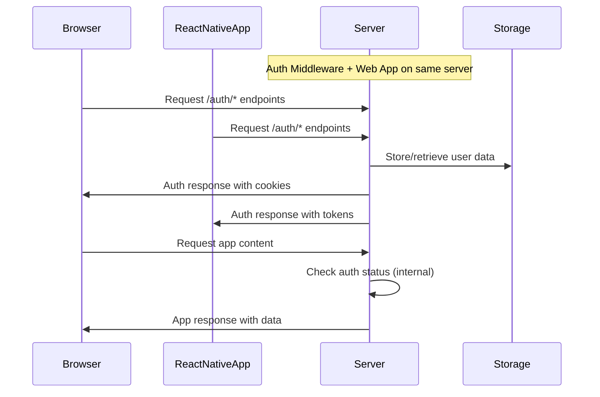

# 🔐 Auth Kit

A headless, isomorphic authentication toolkit that runs seamlessly across server-side, web, and React Native environments. Auth Kit provides a secure, low-latency authentication system with email verification and token management. Perfect for applications that need a robust, platform-agnostic auth system with a great developer experience.

## Table of Contents

- [Installation](#installation)
- [Key Features](#key-features)
- [Account Linking](#account-linking)
  - [Provider-Consumer Model](#provider-consumer-model)
  - [Account Linking Flow](#account-linking-flow)
  - [Implementation](#implementation)
  - [Security Considerations](#security-considerations)
  - [Benefits](#benefits)
- [Authentication Flow](#authentication-flow)
- [Usage Guide](#usage-guide)
  - [1️⃣ Set up Environment and Server](#1️⃣-set-up-environment-and-server)
  - [2️⃣ Access Auth in React Router Routes](#2️⃣-access-auth-in-react-router-routes)
  - [3️⃣ Configure Server](#3️⃣-configure-server)
  - [4️⃣ Set up Auth Client and React Integration](#4️⃣-set-up-auth-client-and-react-integration)
- [Architecture](#architecture)
- [API Reference](#api-reference)
  - [Client API](#client-api)
  - [Provider Client API](#provider-client-api)
  - [Consumer Client API](#consumer-client-api)
  - [Server API](#server-api)
  - [React API](#react-api)
  - [Test API](#test-api)
  - [HTTP Endpoints](#http-endpoints)
- [Troubleshooting](#troubleshooting)
- [TypeScript Types](#typescript-types)
- [Testing with Storybook](#testing-with-storybook)

## Installation

```bash
npm install @open-game-collective/auth-kit
# or
yarn add @open-game-collective/auth-kit
# or
pnpm add @open-game-collective/auth-kit
```

## Key Features

- 🌐 **Isomorphic & Headless**: Runs anywhere - server-side, web browsers, or React Native. Bring your own UI components.
- 🎭 **Anonymous-First Auth**: Users start with an anonymous session that can be upgraded to a verified account.
- 📧 **Email Verification**: Secure email verification flow with customizable storage and delivery options.
- 🔐 **JWT-Based Tokens**: Secure session and refresh tokens with automatic refresh.
- ⚡️ **Edge-Ready**: Optimized for Cloudflare Workers for minimal latency.
- 🎯 **Type-Safe**: Full TypeScript support with detailed types.
- 🎨 **React Integration**: Ready-to-use hooks and components for auth state management.
- 🔌 **Customizable**: Integrate with your own storage, email delivery systems, and UI components.
- 📱 **Platform Agnostic**: Same API and behavior across web and mobile platforms.
- 🔗 **Account Linking**: Securely link user accounts across different applications to enable cross-application features like push notifications.

## Account Linking

Auth Kit provides a robust account linking system that allows applications to connect user accounts across the Open Game ecosystem. This enables rich cross-application features such as push notifications, achievement sharing, and synchronized experiences, while maintaining each application's independent authentication system.

### Provider-Consumer Model

Account linking follows a provider-consumer model:

- **Provider** (e.g., OpenGame): The central identity provider that manages user accounts
- **Consumer** (e.g., Game applications): Applications that integrate with the provider for feature sharing

Account linking is not about authentication delegation, but rather about enabling cross-application features such as:

- Push notifications from the provider app for events in consumer apps
- Profile and achievement sharing across applications
- Synchronized preferences and settings
- Cross-application rewards and progression
- Unified social features and friend connections

Each application maintains its own authentication system, but linking accounts allows for a richer, connected user experience across the ecosystem.

### Account Linking Flow

The following diagram illustrates how accounts are linked between the provider (OpenGame) and consumer applications (games), enabling cross-application features while maintaining separate authentication systems:


```mermaid
sequenceDiagram
    participant User
    participant OGApp as Provider App
    participant GameApp as Consumer App
    participant ProviderAuth as Provider Auth API
    participant ConsumerAuth as Consumer Auth API
    
    User->>OGApp: Initiates account linking
    OGApp->>ProviderAuth: Requests link token
    ProviderAuth->>OGApp: Returns link token
    OGApp->>User: Displays link URL/QR code
    User->>GameApp: Opens link URL
    GameApp->>ConsumerAuth: Verifies link token
    ConsumerAuth->>ProviderAuth: Validates token
    ProviderAuth->>ConsumerAuth: Confirms token validity
    GameApp->>User: Requests confirmation
    User->>GameApp: Confirms linking
    GameApp->>ConsumerAuth: Confirms link
    ConsumerAuth->>ProviderAuth: Stores account link
    ProviderAuth->>ConsumerAuth: Confirms success
    GameApp->>User: Shows success message
    Note over User, ConsumerAuth: After linking, cross-app features are enabled
```

Once accounts are linked, the provider application can send push notifications about events in the consumer application, share profile information between applications, and enable other cross-application features - all while each application maintains its own independent authentication system.

### Implementation

Auth Kit provides specialized APIs for both providers and consumers:

#### Provider Implementation

```typescript
// Server-side setup
import { createProviderAuthRouter } from "@open-game-collective/auth-kit/provider/server";

const providerRouter = createProviderAuthRouter({
  hooks: {
    // Base auth hooks
    getUserIdByEmail: async ({ email, env }) => { /* ... */ },
    // ... other base hooks
    
    // Provider-specific hooks
    getGameIdFromApiKey: async ({ apiKey, env }) => { /* ... */ },
    storeAccountLink: async ({ openGameUserId, gameId, gameUserId, env }) => { /* ... */ },
    getLinkedAccounts: async ({ openGameUserId, env }) => { /* ... */ },
    removeAccountLink: async ({ openGameUserId, gameId, env }) => { /* ... */ },
  }
});

// Client-side implementation
import { createProviderAuthClient } from "@open-game-collective/auth-kit/provider";
import { createProviderAuthContext } from "@open-game-collective/auth-kit/provider/react";

const ProviderAuthContext = createProviderAuthContext();
const providerClient = createProviderAuthClient({
  host: "your-api.example.com",
  userId: "provider-123",
  sessionToken: "jwt-token"
});

function AccountLinkingUI() {
  return (
    <ProviderAuthContext.Provider client={providerClient}>
      <ProviderAuthContext.LinkedAccounts>
        <h2>Your Linked Accounts</h2>
        
        <ProviderAuthContext.LinkedAccountsList>
          {({ accounts, isLoading, error }) => (
            <div>
              {isLoading ? <Spinner /> : (
                <ul>
                  {accounts.map(account => (
                    <li key={account.gameId}>
                      {account.gameName} - {account.gameUserId}
                      <ProviderAuthContext.UnlinkAccount gameId={account.gameId}>
                        {({ onUnlink, isUnlinking, error }) => (
                          <button 
                            onClick={onUnlink} 
                            disabled={isUnlinking}
                            style={{ marginLeft: '10px' }}
                          >
                            {isUnlinking ? "Unlinking..." : "Unlink"}
                          </button>
                        )}
                      </ProviderAuthContext.UnlinkAccount>
                    </li>
                  ))}
                </ul>
              )}
              {error && <div className="error">{error}</div>}
            </div>
          )}
        </ProviderAuthContext.LinkedAccountsList>
      </ProviderAuthContext.LinkedAccounts>
      
      <ProviderAuthContext.InitiateLinking gameId="game-123">
        {({ onInitiate, isInitiating, error }) => (
          <button 
            onClick={async () => {
              const { linkToken } = await onInitiate();
              console.log(`Link URL: https://game.example.com/link?token=${linkToken}`);
            }} 
            disabled={isInitiating}
          >
            Link New Account
          </button>
        )}
      </ProviderAuthContext.InitiateLinking>
    </ProviderAuthContext.Provider>
  );
}
```

#### Consumer Implementation

```typescript
// Server-side setup
import { createConsumerAuthRouter } from "@open-game-collective/auth-kit/consumer/server";

const consumerRouter = createConsumerAuthRouter({
  hooks: {
    // Base auth hooks
    getUserIdByEmail: async ({ email, env }) => { /* ... */ },
    // ... other base hooks
    
    // Consumer-specific hooks
    storeOpenGameLink: async ({ gameUserId, openGameUserId, env }) => { /* ... */ },
    getOpenGameUserId: async ({ gameUserId, env }) => { /* ... */ },
    getOpenGameProfile: async ({ openGameUserId, env }) => { /* ... */ },
  },
  gameId: "your-game-id" // Required for consumer router
});

// Client-side implementation
import { createConsumerAuthClient } from "@open-game-collective/auth-kit/consumer";
import { createConsumerAuthContext } from "@open-game-collective/auth-kit/consumer/react";

const ConsumerAuthContext = createConsumerAuthContext();
const consumerClient = createConsumerAuthClient({
  host: "your-api.example.com",
  userId: "game-user-123",
  sessionToken: "jwt-token"
});

function LinkVerificationUI({ linkToken }) {
  return (
    <ConsumerAuthContext.Provider value={consumerClient}>
      <ConsumerAuthContext.VerifyLinkToken token={linkToken}>
        {({ isVerifying, isValid, openGameUserId, email, error }) => (
          <div>
            {isVerifying ? (
              <p>Verifying link...</p>
            ) : isValid ? (
              <ConsumerAuthContext.ConfirmLink 
                token={linkToken} 
                gameUserId="game-user-123"
              >
                {({ onConfirm, isConfirming, isConfirmed, error }) => (
                  <div>
                    <p>Link your account with {email}?</p>
                    <button 
                      onClick={onConfirm} 
                      disabled={isConfirming || isConfirmed}
                    >
                      {isConfirming ? "Linking..." : 
                       isConfirmed ? "Linked!" : "Confirm Link"}
                    </button>
                  </div>
                )}
              </ConsumerAuthContext.ConfirmLink>
            ) : (
              <p>Invalid or expired link token</p>
            )}
          </div>
        )}
      </ConsumerAuthContext.VerifyLinkToken>
    </ConsumerAuthContext.Provider>
  );
}
```

### Security Considerations

The account linking system includes several security features to ensure secure cross-application communication:

1. **JWT-Based Link Tokens**: Cryptographically signed tokens with short expiration times ensure secure linking process
2. **API Key Authentication**: Server-to-server communication secured with API keys for trusted application verification
3. **User Confirmation**: Explicit user consent required before enabling cross-application features
4. **Secure Storage**: Account links stored securely on both provider and consumer sides
5. **Unlinking Capability**: Users can disable cross-application features by unlinking accounts at any time
6. **Limited Data Sharing**: Only necessary data is shared between applications, with clear user consent
7. **Independent Authentication**: Each application maintains its own authentication system, with no credential sharing

### Benefits

- **Connected Ecosystem**: Enable rich interactions between different applications in the ecosystem
- **Enhanced User Experience**: Provide seamless cross-application features without requiring users to manually connect accounts
- **Push Notifications**: Allow the provider app to send notifications about events in linked consumer apps
- **Feature Sharing**: Share profiles, achievements, and other data across applications with user consent
- **Independent Authentication**: Each application maintains its own authentication while still enabling connected experiences
- **Secure Communication**: All communication between applications is secured with API keys and JWT tokens
- **User Control**: Users can link and unlink accounts at any time, maintaining control over their connected experience

For detailed implementation guidance, see the [Account Linking Implementation Guide](docs/account-linking.md).

## Authentication Flow


```mermaid
sequenceDiagram
    participant U as User
    participant B as Browser
    participant RN as React Native
    participant S as Server
    participant E as Email
    participant DB as Storage

    Note over U,S: Anonymous Session
    
    alt Browser Client
        U->>B: First Visit
        B->>S: Request
        S->>S: Create Anonymous User (userId: "anon-123")
        S->>B: Response with Set-Cookie (HTTP-only cookies)<br>sessionToken (15m) & refreshToken (7d)
        Note over B: Cookies stored in browser
    else React Native Client
        U->>RN: First Open
        RN->>S: POST /auth/anonymous
        S->>S: Create Anonymous User (userId: "anon-123")
        S->>RN: Return JSON {userId, sessionToken, refreshToken}
        Note over RN: Tokens stored in secure storage<br>Consider biometric protection for refreshToken
    end
    
    Note over U,S: Email Verification
    U->>B: Enter Email "user@example.com"
    B->>S: POST /auth/request-code {email: "user@example.com"}
    S->>E: Send Code "123456"
    E->>U: Deliver Code "123456"
    U->>B: Submit Code
    B->>S: POST /auth/verify {email: "user@example.com", code: "123456"}
    S->>DB: Check if email exists in system
    
    alt New User (Anonymous Session Upgrade)
        Note over S: Email not found in system
        S->>DB: Update same userId "anon-123" from anonymous to verified
        
        alt Browser Client
            S->>B: Set new cookies & return {userId: "anon-123", email: "user@example.com"}
            Note over B: Same userId, upgraded permissions
        else React Native Client
            S->>RN: Return {userId: "anon-123", sessionToken: "jwt...", refreshToken: "jwt...", email: "user@example.com"}
            Note over RN: Store tokens in secure storage
        end
        
        Note over U: Show verified user interface
    else Existing User (Session Switch)
        Note over S: Email found with existing userId "user-456"
        S->>DB: Look up existing userId for this email
        
        alt Browser Client
            S->>B: Set new cookies & return {userId: "user-456", email: "user@example.com"}
            Note over B: Different userId, switch to existing account
        else React Native Client
            S->>RN: Return {userId: "user-456", sessionToken: "jwt...", refreshToken: "jwt...", email: "user@example.com"}
            Note over RN: Replace tokens in secure storage
        end
        
        Note over U: Show existing user interface
    end
    
    Note over U,S: Session Management
    
    alt Browser Client
        B->>S: API Requests with session cookie
        S->>S: Validate Session Cookie
        alt Session Expired (15m)
            S->>S: Check Refresh Cookie (7d)
            S->>B: Set new session cookie
        end
    else React Native Client
        RN->>S: API Requests with Authorization: Bearer {sessionToken}
    S->>S: Validate Session Token
        alt Session Expired (15m)
            RN->>S: POST /auth/refresh with refreshToken
            S->>RN: Return new sessionToken
            Note over RN: Update sessionToken in secure storage
        end
    end
    
    Note over U,S: Logout
    
    alt Browser Client
        U->>B: Logout
        B->>S: POST /auth/logout
        S->>B: Clear Cookies with Set-Cookie header
    else React Native Client
        U->>RN: Logout
        RN->>S: POST /auth/logout
        RN->>RN: Delete tokens from secure storage
    end
    
    Note over U,S: Next visit starts new anonymous session
```

### User Data in JWT Tokens

Auth Kit uses JWT tokens to securely store and transmit user information. By default, the tokens include minimal data:

1. **Session Tokens** include:
   - `userId`: The unique identifier for the user
   - `sessionId`: A unique identifier for the session
   - `email`: The user's email address (if verified)
   - `aud`: Audience claim set to "SESSION"
   - `exp`: Expiration time (default: 15 minutes)

2. **Refresh Tokens** include:
   - `userId`: The unique identifier for the user
   - `aud`: Audience claim set to "REFRESH"
   - `exp`: Expiration time (default: 7 days for cookies, 1 hour for transient tokens)

You can extend the tokens to include additional user data by modifying the token creation functions:

```typescript
// Example: Including email in session tokens
async function createSessionToken(
  userId: string,
  email: string | null,
  secret: string,
  expiresIn: string = "15m"
): Promise<string> {
  const sessionId = crypto.randomUUID();
  return await new SignJWT({ 
    userId, 
    sessionId,
    email
  })
    .setProtectedHeader({ alg: "HS256" })
    .setAudience("SESSION")
    .setExpirationTime(expiresIn)
    .sign(new TextEncoder().encode(secret));
}
```

**Benefits of storing user data in JWTs:**
- Reduces database lookups for common user information
- Makes user data available on the client without additional API calls
- Simplifies client-side state management

**Considerations:**
- Only include non-sensitive data in tokens
- Keep tokens reasonably sized (avoid large payloads)
- Remember that JWT contents can be read (though not modified) by clients
- Update tokens when user data changes

The Auth Kit client automatically extracts and provides this data to your application through the auth state:

```typescript
const { userId, email } = authClient.getState();
```

### Authentication State

Auth Kit maintains a core state object that represents the current user's authentication status. This state is accessible through the client and can be subscribed to for real-time updates.

The `AuthState` type is defined as:

```typescript
/**
 * The authentication state object that represents the current user's session.
 * This is the core state object used throughout the auth system.
 */
export type AuthState = {
  /**
   * The unique identifier for the current user.
   * For anonymous users, this will be a randomly generated ID.
   * For verified users, this will be their permanent user ID.
   */
  userId: string;

  /**
   * The JWT session token used for authenticated requests.
   * This token has a short expiration (typically 15 minutes) and is
   * automatically refreshed using the refresh token when needed.
   */
  sessionToken: string | null;

  /**
   * The user's verified email address, if they have completed verification.
   * Will be null for anonymous users or users who haven't verified their email.
   * The presence of an email indicates the user is verified.
   */
  email: string | null;

  /**
   * Indicates if an authentication operation is currently in progress.
   * Used to show loading states in the UI during auth operations.
   */
  isLoading: boolean;

  /**
   * Any error that occurred during the last authentication operation.
   * Will be null if no error occurred.
   */
  error: string | null;
};
```

#### Working with Authentication State

You can access the current state at any time:

```typescript
const state = authClient.getState();
console.log(`User ID: ${state.userId}`);
console.log(`Is verified: ${Boolean(state.email)}`);
```

For reactive applications, you can subscribe to state changes:

```typescript
const unsubscribe = authClient.subscribe((state) => {
  console.log('Auth state updated:', state);
  
  if (state.email) {
    // User is verified
    showVerifiedUI();
  } else {
    // User is anonymous
    showAnonymousUI();
  }
  
  if (state.isLoading) {
    // Show loading indicator
    showLoadingSpinner();
  }
  
  if (state.error) {
    // Show error message
    showErrorNotification(state.error);
  }
});

// Later, when you no longer need updates:
unsubscribe();
```

#### React Integration

For React applications, Auth Kit provides components that automatically respond to state changes:

```jsx
import { createAuthContext } from '@open-game-collective/auth-kit/react';

const AuthContext = createAuthContext();

function App() {
  return (
    <AuthContext.Provider client={authClient}>
      <AuthContext.Loading>
        <LoadingSpinner />
      </AuthContext.Loading>
      
      <AuthContext.Verified>
        <VerifiedUserDashboard />
      </AuthContext.Verified>
      
      <AuthContext.Unverified>
        <EmailVerificationForm />
      </AuthContext.Unverified>
    </AuthContext.Provider>
  );
}
```

You can also use the `useSelector` hook to access specific parts of the state:

```jsx
function UserGreeting() {
  const email = AuthContext.useSelector(state => state.email);
  
  return (
    <h1>
      {email 
        ? `Welcome back, ${email}!` 
        : 'Welcome! Please verify your email.'}
    </h1>
  );
}
```

## Usage Guide

### Architecture Overview

Auth Kit is deployed with the auth middleware integrated into your application server:


```mermaid
sequenceDiagram
    participant Browser
    participant ReactNativeApp
    participant Server
    participant Storage
    
    Note over Server: Auth Middleware + Web App on same server
    
    Browser->>Server: Request /auth/* endpoints
    ReactNativeApp->>Server: Request /auth/* endpoints
    Server->>Storage: Store/retrieve user data
    Server->>Browser: Auth response with cookies
    Server->>ReactNativeApp: Auth response with tokens
    
    Browser->>Server: Request app content
    Server->>Server: Check auth status (internal)
    Server->>Browser: App response with data
```

In this deployment:
- **Browser clients** use HTTP cookies for authentication
- **React Native clients** store tokens in secure storage
- The same Auth API endpoints are used by all clients
- The authentication flow applies consistently across platforms

### Auth Middleware Setup

The Auth middleware handles all authentication routes and token management, integrated with your web application.

```typescript
// auth-worker.ts
import { AuthHooks, createAuthRouter, Router } from "@open-game-collective/auth-kit/server";
import { Env } from "./env";
import { WorkerEntrypoint } from "@cloudflare/workers-types";

export class AuthWorker extends WorkerEntrypoint<Env> {
  private router: Router<Env>;
  private hooks: AuthHooks<Env>;

  constructor() {
    super();
    
    // Define hooks using KV - only defined once when the worker is instantiated
    this.hooks = {
      getUserIdByEmail: async ({ email, env }) => {
        try {
          const userIdKey = `email:${email}`;
          return await env.AUTH_KV.get(userIdKey);
        } catch (error) {
          console.error("Error getting userId by email:", error);
          return null;
        }
      },

      storeVerificationCode: async ({ email, code, env }) => {
        try {
          const expiresAt = new Date(Date.now() + 10 * 60 * 1000); // 10 minutes
          const codeData = JSON.stringify({
            code,
            expiresAt: expiresAt.toISOString(),
          });
          
          await env.AUTH_KV.put(`verification:${email}`, codeData, {
            expirationTtl: 600, // 10 minutes in seconds
          });
        } catch (error) {
          console.error("Error storing verification code:", error);
        }
      },

      verifyVerificationCode: async ({ email, code, env }) => {
        try {
          const codeDataStr = await env.AUTH_KV.get(`verification:${email}`);
          if (!codeDataStr) return false;
          
          const codeData = JSON.parse(codeDataStr);
          const now = new Date();
          const expiresAt = new Date(codeData.expiresAt);
          
          return codeData.code === code && now < expiresAt;
        } catch (error) {
          console.error("Error verifying code:", error);
          return false;
        }
      },

      sendVerificationCode: async ({ email, code, env }) => {
        try {
          const response = await fetch("https://api.sendgrid.com/v3/mail/send", {
            method: "POST",
            headers: {
              Authorization: `Bearer ${env.SENDGRID_API_KEY}`,
              "Content-Type": "application/json",
            },
            body: JSON.stringify({
              personalizations: [{ to: [{ email }] }],
              from: { email: "auth@yourdomain.com" },
              subject: "Your verification code",
              content: [{ type: "text/plain", value: `Your code is: ${code}` }],
            }),
          });
          return response.ok;
        } catch (error) {
          console.error("Failed to send email:", error);
          return false;
        }
      },

      onNewUser: async ({ userId, env }) => {
        try {
          await env.AUTH_KV.put(`user:${userId}`, JSON.stringify({
            userId,
            createdAt: new Date().toISOString(),
          }));
        } catch (error) {
          console.error("Error creating new user:", error);
        }
      },

      onAuthenticate: async ({ userId, env }) => {
        try {
          const userDataStr = await env.AUTH_KV.get(`user:${userId}`);
          if (!userDataStr) return;
          
          const userData = JSON.parse(userDataStr);
          userData.lastLogin = new Date().toISOString();
          
          await env.AUTH_KV.put(`user:${userId}`, JSON.stringify(userData));
        } catch (error) {
          console.error("Error updating last login:", error);
        }
      },

      onEmailVerified: async ({ userId, email, env }) => {
        try {
          // Store email to userId mapping
          await env.AUTH_KV.put(`email:${email}`, userId);
          
          // Update user record
          const userDataStr = await env.AUTH_KV.get(`user:${userId}`);
          if (!userDataStr) return;
          
          const userData = JSON.parse(userDataStr);
          userData.email = email;
          userData.emailVerified = true;
          
          await env.AUTH_KV.put(`user:${userId}`, JSON.stringify(userData));
        } catch (error) {
          console.error("Error verifying email:", error);
        }
      },
      
      // Provider-specific hooks
      getGameIdFromApiKey: async ({ apiKey, env }) => {
        try {
          return await env.AUTH_KV.get(`apiKey:${apiKey}`);
        } catch (error) {
          console.error("Error getting game ID from API key:", error);
          return null;
        }
      },
      
      storeAccountLink: async ({ openGameUserId, gameId, gameUserId, env }) => {
        try {
          const linkData = {
            openGameUserId,
            gameId,
            gameUserId,
            linkedAt: new Date().toISOString(),
          };
          
          // Store link in both directions for easy lookup
          await env.AUTH_KV.put(
            `accountLink:${openGameUserId}:${gameId}`, 
            JSON.stringify(linkData)
          );
          
          await env.AUTH_KV.put(
            `gameLink:${gameId}:${gameUserId}`, 
            openGameUserId
          );
          
          return true;
        } catch (error) {
          console.error("Error storing account link:", error);
          return false;
        }
      },
      
      getLinkedAccounts: async ({ openGameUserId, env }) => {
        try {
          // List all account links for this user
          const links = await env.AUTH_KV.list({ prefix: `accountLink:${openGameUserId}:` });
          
          // Fetch each link's data
          const linkedAccounts = await Promise.all(
            links.keys.map(async (key) => {
              const linkDataStr = await env.AUTH_KV.get(key.name);
              if (!linkDataStr) return null;
              
              const linkData = JSON.parse(linkDataStr);
              return {
                gameId: linkData.gameId,
                gameUserId: linkData.gameUserId,
                linkedAt: linkData.linkedAt,
                gameName: env.GAME_NAMES[linkData.gameId] || linkData.gameId,
              };
            })
          );
          
          // Filter out any null values and return
          return linkedAccounts.filter(Boolean);
        } catch (error) {
          console.error("Error getting linked accounts:", error);
          return [];
        }
      },
      
      removeAccountLink: async ({ openGameUserId, gameId, env }) => {
        try {
          // Get the link data first to get the gameUserId
          const linkDataStr = await env.AUTH_KV.get(`accountLink:${openGameUserId}:${gameId}`);
          if (!linkDataStr) return false;
          
          const linkData = JSON.parse(linkDataStr);
          
          // Delete both link directions
          await env.AUTH_KV.delete(`accountLink:${openGameUserId}:${gameId}`);
          await env.AUTH_KV.delete(`gameLink:${gameId}:${linkData.gameUserId}`);
          
          return true;
        } catch (error) {
          console.error("Error removing account link:", error);
          return false;
        }
      },
      
      // Consumer-specific hooks
      storeOpenGameLink: async ({ gameUserId, openGameUserId, env }) => {
        try {
          const linkData = {
            openGameUserId,
            gameId: env.GAME_ID,
            gameUserId,
            linkedAt: new Date().toISOString(),
          };
          
          // Store link in both directions
          await env.AUTH_KV.put(
            `accountLink:${openGameUserId}:${env.GAME_ID}`, 
            JSON.stringify(linkData)
          );
          
          await env.AUTH_KV.put(
            `gameLink:${env.GAME_ID}:${gameUserId}`, 
            openGameUserId
          );
          
          return true;
        } catch (error) {
          console.error("Error storing open game link:", error);
          return false;
        }
      },
      
      getOpenGameUserId: async ({ gameUserId, env }) => {
        try {
          return await env.AUTH_KV.get(`gameLink:${env.GAME_ID}:${gameUserId}`);
        } catch (error) {
          console.error("Error getting open game user ID:", error);
          return null;
        }
      }
    };
    
    // Create the router once during initialization
    this.router = createAuthRouter({
      hooks: this.hooks,
      useTopLevelDomain: true
    });
  }
  
  // Override the fetch method from WorkerEntrypoint
  async fetch(request: Request, env: Env, ctx: ExecutionContext): Promise<Response> {
    return this.router.handle(request, env);
  }
}

// Export the worker
export default AuthWorker;
```

### Configuring Cloudflare KV

To use KV with your worker, you need to configure your `wrangler.toml` file:

```toml
name = "auth-kit-example"
main = "src/index.ts"
compatibility_date = "2023-10-30"

# Define the KV namespace
[[kv_namespaces]]
binding = "AUTH_KV"
id = "your-kv-namespace-id"
preview_id = "your-preview-kv-namespace-id"
```

Then, define your environment interface:

```typescript
// env.ts
export interface Env {
  AUTH_KV: KVNamespace;
  AUTH_SECRET: string;
  SENDGRID_API_KEY: string;
  GAME_ID?: string; // For consumer apps
  GAME_NAMES: Record<string, string>; // For provider apps
}
```

For production, you might want to use a more sophisticated logging solution:

```typescript
// logger.ts
export const logger = {
  debug: (message: string, ...args: any[]) => {
    if (process.env.NODE_ENV === 'development') {
      console.log(`[DEBUG] ${message}`, ...args);
    }
  },
  info: (message: string, ...args: any[]) => {
    console.log(`[INFO] ${message}`, ...args);
  },
  warn: (message: string, ...args: any[]) => {
    console.warn(`[WARN] ${message}`, ...args);
  },
  error: (message: string, error?: Error, ...args: any[]) => {
    console.error(`[ERROR] ${message}`, error, ...args);
    
    // In production, you might want to send errors to a monitoring service
    if (process.env.NODE_ENV === 'production' && typeof process.env.SENTRY_DSN === 'string') {
      // Send to error monitoring
    }
  }
};

// Usage in auth hooks
const hooks = {
  verifyVerificationCode: async ({ email, code, env }) => {
    logger.debug('Verifying code', { email, codeLength: code.length });
    // Verification logic...
  }
};
```

### Accessing Auth from Your Application

To integrate the auth system with your application, you can extend the `WorkerEntrypoint` class:

```typescript
// app/worker.ts (e.g., for Remix, Next.js, etc.)
import { Env } from "./env";
import { createRequestHandler } from "@remix-run/cloudflare";
import * as build from "@remix-run/dev/server-build";
import { AuthWorker } from "./auth-worker";
import { WorkerEntrypoint } from "@cloudflare/workers-types";
import { jwtVerify } from "jose";

export default class AppWorker extends WorkerEntrypoint<Env> {
  // Create an instance of the AuthWorker
  private authWorker = new AuthWorker();
  
  async fetch(request: Request, env: Env, ctx: ExecutionContext) {
    const url = new URL(request.url);
    
    // Handle auth routes with the AuthWorker
    if (url.pathname.startsWith('/auth/')) {
      return this.authWorker.fetch(request, env, ctx);
    }
    
    // For non-auth routes, extract auth info from cookies/headers
    // and pass it to your application
    const sessionToken = getCookie(request, 'auth_session_token');
    let authInfo = { isAuthenticated: false };
    
    if (sessionToken) {
      try {
        // Verify the session token
        const verified = await verifyToken(sessionToken, env.AUTH_SECRET);
        if (verified) {
          authInfo = {
            isAuthenticated: true,
            userId: verified.userId,
            email: verified.email,
          };
        }
      } catch (error) {
        console.error("Error verifying session token:", error);
      }
    }
    
    // Pass auth info to your application
    return createRequestHandler({
      build,
      mode: process.env.NODE_ENV,
      getLoadContext() {
        return { 
          env, 
          auth: authInfo
        };
      },
    })(request);
  }
}

// Helper functions for cookies and token verification
function getCookie(request: Request, name: string): string | undefined {
  const cookieHeader = request.headers.get("cookie") || request.headers.get("Cookie");
  if (!cookieHeader) return undefined;
  
  const cookies = cookieHeader.split(";").map((cookie) => cookie.trim());
  const cookie = cookies.find((cookie) => cookie.startsWith(`${name}=`));
  
  if (!cookie) return undefined;
  return decodeURIComponent(cookie.split("=")[1]);
}

async function verifyToken(token: string, secret: string) {
  try {
    const verified = await jwtVerify(token, new TextEncoder().encode(secret));
    return verified.payload;
  } catch (error) {
    return null;
  }
}
```

### Using KV with Auth Kit

Cloudflare KV provides several advantages for implementing Auth Kit hooks:

1. **Global Distribution**: KV data is replicated globally, providing low-latency access from any Cloudflare edge location.
2. **Shared State**: Unlike Durable Objects, KV allows sharing state across multiple workers and regions.
3. **Simple API**: KV provides a straightforward key-value API that's easy to use.
4. **Automatic Expiration**: KV supports automatic expiration for items like verification codes.
5. **High Read Performance**: KV is optimized for high-performance reads.

### Benefits of the Worker Class Approach

The `WorkerEntrypoint` class implementation shown above offers several advantages:

1. **Standard Cloudflare Pattern**: Using `WorkerEntrypoint` follows the recommended Cloudflare Workers pattern for class-based workers.
2. **Proper Inheritance**: Extends the base worker class, giving you access to all its features and lifecycle methods.
3. **Initialization Efficiency**: Hooks are defined only once when the worker is instantiated, not on every request.
4. **Type Safety**: The generic type parameter `<Env>` ensures proper typing of environment variables.
5. **Code Organization**: The class structure provides a clean way to organize related functionality.
6. **Composability**: Makes it easy to compose multiple worker functionalities by extending and delegating.
7. **Testability**: The class structure makes it easier to write unit tests for your auth implementation.
8. **Maintainability**: Separating the auth logic into its own class makes the codebase more maintainable.

This approach is particularly beneficial for high-traffic applications where performance is critical. By defining hooks and creating the router only once, you reduce the overhead of each request, resulting in faster response times and lower compute costs.

#### Integration with Auth Kit

To integrate KV with Auth Kit:

1. **Create the KV namespace** in your Cloudflare dashboard or using Wrangler.
2. **Implement the auth hooks** using KV operations.
3. **Create the auth router** in your worker's fetch handler.
4. **Handle auth routes** by checking the URL path.

#### Key Structure for KV

When using KV for auth data, a good key structure helps organize your data:

- `user:{userId}` - User data
- `email:{email}` - Maps email to userId
- `verification:{email}` - Verification codes
- `accountLink:{openGameUserId}:{gameId}` - Account links from provider perspective
- `gameLink:{gameId}:{gameUserId}` - Account links from consumer perspective
- `apiKey:{apiKey}` - Maps API keys to game IDs

This structure makes it easy to find and manage related data.

## API Reference

- [Client API](#client-api)
- [Provider Client API](#provider-client-api)
- [Consumer Client API](#consumer-client-api)
- [Server API](#server-api)
- [React API](#react-api)
- [Test API](#test-api)
- [HTTP Endpoints](#http-endpoints)
