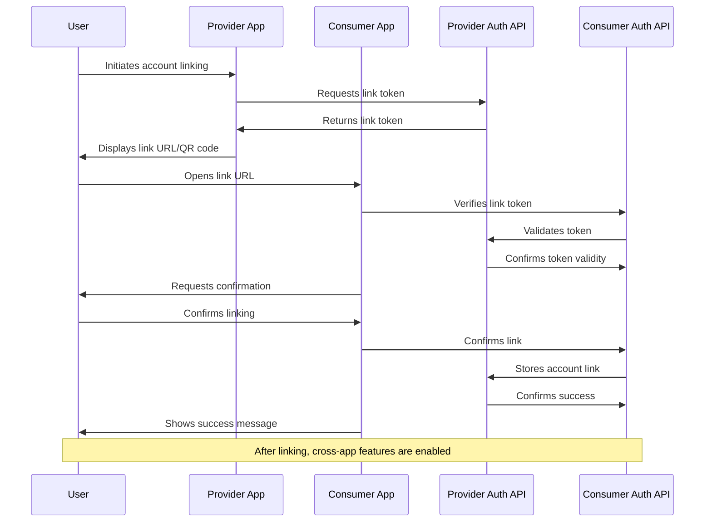

# 🔐 Auth Kit

A headless, isomorphic authentication toolkit that runs seamlessly across server-side, web, and React Native environments. Auth Kit provides a secure, low-latency authentication system with email verification and token management. Perfect for applications that need a robust, platform-agnostic auth system with a great developer experience.

## Table of Contents

- [Installation](#installation)
- [Key Features](#key-features)
- [Authentication Flow](#authentication-flow)
- [Usage Guide](#usage-guide)
  - [1️⃣ Set up Environment and Server](#1️⃣-set-up-environment-and-server)
  - [2️⃣ Access Auth in React Router Routes](#2️⃣-access-auth-in-react-router-routes)
  - [3️⃣ Configure Server](#3️⃣-configure-server)
  - [4️⃣ Set up Auth Client and React Integration](#4️⃣-set-up-auth-client-and-react-integration)
- [Architecture](#architecture)
  - [Middleware Architecture](#middleware-architecture)
- [Account Linking](#account-linking)
  - [Provider-Consumer Model](#provider-consumer-model)
  - [Account Linking Flow](#account-linking-flow)
  - [Implementation](#implementation)
  - [Security Considerations](#security-considerations)
  - [Benefits](#benefits)
- [API Reference](#api-reference)
  - [Client API](#client-api)
  - [Provider Client API](#provider-client-api)
  - [Consumer Client API](#consumer-client-api)
  - [Server API](#server-api)
  - [React API](#react-api)
  - [Test API](#test-api)
  - [HTTP Endpoints](#http-endpoints)
- [Troubleshooting](#troubleshooting)
- [TypeScript Types](#typescript-types)
- [Testing with Storybook](#testing-with-storybook)
- [Package Structure](#package-structure)
- [Recent Changes](#recent-changes)

## Installation

```bash
npm install @open-game-collective/auth-kit
# or
yarn add @open-game-collective/auth-kit
# or
pnpm add @open-game-collective/auth-kit
```

## Key Features

- **Isomorphic Design**: Works seamlessly across server-side, web, and React Native environments
- **Email Verification**: Secure email-based authentication with verification codes
- **Token Management**: Automatic handling of session and refresh tokens
- **Flexible Middleware**: Separation of authentication middleware from route handlers
- **Account Linking**: Cross-application authentication between provider and consumer applications
- **React Integration**: Ready-to-use React hooks and components
- **Cloudflare Workers Support**: Optimized for edge computing environments
- **TypeScript Support**: Full type safety and autocompletion

## Authentication Flow

Auth Kit uses a secure, token-based authentication flow:

1. **Request Verification Code**: User enters email and requests a verification code
2. **Email Delivery**: Verification code is sent to the user's email
3. **Code Verification**: User enters the code, which is verified on the server
4. **Token Generation**: Upon successful verification, session and refresh tokens are generated
5. **Authenticated Requests**: Subsequent requests include the session token for authentication
6. **Token Refresh**: When the session token expires, the refresh token is used to obtain a new one

This flow provides a secure, passwordless authentication system that works across all platforms.

## Usage Guide

### 1️⃣ Set up Environment and Server

To get started with Auth Kit, you'll need to set up your environment and server configuration:

```typescript
// server.ts or worker.ts
import { withAuth, AuthHooks } from "@open-game-collective/auth-kit/server";
import { Env } from "./env";

// Define your auth hooks
const authHooks: AuthHooks<Env> = {
  // Required: Get user ID by email
  getUserIdByEmail: async ({ email, env }) => {
    // Example with Cloudflare KV
    return await env.AUTH_KV.get(`email:${email}`);
  },
  
  // Required: Store verification code
  storeVerificationCode: async ({ email, code, expiresAt, env }) => {
    await env.AUTH_KV.put(
      `verification:${email}`,
      JSON.stringify({ code, expiresAt: expiresAt.toISOString() }),
      { expirationTtl: 900 } // 15 minutes
    );
  },
  
  // Required: Verify the code
  verifyVerificationCode: async ({ email, code, env }) => {
    const storedData = await env.AUTH_KV.get(`verification:${email}`);
    if (!storedData) return false;
    
    const { code: storedCode, expiresAt } = JSON.parse(storedData);
    return storedCode === code && new Date(expiresAt) > new Date();
  },
  
  // Required: Send verification code to user
  sendVerificationCode: async ({ email, code, env }) => {
    // Integrate with your email service
    console.log(`Sending code ${code} to ${email}`);
    // Example: await env.EMAIL_SERVICE.send(email, `Your verification code: ${code}`);
  }
};

// Create the auth middleware
const authMiddleware = withAuth(
  async (request, env, { userId, sessionId, sessionToken }) => {
    // This handler runs for non-auth routes
    const url = new URL(request.url);
    
    // Example of a protected route
    if (url.pathname === '/dashboard') {
      return new Response(`Welcome to your dashboard, user ${userId}!`);
    }
    
    // Default response for other routes
    return new Response('Hello World');
  },
  {
    hooks: authHooks,
    useTopLevelDomain: true, // Optional: Use top-level domain for cookies
    basePath: "/auth" // Optional: Base path for auth routes
  }
);

// Export the worker handler
export default {
  async fetch(request: Request, env: Env, ctx: ExecutionContext) {
    return authMiddleware(request, env, ctx);
  }
};
```

For Cloudflare Workers, configure your `wrangler.toml`:

```toml
name = "auth-kit-example"
main = "src/index.ts"
compatibility_date = "2024-03-25"

[[kv_namespaces]]
binding = "AUTH_KV"
id = "your-kv-namespace-id"

[vars]
# Environment variables

# Secrets (use `wrangler secret put AUTH_SECRET` to set)
# - AUTH_SECRET
```

### 2️⃣ Access Auth in React Router Routes

If you're using React Router or Remix, you can access authentication information in your routes:

```tsx
// app/routes/dashboard.tsx (Remix example)
import { useLoaderData } from "@remix-run/react";
import { json, LoaderFunctionArgs, redirect } from "@remix-run/cloudflare";

// Define loader function to access auth info
export async function loader({ context }: LoaderFunctionArgs) {
  // Auth info is passed from the Auth Kit middleware
  const { userId, sessionId, sessionToken } = context;
  
  if (!userId) {
    // Redirect to login if not authenticated
    return redirect("/login");
  }
  
  // Fetch user data using the userId
  const userData = await context.env.AUTH_KV.get(`user:${userId}`);
  const user = userData ? JSON.parse(userData) : null;
  
  return json({ user });
}

export default function Dashboard() {
  const { user } = useLoaderData<typeof loader>();
  
  return (
    <div>
      <h1>Dashboard</h1>
      <p>Welcome, {user.email}!</p>
      {/* Your dashboard content */}
    </div>
  );
}
```

For React Router (non-Remix):

```tsx
// src/routes/ProtectedRoute.tsx
import { Navigate, Outlet, useLocation } from "react-router-dom";
import { useAuth } from "../hooks/useAuth";

export function ProtectedRoute() {
  const { isAuthenticated, isLoading } = useAuth();
  const location = useLocation();
  
  if (isLoading) {
    return <div>Loading...</div>;
  }
  
  if (!isAuthenticated) {
    // Redirect to login if not authenticated
    return <Navigate to="/login" state={{ from: location }} replace />;
  }
  
  return <Outlet />;
}

// src/App.tsx
import { Routes, Route } from "react-router-dom";
import { ProtectedRoute } from "./routes/ProtectedRoute";
import { Dashboard } from "./routes/Dashboard";
import { Login } from "./routes/Login";
import { Home } from "./routes/Home";

export function App() {
  return (
    <Routes>
      <Route path="/login" element={<Login />} />
      <Route element={<ProtectedRoute />}>
        <Route path="/dashboard" element={<Dashboard />} />
        {/* Other protected routes */}
      </Route>
      <Route path="/" element={<Home />} />
    </Routes>
  );
}
```

### 3️⃣ Configure Server

For more advanced server configurations, you can separate auth routes from application routes:

```typescript
// server.ts
import { createAuthRouter, withAuth } from "@open-game-collective/auth-kit/server";
import { createRequestHandler } from "@remix-run/cloudflare";
import * as build from "@remix-run/dev/server-build";

// Create the Remix request handler
const remixHandler = createRequestHandler(build);

// Define auth hooks
const authHooks = {
  // ... your hooks implementation
};

// Create the auth router for auth-specific routes
const authRouter = createAuthRouter({
  hooks: authHooks,
  useTopLevelDomain: true,
  basePath: "/auth"
});

// Create the auth handler for application routes
const appHandler = withAuth(
  async (request, env, { userId, sessionId, sessionToken }) => {
    // Pass auth info to Remix
    return remixHandler(request, {
      env,
      userId,
      sessionId,
      sessionToken,
    });
  },
  {
    hooks: authHooks,
    useTopLevelDomain: true
  }
);

// Main worker entry point
export default {
  async fetch(request: Request, env: Env, ctx: ExecutionContext) {
    const url = new URL(request.url);
    
    // Handle auth routes with the auth router
    if (url.pathname.startsWith('/auth/')) {
      return authRouter(request, env, ctx);
    }
    
    // Handle application routes with the auth handler
    return appHandler(request, env, ctx);
  }
};
```

For Durable Objects:

```typescript
// durable-object.ts
import { withAuth } from "@open-game-collective/auth-kit/server";
import { createRequestHandler } from "@remix-run/cloudflare";
import * as build from "@remix-run/dev/server-build";

// Create the Remix request handler
const remixHandler = createRequestHandler(build);

// Define auth hooks
const authHooks = {
  // ... your hooks implementation
};

// Create the auth middleware for the Durable Object
const authMiddleware = withAuth(
  async (request, env, { userId, sessionId, sessionToken }) => {
    // Pass auth info to Remix
    return remixHandler(request, {
      env,
      userId,
      sessionId,
      sessionToken,
    });
  },
  {
    hooks: authHooks,
    useTopLevelDomain: true,
    basePath: "/auth" // This tells withAuth to handle /auth/* routes internally
  }
);

// Durable Object implementation
export class AppDO extends DurableObject {
  async fetch(request: Request) {
    // No need to check for /auth/ paths - withAuth handles that internally
    return authMiddleware(request, this.env);
  }
}

// Main worker entry point
export default {
  async fetch(request: Request, env: Env, ctx: ExecutionContext) {
    const url = new URL(request.url);
    
    // For all routes, use the Durable Object
    const id = env.APP_DO.idFromName("default");
    const appDO = env.APP_DO.get(id);
    return appDO.fetch(request);
  }
};
```

### 4️⃣ Set up Auth Client and React Integration

On the client side, set up the Auth Kit client and React integration:

```tsx
// src/auth.ts
import { createAuthClient } from "@open-game-collective/auth-kit/client";
import { createAuthContext } from "@open-game-collective/auth-kit/react";

// Create the auth context
export const AuthContext = createAuthContext();

// Initialize the client
export function initializeAuthClient() {
  // Get auth info from cookies or localStorage
  const userId = getCookie("userId");
  const sessionToken = getCookie("sessionToken");
  
  if (!userId || !sessionToken) {
    return null;
  }
  
  return createAuthClient({
    host: "your-api.example.com",
    userId,
    sessionToken
  });
}

// Helper function to get cookies
function getCookie(name: string) {
  const value = `; ${document.cookie}`;
  const parts = value.split(`; ${name}=`);
  if (parts.length === 2) return parts.pop()?.split(';').shift();
  return null;
}
```

Then, set up the React provider:

```tsx
// src/App.tsx
import { useState, useEffect } from "react";
import { BrowserRouter } from "react-router-dom";
import { AuthContext, initializeAuthClient } from "./auth";
import { Routes } from "./Routes";

export function App() {
  const [client, setClient] = useState(null);
  
  useEffect(() => {
    setClient(initializeAuthClient());
  }, []);
  
  return (
    <BrowserRouter>
      <AuthContext.Provider client={client}>
        <Routes />
      </AuthContext.Provider>
    </BrowserRouter>
  );
}
```

Create login and registration components:

```tsx
// src/components/Login.tsx
import { useState } from "react";
import { AuthContext } from "../auth";

export function Login() {
  const [email, setEmail] = useState("");
  const [code, setCode] = useState("");
  const [codeSent, setCodeSent] = useState(false);
  const client = AuthContext.useClient();
  const { isLoading, error } = AuthContext.useSelector(state => ({
    isLoading: state.isLoading,
    error: state.error
  }));
  
  const handleRequestCode = async (e) => {
    e.preventDefault();
    await client.requestCode(email);
    setCodeSent(true);
  };
  
  const handleVerifyCode = async (e) => {
    e.preventDefault();
    const result = await client.verifyEmail(email, code);
    if (result.success) {
      // Redirect to dashboard or home page
      window.location.href = "/dashboard";
    }
  };
  
  return (
    <div>
      <h1>Login</h1>
      {!codeSent ? (
        <form onSubmit={handleRequestCode}>
          <label>
            Email:
            <input 
              type="email" 
              value={email} 
              onChange={(e) => setEmail(e.target.value)} 
              required 
            />
          </label>
          <button type="submit" disabled={isLoading}>
            {isLoading ? "Sending..." : "Request Code"}
          </button>
        </form>
      ) : (
        <form onSubmit={handleVerifyCode}>
          <p>We sent a verification code to {email}</p>
          <label>
            Verification Code:
            <input 
              type="text" 
              value={code} 
              onChange={(e) => setCode(e.target.value)} 
              required 
            />
          </label>
          <button type="submit" disabled={isLoading}>
            {isLoading ? "Verifying..." : "Verify Code"}
          </button>
        </form>
      )}
      {error && <p className="error">{error}</p>}
    </div>
  );
}
```

Create a hook to access auth state in your components:

```tsx
// src/hooks/useAuth.ts
import { useEffect } from "react";
import { AuthContext } from "../auth";

export function useAuth() {
  const client = AuthContext.useClient();
  const state = AuthContext.useSelector(state => state);
  
  useEffect(() => {
    // Refresh the session when the component mounts
    if (client) {
      client.refresh().catch(err => {
        console.error("Failed to refresh session:", err);
      });
    }
  }, [client]);
  
  const logout = async () => {
    if (client) {
      await client.logout();
      window.location.href = "/login";
    }
  };
  
  return {
    isAuthenticated: !!state.userId,
    isLoading: state.isLoading,
    error: state.error,
    email: state.email,
    userId: state.userId,
    logout
  };
}
```

Now you can use this hook in your components:

```tsx
// src/components/Header.tsx
import { useAuth } from "../hooks/useAuth";

export function Header() {
  const { isAuthenticated, email, logout } = useAuth();
  
  return (
    <header>
      <nav>
        <a href="/">Home</a>
        {isAuthenticated ? (
          <>
            <a href="/dashboard">Dashboard</a>
            <span>{email}</span>
            <button onClick={logout}>Logout</button>
          </>
        ) : (
          <a href="/login">Login</a>
        )}
      </nav>
    </header>
  );
}
```

## Architecture

Auth Kit is designed with a modular architecture that separates concerns and provides flexibility for different use cases.

### Middleware Architecture

Auth Kit provides a flexible middleware architecture that separates authentication middleware from route handlers. This is particularly useful for environments like Cloudflare Workers where middleware and route handling need to be distinct.

#### Key Components

- **`createAuthRouter`**: Handles auth-specific routes like `/auth/*`
- **`withAuth`**: Creates middleware that applies authentication to your application handler

#### Integration with Cloudflare Workers

Here's how to integrate Auth Kit with Cloudflare Workers and Remix:

```typescript
import { AuthHooks, withAuth } from "@open-game-collective/auth-kit/server";
import { createRequestHandler, logDevReady } from "@remix-run/cloudflare";
import * as build from "@remix-run/dev/server-build";

// Create the Remix request handler
const handleRemixRequest = createRequestHandler(build);

if (process.env.NODE_ENV === "development") {
  logDevReady(build);
}

// Define auth hooks
const authHooks: AuthHooks<Env> = {
  getUserIdByEmail: async ({ email, env }) => {
    return await env.KV_STORAGE.get(`email:${email}`);
  },
  // ... other hooks implementation
};

// Create the auth middleware
const authMiddleware = withAuth(
  async (request, env, { userId, sessionId, sessionToken }) => {
    // This handler runs for non-auth routes
    // Auth routes like /auth/* are handled automatically by the middleware
    
    // Pass auth info to Remix
    return handleRemixRequest(request, {
      env,
      userId,
      sessionId,
      sessionToken,
    });
  },
  {
    hooks: authHooks,
    useTopLevelDomain: true,
    basePath: "/auth" // This tells withAuth to handle /auth/* routes internally
  }
);

// Main worker entry point
export default {
  async fetch(request: Request, env: Env, ctx: ExecutionContext) {
    // All requests go through the auth middleware
    // - Auth routes like /auth/* are handled automatically
    // - Other routes get authentication and are passed to the Remix request handler
    return authMiddleware(request, env, ctx);
  }
};
```

This pattern provides several benefits:

1. **Simplified Integration**: The `withAuth` function handles both auth routes and application routes
2. **Clear Separation of Concerns**: Auth routes are handled internally by the middleware
3. **Flexibility**: You can use this pattern with any framework or custom request handler
4. **Performance**: Auth routes are handled efficiently by the middleware

#### Alternative: Using a Separate Auth Router

If you need more control over auth routes, you can also use a separate router:

```typescript
import { AuthHooks, createAuthRouter, withAuth } from "@open-game-collective/auth-kit/server";
import { createRequestHandler, logDevReady } from "@remix-run/cloudflare";
import * as build from "@remix-run/dev/server-build";

// Create the Remix request handler
const handleRemixRequest = createRequestHandler(build);

if (process.env.NODE_ENV === "development") {
  logDevReady(build);
}

// Define auth hooks
const authHooks: AuthHooks<Env> = {
  getUserIdByEmail: async ({ email, env }) => {
    return await env.KV_STORAGE.get(`email:${email}`);
  },
  // ... other hooks implementation
};

// Create the auth router for handling auth routes
const authRouter = createAuthRouter({
  hooks: authHooks,
  useTopLevelDomain: true,
  basePath: "/auth"
});

// Define your application handler function
const handleAppRequest = async (
  request: Request, 
  env: Env, 
  authInfo: { userId: string, sessionId: string, sessionToken: string }
) => {
  const { userId, sessionId, sessionToken } = authInfo;
  
  // Pass auth info to Remix
  return await handleRemixRequest(request, {
    env,
    userId,
    sessionId,
    sessionToken,
  });
};

// Create the auth handler using withAuth
const handler = withAuth(handleAppRequest, {
  hooks: authHooks,
  useTopLevelDomain: true
});

// Main worker entry point
export default {
  async fetch(request: Request, env: Env, ctx: ExecutionContext) {
    const url = new URL(request.url);
    
    // Handle auth routes with the auth router
    if (url.pathname.startsWith('/auth/')) {
      return authRouter(request, env, ctx);
    }
    
    // Handle all other routes with the auth handler, which passes them to the Remix request handler
    return handler(request, env, ctx);
  }
};
```

This approach gives you more control over how auth routes are handled, which can be useful in specific scenarios like:
- When you need to apply different middleware to auth routes
- When you want to handle auth routes at the edge but process application routes in a Durable Object
- When you need to customize the auth route handling beyond what `withAuth` provides

#### Example with Durable Objects

If you're using Durable Objects, you can adapt the pattern like this:

```typescript
import { AuthHooks, withAuth } from "@open-game-collective/auth-kit/server";
import { createRequestHandler } from "@remix-run/cloudflare";
import * as build from "@remix-run/dev/server-build";
import { DurableObject } from "cloudflare:workers";

// Create the Remix request handler
const handleRemixRequest = createRequestHandler(build);

// Define auth hooks
const authHooks: AuthHooks<Env> = {
  // ... hooks implementation
};

// Create the auth middleware for the Durable Object
const authMiddleware = withAuth(
  async (request, env, { userId, sessionId, sessionToken }) => {
    // Pass auth info to Remix
    return handleRemixRequest(request, {
      env,
      userId,
      sessionId,
      sessionToken,
    });
  },
  {
    hooks: authHooks,
    useTopLevelDomain: true,
    basePath: "/auth" // This tells withAuth to handle /auth/* routes internally
  }
);

// Durable Object implementation
export class AppDO extends DurableObject<Env> {
  async fetch(request: Request): Promise<Response> {
    // No need to check for /auth/ paths - withAuth handles that internally
    return authMiddleware(request, this.env);
  }
}

// Main worker entry point
export default {
  async fetch(request: Request, env: Env, ctx: ExecutionContext) {
    // For all routes, use the Durable Object
    const id = env.APP_DO.idFromName("default");
    const appDO = env.APP_DO.get(id);
    return appDO.fetch(request);
  }
};
```

For more detailed examples, including provider/consumer implementations, see the documentation.

## Account Linking

Auth Kit provides a robust account linking system that allows applications to connect user accounts across the Open Game ecosystem. This enables rich cross-application features such as push notifications, achievement sharing, and synchronized experiences, while maintaining each application's independent authentication system.

### Provider-Consumer Model

Account linking follows a provider-consumer model:

- **Provider** (e.g., OpenGame): The central identity provider that manages user accounts
- **Consumer** (e.g., Game applications): Applications that integrate with the provider for feature sharing

Account linking is not about authentication delegation, but rather about enabling cross-application features such as:

- Push notifications from the provider app for events in consumer apps
- Profile and achievement sharing across applications
- Synchronized preferences and settings
- Cross-application rewards and progression
- Unified social features and friend connections

Each application maintains its own authentication system, but linking accounts allows for a richer, connected user experience across the ecosystem.

### Account Linking Flow

The following diagram illustrates how accounts are linked between the provider (OpenGame) and consumer applications (games), enabling cross-application features while maintaining separate authentication systems:


```mermaid
sequenceDiagram
    participant User
    participant OGApp as Provider App
    participant GameApp as Consumer App
    participant ProviderAuth as Provider Auth API
    participant ConsumerAuth as Consumer Auth API
    
    User->>OGApp: Initiates account linking
    OGApp->>ProviderAuth: Requests link token
    ProviderAuth->>OGApp: Returns link token
    OGApp->>User: Displays link URL/QR code
    User->>GameApp: Opens link URL
    GameApp->>ConsumerAuth: Verifies link token
    ConsumerAuth->>ProviderAuth: Validates token
    ProviderAuth->>ConsumerAuth: Confirms token validity
    GameApp->>User: Requests confirmation
    User->>GameApp: Confirms linking
    GameApp->>ConsumerAuth: Confirms link
    ConsumerAuth->>ProviderAuth: Stores account link
    ProviderAuth->>ConsumerAuth: Confirms success
    GameApp->>User: Shows success message
    Note over User, ConsumerAuth: After linking, cross-app features are enabled
```

Once accounts are linked, the provider application can send push notifications about events in the consumer application, share profile information between applications, and enable other cross-application features - all while each application maintains its own independent authentication system.

### Implementation

Auth Kit provides specialized APIs for both providers and consumers:

#### Provider Implementation

```typescript
// Server-side setup
import { createProviderAuthRouter } from "@open-game-collective/auth-kit/provider/server";

const providerRouter = createProviderAuthRouter({
  hooks: {
    // Base auth hooks
    getUserIdByEmail: async ({ email, env }) => { /* ... */ },
    // ... other base hooks
    
    // Provider-specific hooks
    getGameIdFromApiKey: async ({ apiKey, env }) => { /* ... */ },
    storeAccountLink: async ({ openGameUserId, gameId, gameUserId, env }) => { /* ... */ },
    getLinkedAccounts: async ({ openGameUserId, env }) => { /* ... */ },
    removeAccountLink: async ({ openGameUserId, gameId, env }) => { /* ... */ },
  },
  useTopLevelDomain: true, // Optional
  basePath: "/auth" // Optional, defaults to "/auth"
});

// Client-side implementation
import { createProviderAuthClient } from "@open-game-collective/auth-kit/provider/client";
import { createProviderAuthContext } from "@open-game-collective/auth-kit/provider/react";

const ProviderAuthContext = createProviderAuthContext();
const providerClient = createProviderAuthClient({
  host: "your-api.example.com",
  userId: "provider-123",
  sessionToken: "jwt-token"
});

function AccountLinkingUI() {
  return (
    <ProviderAuthContext.Provider client={providerClient}>
      <ProviderAuthContext.LinkedAccounts>
        <h2>Your Linked Accounts</h2>
        
        <ProviderAuthContext.LinkedAccountsList>
          {({ accounts, onUnlink }) => (
            <ul>
              {accounts.map(account => (
                <li key={account.gameId}>
                  {account.gameId}
                  <button onClick={() => onUnlink(account.gameId)}>
                    Unlink
                  </button>
                </li>
              ))}
            </ul>
          )}
        </ProviderAuthContext.LinkedAccountsList>
      </ProviderAuthContext.LinkedAccounts>
      
      <ProviderAuthContext.InitiateLinking>
        {({ onInitiate, isInitiating, error }) => (
          <button 
            onClick={async () => {
              const { linkToken } = await onInitiate();
              console.log(`Link URL: https://game.example.com/link?token=${linkToken}`);
            }} 
            disabled={isInitiating}
          >
            Link New Account
          </button>
        )}
      </ProviderAuthContext.InitiateLinking>
    </ProviderAuthContext.Provider>
  );
}
```

#### Consumer Implementation

```typescript
// Server-side setup
import { createConsumerAuthRouter } from "@open-game-collective/auth-kit/consumer/server";

const consumerRouter = createConsumerAuthRouter({
  hooks: {
    // Base auth hooks
    getUserIdByEmail: async ({ email, env }) => { /* ... */ },
    // ... other base hooks
    
    // Consumer-specific hooks
    storeOpenGameLink: async ({ gameUserId, openGameUserId, env }) => { /* ... */ },
    getOpenGameUserId: async ({ gameUserId, env }) => { /* ... */ },
    getOpenGameProfile: async ({ openGameUserId, env }) => { /* ... */ },
  },
  gameId: "your-game-id", // Required for consumer router
  useTopLevelDomain: true, // Optional
  basePath: "/auth" // Optional, defaults to "/auth"
});

// Client-side implementation
import { createConsumerAuthClient } from "@open-game-collective/auth-kit/consumer/client";
import { createConsumerAuthContext } from "@open-game-collective/auth-kit/consumer/react";

const ConsumerAuthContext = createConsumerAuthContext();
const consumerClient = createConsumerAuthClient({
  host: "your-api.example.com",
  userId: "game-user-123",
  sessionToken: "jwt-token",
  gameId: "your-game-id" // Required for consumer client
});

function LinkVerificationUI({ linkToken }) {
  return (
    <ConsumerAuthContext.Provider value={consumerClient}>
      <ConsumerAuthContext.VerifyLinkToken token={linkToken}>
        {({ isVerifying, isValid, openGameUserId, email, error }) => (
          <div>
            {isVerifying ? (
              <p>Verifying link...</p>
            ) : isValid ? (
              <ConsumerAuthContext.ConfirmLink 
                token={linkToken} 
                gameUserId="game-user-123"
              >
                {({ onConfirm, isConfirming, isConfirmed, error }) => (
                  <div>
                    <p>Link your account with {email}?</p>
                    <button 
                      onClick={onConfirm} 
                      disabled={isConfirming || isConfirmed}
                    >
                      {isConfirming ? "Linking..." : 
                       isConfirmed ? "Linked!" : "Confirm Link"}
                    </button>
                  </div>
                )}
              </ConsumerAuthContext.ConfirmLink>
            ) : (
              <p>Invalid or expired link token</p>
            )}
          </div>
        )}
      </ConsumerAuthContext.VerifyLinkToken>
    </ConsumerAuthContext.Provider>
  );
}
```

### Security Considerations

The account linking system includes several security features to ensure secure cross-application communication:

1. **JWT-Based Link Tokens**: Cryptographically signed tokens with short expiration times ensure secure linking process
2. **API Key Authentication**: Server-to-server communication secured with API keys for trusted application verification
3. **User Confirmation**: Explicit user consent required before enabling cross-application features
4. **Secure Storage**: Account links stored securely on both provider and consumer sides
5. **Unlinking Capability**: Users can disable cross-application features by unlinking accounts at any time
6. **Limited Data Sharing**: Only necessary data is shared between applications, with clear user consent
7. **Independent Authentication**: Each application maintains its own authentication system, with no credential sharing

### Benefits

- **Connected Ecosystem**: Enable rich interactions between different applications in the ecosystem
- **Enhanced User Experience**: Provide seamless cross-application features without requiring users to manually connect accounts
- **Push Notifications**: Allow the provider app to send notifications about events in linked consumer apps
- **Feature Sharing**: Share profiles, achievements, and other data across applications with user consent
- **Independent Authentication**: Each application maintains its own authentication while still enabling connected experiences
- **Secure Communication**: All communication between applications is secured with API keys and JWT tokens
- **User Control**: Users can link and unlink accounts at any time, maintaining control over their connected experience

For detailed implementation guidance, see the [Account Linking Implementation Guide](docs/account-linking.md).

## API Reference

### Client API

The client provides methods for managing authentication:

```typescript
interface AuthClient {
  // Core authentication methods
  getState(): AuthState;
  subscribe(callback: (state: AuthState) => void): () => void;
  requestCode(email: string): Promise<void>;
  verifyEmail(email: string, code: string): Promise<{ success: boolean }>;
  logout(): Promise<void>;
  refresh(): Promise<void>;

  // Mobile-to-web authentication (mobile only)
  getWebAuthCode(): Promise<{ code: string; expiresIn: number }>;
}
```

**Core Methods:**

- `getState()`: Get current authentication state
- `subscribe(callback)`: Subscribe to state changes
- `requestCode(email)`: Request email verification code
- `verifyEmail(email, code)`: Verify email with code
- `logout()`: Clear session and tokens
- `refresh()`: Refresh session using refresh token

**Mobile-to-Web Method:**

- `getWebAuthCode()`: Generate a one-time code for web authentication (mobile only)
  ```typescript
  const { code, expiresIn } = await client.getWebAuthCode();
  // code: One-time auth code
  // expiresIn: Expiration time in seconds (e.g. 300 for 5 minutes)
  ```

**Creating a Client:**

```typescript
import { createAuthClient } from '@open-game-collective/auth-kit/client';

const client = createAuthClient({
  host: 'your-api.example.com',
  userId: 'user-123',
  sessionToken: 'jwt-token',
  // Optional initial state
  initialState: {
    email: 'user@example.com',
    isLoading: false,
    error: null
  }
});
```

**Creating an Anonymous User:**

```typescript
import { createAnonymousUser } from '@open-game-collective/auth-kit/client';

const { userId, sessionToken } = await createAnonymousUser({
  host: 'your-api.example.com',
  // Optional parameters
  refreshTokenExpiresIn: '7d',
  sessionTokenExpiresIn: '15m'
});
```

### Provider Client API

The provider client extends the base client with methods for managing linked accounts:

```typescript
interface ProviderAuthClient extends AuthClient {
  getLinkedAccounts(): Promise<LinkedAccount[]>;
  initiateAccountLinking(gameId: string): Promise<{ linkToken: string; expiresAt: string }>;
  unlinkAccount(gameId: string): Promise<boolean>;
  getState(): ProviderAuthState;
  subscribe(callback: (state: ProviderAuthState) => void): () => void;
}
```

**Provider-Specific Methods:**

- `getLinkedAccounts()`: Get list of accounts linked to the provider account
- `initiateAccountLinking(gameId)`: Generate a link token for a specific game
- `unlinkAccount(gameId)`: Remove link between provider account and game account

**Creating a Provider Client:**

```typescript
import { createProviderAuthClient } from '@open-game-collective/auth-kit/provider/client';

const providerClient = createProviderAuthClient({
  host: 'your-api.example.com',
  userId: 'provider-123',
  sessionToken: 'jwt-token',
  // Optional initial state
  initialState: {
    linkedAccounts: [],
    requests: {}
  }
});
```

### Consumer Client API

The consumer client extends the base client with methods for managing links with the provider:

```typescript
interface ConsumerAuthClient extends AuthClient {
  getOpenGameLinkStatus(): Promise<{
    isLinked: boolean;
    openGameUserId?: string;
    linkedAt?: string;
    profile?: Record<string, any>;
  }>;
  verifyLinkToken(token: string): Promise<{
    valid: boolean;
    openGameUserId?: string;
    email?: string;
  }>;
  confirmLink(token: string, gameUserId: string): Promise<boolean>;
  getState(): ConsumerAuthState;
  subscribe(callback: (state: ConsumerAuthState) => void): () => void;
}
```

**Consumer-Specific Methods:**

- `getOpenGameLinkStatus()`: Check if the consumer account is linked with a provider account
- `verifyLinkToken(token)`: Verify a link token from a provider
- `confirmLink(token, gameUserId)`: Confirm linking between consumer and provider accounts

**Creating a Consumer Client:**

```typescript
import { createConsumerAuthClient } from '@open-game-collective/auth-kit/consumer/client';

const consumerClient = createConsumerAuthClient({
  host: 'your-api.example.com',
  userId: 'game-user-123',
  sessionToken: 'jwt-token',
  gameId: 'your-game-id', // Required for consumer client
  // Optional initial state
  initialState: {
    openGameLink: undefined,
    requests: {}
  }
});
```

### Server API

The server provides three main exports for each type of server (base, provider, and consumer):

1. **Router Creation**:
   - `createAuthRouter`: Creates a base auth router that handles all auth endpoints
   - `createProviderAuthRouter`: Creates a provider auth router for account linking
   - `createConsumerAuthRouter`: Creates a consumer auth router for OpenGame linking

2. **Authentication Middleware**:
   - `withAuth` (from `/server`): Middleware that integrates base authentication with your app
   - `withAuth` (from `/provider/server`): Middleware for provider authentication
   - `withAuth` (from `/consumer/server`): Middleware for consumer authentication

**Important**: The `withAuth` middleware handles both auth routes (like `/auth/*`) AND your custom routes. In most cases, you only need to use `withAuth` without a separate auth router.

**Using the withAuth Middleware (Recommended):**

```typescript
import { withAuth } from '@open-game-collective/auth-kit/server';
import { createRequestHandler } from '@remix-run/cloudflare';
import * as build from '@remix-run/dev/server-build';

// Create the Remix request handler
const remixHandler = createRequestHandler(build);

// Create the middleware once when the module is loaded
const authMiddleware = withAuth(
  async (request, env, { userId, sessionId, sessionToken }) => {
    // This handler runs for non-auth routes
    // Auth routes like /auth/* are handled automatically by the middleware
    
    // Pass auth info to Remix
    return remixHandler(request, {
      env,
      userId,
      sessionId,
      sessionToken,
      // Any other context you want to provide to your routes
    });
  },
  {
    hooks: {
      // Same hooks as createAuthRouter
      getUserIdByEmail: async ({ email, env }) => { /* ... */ },
      // ... other hooks
    },
    useTopLevelDomain: true, // Optional
    basePath: "/auth" // Optional, defaults to "/auth"
  }
);

// Use the middleware in your fetch handler
export default {
  async fetch(request: Request, env: Env, ctx: ExecutionContext) {
    // All requests go through the auth middleware
    // - Auth routes like /auth/* are handled automatically
    // - Other routes get authentication and are passed to your framework's handler
    return authMiddleware(request, env, ctx);
  }
};
```

**Creating a Separate Auth Router (When You Need More Control):**

```typescript
import { createAuthRouter, createAuthHandler } from '@open-game-collective/auth-kit/server';
import { createRequestHandler } from '@remix-run/cloudflare';
import * as build from '@remix-run/dev/server-build';
import { Env } from "./env";

// Create the Remix request handler
const remixHandler = createRequestHandler(build);

// Define your hooks
const authHooks = { /* ... */ };

// Create the auth router for auth endpoints
const authRouter = createAuthRouter({
  hooks: authHooks,
  useTopLevelDomain: true,
  basePath: "/auth"
});

// Create an authentication handler for your app routes
const authHandler = createAuthHandler(
  async (request, env, { userId, sessionId, sessionToken }) => {
    // Pass auth info to Remix
    return remixHandler(request, {
      env,
      userId,
      sessionId,
      sessionToken,
      // Any other context you want to provide to your routes
    });
  },
  {
    hooks: authHooks,
    useTopLevelDomain: true
  }
);

// Use in your fetch handler
export default {
  async fetch(request: Request, env: Env, ctx: ExecutionContext): Promise<Response> {
    const url = new URL(request.url);
    
    // Handle auth routes with the auth router
    if (url.pathname.startsWith('/auth/')) {
      return authRouter(request, env, ctx);
    }
    
    // Handle app routes with the auth handler, which passes them to the Remix request handler
    return authHandler(request, env, ctx);
  }
};
```

This approach gives you more control over how auth routes are handled, which can be useful in specific scenarios like:
- When you need to apply different middleware to auth routes
- When you want to handle auth routes at the edge but process application routes in a Durable Object
- When you need to customize the auth route handling beyond what `withAuth` provides

However, for most applications, the simpler `withAuth` approach is recommended.

**Provider Router and Middleware:**

```typescript
import { withAuth } from '@open-game-collective/auth-kit/provider/server';
import { createRequestHandler } from '@remix-run/cloudflare';
import * as build from '@remix-run/dev/server-build';

// Create the Remix request handler
const remixHandler = createRequestHandler(build);

// Define provider hooks
const providerHooks = {
  // Base auth hooks
  getUserIdByEmail: async ({ email, env }) => { /* ... */ },
  // ... other base hooks
  
  // Provider-specific hooks
  getGameIdFromApiKey: async ({ apiKey, env }) => { /* ... */ },
  storeAccountLink: async ({ openGameUserId, gameId, gameUserId, env }) => { /* ... */ },
  getLinkedAccounts: async ({ openGameUserId, env }) => { /* ... */ },
  removeAccountLink: async ({ openGameUserId, gameId, env }) => { /* ... */ }
};

// Create provider-specific authenticated middleware (recommended)
const providerAuthMiddleware = withAuth(
  async (request, env, { userId, sessionId, sessionToken }) => {
    // Pass auth info to Remix
    return remixHandler(request, {
      env,
      userId,
      sessionId,
      sessionToken,
    });
  },
  {
    hooks: providerHooks,
    useTopLevelDomain: true, // Optional
    basePath: "/auth" // Optional
  }
);

// Export the worker handler
export default {
  async fetch(request: Request, env: Env, ctx: ExecutionContext) {
    // All requests go through the auth middleware
    return providerAuthMiddleware(request, env, ctx);
  }
};
```

**Consumer Router and Middleware:**

```typescript
import { withAuth } from '@open-game-collective/auth-kit/consumer/server';
import { createRequestHandler } from '@remix-run/cloudflare';
import * as build from '@remix-run/dev/server-build';

// Create the Remix request handler
const remixHandler = createRequestHandler(build);

// Define consumer hooks
const consumerHooks = {
  // Base auth hooks
  getUserIdByEmail: async ({ email, env }) => { /* ... */ },
  // ... other base hooks
  
  // Consumer-specific hooks
  storeOpenGameLink: async ({ gameUserId, openGameUserId, env }) => { /* ... */ },
  getOpenGameUserId: async ({ gameUserId, env }) => { /* ... */ },
  getOpenGameProfile: async ({ openGameUserId, env }) => { /* ... */ }
};

// Create consumer-specific authenticated middleware
const consumerAuthMiddleware = withAuth(
  async (request, env, { userId, sessionId, sessionToken }) => {
    // Pass auth info to Remix
    return remixHandler(request, {
      env,
      userId,
      sessionId,
      sessionToken,
    });
  },
  {
    hooks: consumerHooks,
    gameId: "your-game-id", // Required for consumer
    useTopLevelDomain: true, // Optional
    basePath: "/auth" // Optional
  }
);

// Export the worker handler
export default {
  async fetch(request: Request, env: Env, ctx: ExecutionContext) {
    // All requests go through the auth middleware
    return consumerAuthMiddleware(request, env, ctx);
  }
};
```

**Auth Endpoints:**

- `POST /auth/anonymous`: Create anonymous user
- `POST /auth/request-code`: Request email verification code
- `POST /auth/verify`: Verify email code
- `POST /auth/refresh`: Refresh session token
- `POST /auth/logout`: Clear session
- `POST /auth/web-code`: Generate one-time web auth code

**Provider Endpoints:**

- `GET /auth/linked-accounts`: Get linked accounts
- `POST /auth/account-link-token`: Create account link token
- `DELETE /auth/linked-accounts/:gameId`: Unlink account
- `POST /auth/verify-link-token`: Verify link token from consumer
- `POST /auth/confirm-link`: Confirm account link

**Consumer Endpoints:**

- `GET /auth/opengame-link`: Get OpenGame link status
- `POST /auth/verify-link-token`: Verify link token
- `POST /auth/confirm-link`: Confirm account link