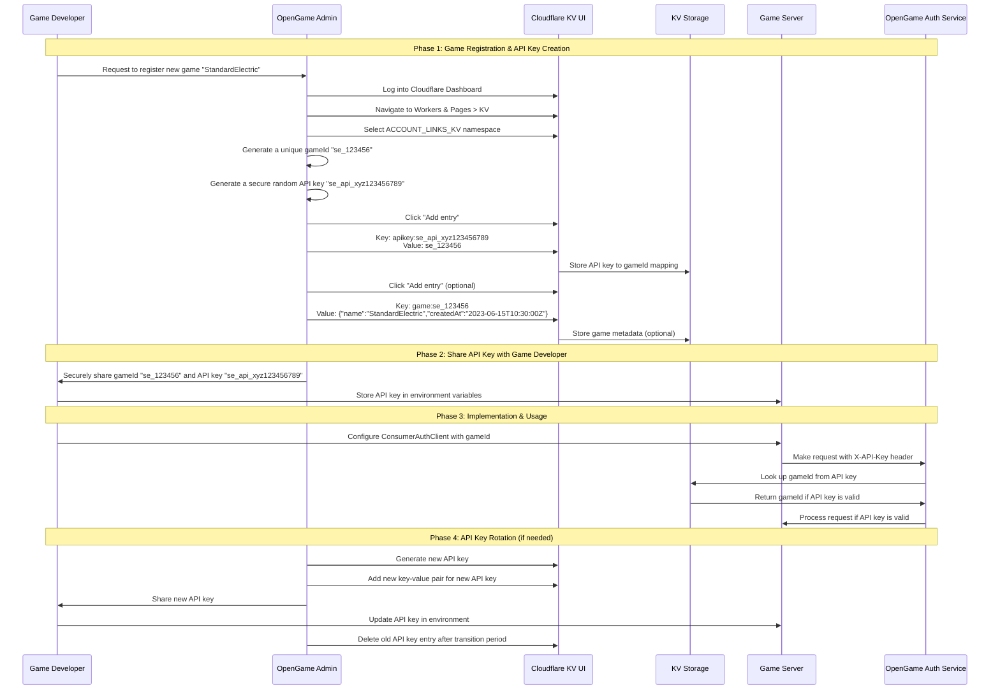
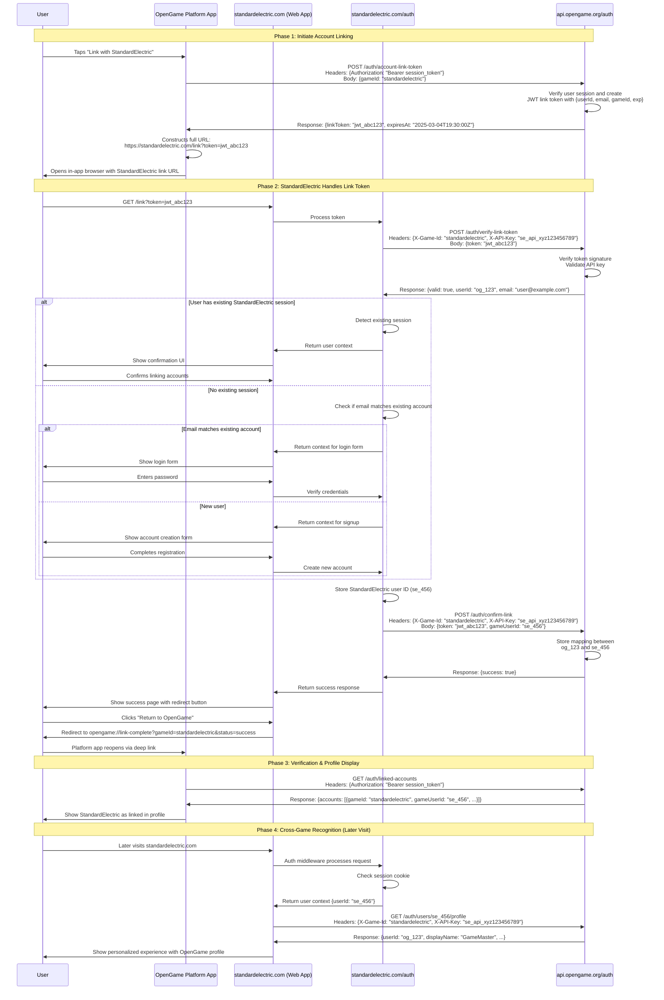

# Auth Kit Account Linking Implementation Plan

This document outlines the plan for implementing account linking functionality in Auth Kit, allowing applications to securely link user accounts across different platforms in the Open Game ecosystem.

## Current Architecture

Auth Kit currently provides:
- Anonymous-first authentication
- Email verification
- JWT-based session management
- Isomorphic client/server architecture
- React integration

The current architecture is focused on single-application authentication without explicit support for cross-application account linking.

## Proposed Changes

To support account linking as described in the sequence diagram, we need to extend Auth Kit with:

1. **Provider/Consumer Roles**: Distinguish between identity providers (e.g., OpenGame) and consumers (e.g., StandardElectric)
2. **Account Linking API**: Add endpoints for creating, verifying, and confirming link tokens
3. **API Key Management**: Support for API keys to secure server-to-server communication
4. **Role-Specific Client Types**: Specialized client implementations for providers and consumers
5. **Role-Specific State Management**: Different state structures for providers and consumers

## Implementation Phases

### Phase 1: Core Types and Interfaces

1. **Define New Types**:

```typescript
// Common types for account linking
export interface LinkedAccount {
  gameId: string;
  gameUserId: string;
  linkedAt: string;
  profile?: Record<string, any>;
}

export interface LinkToken {
  token: string;
  expiresAt: string;
}

// Request status tracking
export interface RequestStatus {
  isLoading: boolean;
  error: string | null;
  lastUpdated: string | null;
}

export interface RequestsMap {
  [key: string]: RequestStatus;
}

// Provider-specific auth state (for OpenGame)
export interface ProviderAuthState extends AuthState {
  linkedAccounts: LinkedAccount[];
  requests: RequestsMap;
}

// Consumer-specific auth state (for games like StandardElectric)
export interface ConsumerAuthState extends AuthState {
  openGameLink?: {
    openGameUserId: string;
    linkedAt: string;
    profile?: Record<string, any>;
  };
  requests: RequestsMap;
}

// Provider-specific client interface
export interface ProviderAuthClient extends AuthClient {
  getLinkedAccounts(): Promise<LinkedAccount[]>;
  initiateAccountLinking(gameId: string): Promise<{ linkToken: string; expiresAt: string }>;
  unlinkAccount(gameId: string): Promise<boolean>;
  getState(): ProviderAuthState;
  subscribe(callback: (state: ProviderAuthState) => void): () => void;
}

// Consumer-specific client interface
export interface ConsumerAuthClient extends AuthClient {
  getOpenGameLinkStatus(): Promise<{
    isLinked: boolean;
    openGameUserId?: string;
    linkedAt?: string;
    profile?: Record<string, any>;
  }>;
  verifyLinkToken(token: string): Promise<{
    valid: boolean;
    openGameUserId?: string;
    email?: string;
  }>;
  confirmLink(token: string, gameUserId: string): Promise<boolean>;
  getState(): ConsumerAuthState;
  subscribe(callback: (state: ConsumerAuthState) => void): () => void;
}
```

2. **Role-Specific Auth Hooks**:

```typescript
// Base hooks interface remains the same
export interface AuthHooks<TEnv> {
  // Existing hooks...
}

// Provider-specific hooks
export interface ProviderAuthHooks<TEnv> extends AuthHooks<TEnv> {
  getGameIdFromApiKey: (params: { apiKey: string; env: TEnv; request: Request }) => Promise<string | null>;
  storeAccountLink: (params: { openGameUserId: string; gameId: string; gameUserId: string; env: TEnv; request: Request }) => Promise<boolean>;
  getLinkedAccounts: (params: { openGameUserId: string; env: TEnv; request: Request }) => Promise<LinkedAccount[]>;
  removeAccountLink: (params: { openGameUserId: string; gameId: string; env: TEnv; request: Request }) => Promise<boolean>;
}

// Consumer-specific hooks
export interface ConsumerAuthHooks<TEnv> extends AuthHooks<TEnv> {
  storeOpenGameLink: (params: { gameUserId: string; openGameUserId: string; env: TEnv; request: Request }) => Promise<boolean>;
  getOpenGameUserId: (params: { gameUserId: string; env: TEnv; request: Request }) => Promise<string | null>;
  getOpenGameProfile: (params: { openGameUserId: string; env: TEnv; request: Request }) => Promise<Record<string, any> | null>;
  setOpenGameAPIKey: (params: { apiKey: string; name: string; env: TEnv; request: Request }) => Promise<boolean>;
  getAPIKeyStatus: (params: { env: TEnv; request: Request }) => Promise<{ hasValidKey: boolean; createdAt?: string; rotatedAt?: string | null }>;
}
```

### Phase 2: Server-Side Implementation

1. **New JWT Token Types**:

```typescript
// In server.ts
async function createLinkToken(
  userId: string,
  email: string | null,
  gameId: string,
  secret: string,
  expiresIn: string = "1h"
): Promise<string> {
  return await new SignJWT({ 
    userId, 
    email,
    gameId
  })
    .setProtectedHeader({ alg: "HS256" })
    .setAudience("LINK")
    .setExpirationTime(expiresIn)
    .sign(new TextEncoder().encode(secret));
}
```

2. **Provider Hooks Implementation**:

```typescript
// Example implementation of provider hooks
const providerHooks: ProviderAuthHooks<Env> = {
  // Base auth hooks (required)
  getUserIdByEmail: async ({ email, env, request }) => {
    // Look up user ID by email in your database
    const user = await env.DB.prepare(`SELECT id FROM users WHERE email = ?`).bind(email).first();
    return user ? user.id : null;
  },
  
  storeVerificationCode: async ({ email, code, env, request }) => {
    // Store verification code with expiration
    await env.DB.prepare(`
      INSERT INTO verification_codes (email, code, expires_at) 
      VALUES (?, ?, datetime('now', '+15 minutes'))
    `).bind(email, code).run();
  },
  
  verifyVerificationCode: async ({ email, code, env, request }) => {
    // Check if code is valid and not expired
    const result = await env.DB.prepare(`
      SELECT 1 FROM verification_codes 
      WHERE email = ? AND code = ? AND expires_at > datetime('now')
    `).bind(email, code).first();
    
    return !!result;
  },
  
  sendVerificationCode: async ({ email, code, env, request }) => {
    // Send verification code via email
    try {
      await env.EMAIL_SERVICE.send({
        to: email,
        subject: "Your verification code",
        text: `Your verification code is: ${code}`
      });
      return true;
    } catch (error) {
      console.error("Failed to send verification code:", error);
      return false;
    }
  },
  
  // Provider-specific hooks (required)
  getGameIdFromApiKey: async ({ apiKey, env, request }) => {
    // Look up game ID from API key in KV store
    return await env.ACCOUNT_LINKS_KV.get(`apikey:${apiKey}`);
  },
  
  storeAccountLink: async ({ openGameUserId, gameId, gameUserId, env, request }) => {
    // Get current linked accounts
    const linkedAccountsStr = await env.ACCOUNT_LINKS_KV.get(`user:${openGameUserId}:linked_accounts`);
    const linkedAccounts: LinkedAccount[] = linkedAccountsStr ? JSON.parse(linkedAccountsStr) : [];
    
    // Add new link
    linkedAccounts.push({
      gameId,
      gameUserId,
      linkedAt: new Date().toISOString()
    });
    
    // Store updated linked accounts
    await env.ACCOUNT_LINKS_KV.put(`user:${openGameUserId}:linked_accounts`, JSON.stringify(linkedAccounts));
    
    // Store reverse lookup
    await env.ACCOUNT_LINKS_KV.put(`game:${gameId}:user:${gameUserId}`, openGameUserId);
    
    return true;
  },
  
  getLinkedAccounts: async ({ openGameUserId, env, request }) => {
    // Retrieve linked accounts from KV store
    const linkedAccountsStr = await env.ACCOUNT_LINKS_KV.get(`user:${openGameUserId}:linked_accounts`);
    return linkedAccountsStr ? JSON.parse(linkedAccountsStr) : [];
  },
  
  // Provider-specific hooks (optional)
  removeAccountLink: async ({ openGameUserId, gameId, env, request }) => {
    // Get current linked accounts
    const linkedAccountsStr = await env.ACCOUNT_LINKS_KV.get(`user:${openGameUserId}:linked_accounts`);
    if (!linkedAccountsStr) return false;
    
    const linkedAccounts: LinkedAccount[] = JSON.parse(linkedAccountsStr);
    
    // Find the account to remove
    const accountIndex = linkedAccounts.findIndex(account => account.gameId === gameId);
    if (accountIndex === -1) return false;
    
    // Get the gameUserId before removing
    const gameUserId = linkedAccounts[accountIndex].gameUserId;
    
    // Remove the account
    linkedAccounts.splice(accountIndex, 1);
    
    // Update linked accounts
    await env.ACCOUNT_LINKS_KV.put(`user:${openGameUserId}:linked_accounts`, JSON.stringify(linkedAccounts));
    
    // Remove reverse lookup
    await env.ACCOUNT_LINKS_KV.delete(`game:${gameId}:user:${gameUserId}`);
    
    return true;
  },
  
  // Base auth hooks (optional)
  onNewUser: async ({ userId, env, request }) => {
    // Optional hook for when a new user is created
    await env.DB.prepare(`
      INSERT INTO user_metadata (user_id, created_at) 
      VALUES (?, datetime('now'))
    `).bind(userId).run();
  },
  
  onAuthenticate: async ({ userId, email, env, request }) => {
    // Optional hook for when a user authenticates
    await env.DB.prepare(`
      UPDATE users 
      SET last_login = datetime('now') 
      WHERE id = ?
    `).bind(userId).run();
  },
  
  onEmailVerified: async ({ userId, email, env, request }) => {
    // Optional hook for when a user verifies their email
    await env.DB.prepare(`
      UPDATE users 
      SET email_verified = 1 
      WHERE id = ?
    `).bind(userId).run();
  },
  
  getUserEmail: async ({ userId, env, request }) => {
    // Optional hook to get a user's email
    const user = await env.DB.prepare(`
      SELECT email FROM users WHERE id = ?
    `).bind(userId).first();
    
    return user ? user.email : undefined;
  }
};
```

3. **Consumer Hooks Implementation**:

```typescript
// Example implementation of consumer hooks
const consumerHooks: ConsumerAuthHooks<Env> = {
  // Base auth hooks (required)
  getUserIdByEmail: async ({ email, env, request }) => {
    // Look up user ID by email in your database
    const user = await env.DB.prepare(`SELECT id FROM users WHERE email = ?`).bind(email).first();
    return user ? user.id : null;
  },
  
  storeVerificationCode: async ({ email, code, env, request }) => {
    // Store verification code with expiration
    await env.DB.prepare(`
      INSERT INTO verification_codes (email, code, expires_at) 
      VALUES (?, ?, datetime('now', '+15 minutes'))
    `).bind(email, code).run();
  },
  
  verifyVerificationCode: async ({ email, code, env, request }) => {
    // Check if code is valid and not expired
    const result = await env.DB.prepare(`
      SELECT 1 FROM verification_codes 
      WHERE email = ? AND code = ? AND expires_at > datetime('now')
    `).bind(email, code).first();
    
    return !!result;
  },
  
  sendVerificationCode: async ({ email, code, env, request }) => {
    // Send verification code via email
    try {
      await env.EMAIL_SERVICE.send({
        to: email,
        subject: "Your verification code",
        text: `Your verification code is: ${code}`
      });
      return true;
    } catch (error) {
      console.error("Failed to send verification code:", error);
      return false;
    }
  },
  
  // Consumer-specific hooks (required)
  storeOpenGameLink: async ({ gameUserId, openGameUserId, env, request }) => {
    // Store the link between game user and OpenGame user
    await env.DB.prepare(`
      INSERT INTO opengame_links (game_user_id, opengame_user_id, linked_at)
      VALUES (?, ?, datetime('now'))
      ON CONFLICT(game_user_id) DO UPDATE SET
        opengame_user_id = excluded.opengame_user_id,
        linked_at = excluded.linked_at
    `).bind(gameUserId, openGameUserId).run();
    
    // Also store in KV for quick lookups
    await env.ACCOUNT_LINKS_KV.put(`game:${env.GAME_ID}:user:${gameUserId}`, openGameUserId);
    
    return true;
  },
  
  getOpenGameUserId: async ({ gameUserId, env, request }) => {
    // First try KV for performance
    const openGameUserId = await env.ACCOUNT_LINKS_KV.get(`game:${env.GAME_ID}:user:${gameUserId}`);
    if (openGameUserId) return openGameUserId;
    
    // Fall back to database
    const link = await env.DB.prepare(`
      SELECT opengame_user_id FROM opengame_links
      WHERE game_user_id = ?
    `).bind(gameUserId).first();
    
    return link ? link.opengame_user_id : null;
  },
  
  // Consumer-specific hooks (optional)
  getOpenGameProfile: async ({ openGameUserId, env, request }) => {
    // Fetch OpenGame profile using API key
    try {
      // Get the API key from environment variable or KV store
      // The API key is manually set up as described in the "API Key Management (Manual Process)" section
      const apiKey = env.OPENGAME_API_KEY;
      
      const response = await fetch(`https://api.opengame.org/auth/users/${openGameUserId}/profile`, {
        headers: {
          'X-API-Key': apiKey,
          'X-Game-Id': env.GAME_ID
        }
      });
      
      if (!response.ok) return null;
      
      return await response.json();
    } catch (error) {
      console.error("Failed to fetch OpenGame profile:", error);
      return null;
    }
  },
  
  setOpenGameAPIKey: async ({ apiKey, name, env, request }) => {
    // Store API key in KV
    await env.ACCOUNT_LINKS_KV.put('current_api_key', apiKey);
    await env.ACCOUNT_LINKS_KV.put('api_key_metadata', JSON.stringify({
      name,
      createdAt: new Date().toISOString()
    }));
    
    return true;
  },
  
  getAPIKeyStatus: async ({ env, request }) => {
    // Check if API key exists and get metadata
    const apiKey = await env.ACCOUNT_LINKS_KV.get('current_api_key');
    if (!apiKey) {
      return { hasValidKey: false };
    }
    
    const metadataStr = await env.ACCOUNT_LINKS_KV.get('api_key_metadata');
    const metadata = metadataStr ? JSON.parse(metadataStr) : {};
    
    return {
      hasValidKey: true,
      createdAt: metadata.createdAt,
      rotatedAt: metadata.rotatedAt
    };
  },
  
  // Base auth hooks (optional)
  onNewUser: async ({ userId, env, request }) => {
    // Optional hook for when a new user is created
    await env.DB.prepare(`
      INSERT INTO user_metadata (user_id, created_at) 
      VALUES (?, datetime('now'))
    `).bind(userId).run();
  }
};
```

4. **API Key Validation Middleware**:

```typescript
async function validateAPIKey(request: Request, env: TEnv): Promise<string | null> {
  const apiKey = request.headers.get("X-API-Key");
  const gameId = request.headers.get("X-Game-Id");
  
  if (!apiKey || !gameId) {
    return null;
  }
  
  // Validate API key and return associated gameId
  return await hooks.getGameIdFromApiKey({ apiKey, env, request });
}
```

### Phase 3: Client-Side Implementation

1. **Provider Auth Client**:

```typescript
export function createProviderAuthClient(config: AuthClientConfig): ProviderAuthClient {
  // Start with base client implementation
  const baseClient = createAuthClient(config);
  
  // Initial provider state
  const initialState: ProviderAuthState = {
    ...baseClient.getState(),
    linkedAccounts: [],
    requests: {}
  };
  
  // State management
  let state = initialState;
  const subscribers: ((state: ProviderAuthState) => void)[] = [];
  
  function setState(newState: Partial<ProviderAuthState>) {
    state = { ...state, ...newState };
    subscribers.forEach(callback => callback(state));
  }
  
  function setRequestStatus(requestId: string, status: Partial<RequestStatus>) {
    const currentStatus = state.requests[requestId] || { 
      isLoading: false, 
      error: null, 
      lastUpdated: null 
    };
    
    setState({
      requests: {
        ...state.requests,
        [requestId]: {
          ...currentStatus,
          ...status,
          lastUpdated: status.lastUpdated || new Date().toISOString()
        }
      }
    });
  }
  
  return {
    // Include all base client methods
    ...baseClient,
    
    // Override state methods to use provider state
    getState() {
      return state;
    },
    
    subscribe(callback: (state: ProviderAuthState) => void) {
      subscribers.push(callback);
      callback(state);
      return () => {
        const index = subscribers.indexOf(callback);
        if (index !== -1) {
          subscribers.splice(index, 1);
        }
      };
    },
    
    // Provider-specific methods
    async getLinkedAccounts() {
      const requestId = 'getLinkedAccounts';
      setRequestStatus(requestId, { isLoading: true, error: null });
      
      try {
        const response = await fetch(`https://${config.host}/auth/linked-accounts`, {
          method: 'GET',
          headers: {
            'Authorization': `Bearer ${state.sessionToken}`,
            'Content-Type': 'application/json'
          }
        });
        
        if (!response.ok) {
          throw new Error(`Failed to get linked accounts: ${response.status}`);
        }
        
        const data = await response.json();
        setState({ linkedAccounts: data.accounts });
        setRequestStatus(requestId, { isLoading: false });
        return data.accounts;
      } catch (error) {
        const errorMessage = error instanceof Error ? error.message : 'Unknown error';
        setRequestStatus(requestId, { isLoading: false, error: errorMessage });
        throw error;
      }
    },
    
    async initiateAccountLinking(gameId: string) {
      const requestId = `initiateAccountLinking:${gameId}`;
      setRequestStatus(requestId, { isLoading: true, error: null });
      
      try {
        const response = await fetch(`https://${config.host}/auth/account-link-token`, {
          method: 'POST',
          headers: {
            'Authorization': `Bearer ${state.sessionToken}`,
            'Content-Type': 'application/json'
          },
          body: JSON.stringify({ gameId })
        });
        
        if (!response.ok) {
          throw new Error(`Failed to create link token: ${response.status}`);
        }
        
        const data = await response.json();
        setRequestStatus(requestId, { isLoading: false });
        return { linkToken: data.linkToken, expiresAt: data.expiresAt };
      } catch (error) {
        const errorMessage = error instanceof Error ? error.message : 'Unknown error';
        setRequestStatus(requestId, { isLoading: false, error: errorMessage });
        throw error;
      }
    },
    
    // Implement other provider methods...
  };
}
```

2. **Consumer Auth Client**:

```typescript
export function createConsumerAuthClient(config: AuthClientConfig & { gameId: string }): ConsumerAuthClient {
  // Start with base client implementation
  const baseClient = createAuthClient(config);
  
  // Initial consumer state
  const initialState: ConsumerAuthState = {
    ...baseClient.getState(),
    openGameLink: undefined,
    requests: {}
  };
  
  // State management
  let state = initialState;
  const subscribers: ((state: ConsumerAuthState) => void)[] = [];
  
  function setState(newState: Partial<ConsumerAuthState>) {
    state = { ...state, ...newState };
    subscribers.forEach(callback => callback(state));
  }
  
  function setRequestStatus(requestId: string, status: Partial<RequestStatus>) {
    const currentStatus = state.requests[requestId] || { 
      isLoading: false, 
      error: null, 
      lastUpdated: null 
    };
    
    setState({
      requests: {
        ...state.requests,
        [requestId]: {
          ...currentStatus,
          ...status,
          lastUpdated: status.lastUpdated || new Date().toISOString()
        }
      }
    });
  }
  
  return {
    // Include all base client methods
    ...baseClient,
    
    // Override state methods to use consumer state
    getState() {
      return state;
    },
    
    subscribe(callback: (state: ConsumerAuthState) => void) {
      subscribers.push(callback);
      callback(state);
      return () => {
        const index = subscribers.indexOf(callback);
        if (index !== -1) {
          subscribers.splice(index, 1);
        }
      };
    },
    
    // Consumer-specific methods
    async getOpenGameLinkStatus() {
      const requestId = 'getOpenGameLinkStatus';
      setRequestStatus(requestId, { isLoading: true, error: null });
      
      try {
        // Internal implementation to check if user is linked with OpenGame
        const response = await fetch(`https://${config.host}/auth/opengame-link`, {
          method: 'GET',
          headers: {
            'Authorization': `Bearer ${state.sessionToken}`,
            'Content-Type': 'application/json'
          }
        });
        
        if (!response.ok) {
          throw new Error(`Failed to get OpenGame link status: ${response.status}`);
        }
        
        const data = await response.json();
        
        if (data.isLinked) {
          setState({ 
            openGameLink: {
              openGameUserId: data.openGameUserId,
              linkedAt: data.linkedAt,
              profile: data.profile
            }
          });
          
          setRequestStatus(requestId, { isLoading: false });
          return {
            isLinked: true,
            openGameUserId: data.openGameUserId,
            linkedAt: data.linkedAt,
            profile: data.profile
          };
        } else {
          setState({ openGameLink: undefined });
          setRequestStatus(requestId, { isLoading: false });
          return { isLinked: false };
        }
      } catch (error) {
        const errorMessage = error instanceof Error ? error.message : 'Unknown error';
        setRequestStatus(requestId, { isLoading: false, error: errorMessage });
        throw error;
      }
    },
    
    // Implement other consumer methods...
  };
}
```

### Phase 4: React Integration

1. **Role-Specific Auth Contexts**:

```typescript
// Provider Auth Context
export function createProviderAuthContext() {
  const context = React.createContext<ProviderAuthClient | null>(null);
  
  function useClient(): ProviderAuthClient {
    const client = React.useContext(context);
    if (!client) {
      throw new Error('useClient must be used within a ProviderAuthContext.Provider');
    }
    return client;
  }
  
  function useSelector<T>(selector: (state: ProviderAuthState) => T) {
    const client = useClient();
    return useSyncExternalStoreWithSelector(
      client.subscribe,
      client.getState,
      null,
      selector,
      defaultCompare
    );
  }
  
  return {
    Provider: ({ client, children }: { client: ProviderAuthClient; children: React.ReactNode }) => (
      <context.Provider value={client}>{children}</context.Provider>
    ),
    useClient,
    useSelector,
    
    // Provider-specific components
    LinkedAccounts: ({ children }: { children: React.ReactNode }) => {
      const linkedAccounts = useSelector(state => state.linkedAccounts);
      return linkedAccounts.length > 0 ? <>{children}</> : null;
    },
    
    NoLinkedAccounts: ({ children }: { children: React.ReactNode }) => {
      const linkedAccounts = useSelector(state => state.linkedAccounts);
      return linkedAccounts.length === 0 ? <>{children}</> : null;
    },
    
    // Other components...
  };
}

// Consumer Auth Context
export function createConsumerAuthContext() {
  const context = React.createContext<ConsumerAuthClient | null>(null);
  
  function useClient(): ConsumerAuthClient {
    const client = React.useContext(context);
    if (!client) {
      throw new Error('useClient must be used within a ConsumerAuthContext.Provider');
    }
    return client;
  }
  
  function useSelector<T>(selector: (state: ConsumerAuthState) => T) {
    const client = useClient();
    return useSyncExternalStoreWithSelector(
      client.subscribe,
      client.getState,
      null,
      selector,
      defaultCompare
    );
  }
  
  return {
    Provider: ({ client, children }: { client: ConsumerAuthClient; children: React.ReactNode }) => (
      <context.Provider value={client}>{children}</context.Provider>
    ),
    useClient,
    useSelector,
    
    // Consumer-specific components
    LinkedWithOpenGame: ({ children }: { children: React.ReactNode }) => {
      const openGameLink = useSelector(state => state.openGameLink);
      return openGameLink ? <>{children}</> : null;
    },
    
    NotLinkedWithOpenGame: ({ children }: { children: React.ReactNode }) => {
      const openGameLink = useSelector(state => state.openGameLink);
      return !openGameLink ? <>{children}</> : null;
    },
    
    // Other components...
  };
}
```

### Phase 5: Testing and Documentation

1. **Role-Specific Mock Clients**:

```typescript
export function createProviderAuthMockClient(config: {
  initialState: Partial<ProviderAuthState>;
}): ProviderAuthClient & {
  produce: (recipe: (draft: ProviderAuthState) => void) => void;
} {
  // Implementation...
}

export function createConsumerAuthMockClient(config: {
  initialState: Partial<ConsumerAuthState>;
}): ConsumerAuthClient & {
  produce: (recipe: (draft: ConsumerAuthState) => void) => void;
} {
  // Implementation...
}
```

2. **Documentation Updates**:
   - Update README.md with account linking information
   - Create LINKING.md with detailed documentation
   - Add examples for both provider and consumer implementations

## Backward Compatibility

To maintain backward compatibility:

1. Keep the original `AuthClient` interface unchanged
2. Ensure `createAuthClient` continues to work as before
3. Make the new client functions (`createProviderAuthClient` and `createConsumerAuthClient`) extensions of the base client
4. Provide clear migration guides for existing applications

## Hook Organization and Router Setup

The Auth Kit uses hooks to customize authentication behavior. With the account linking functionality, we need to extend these hooks for provider and consumer roles. Here's how the hooks are organized:

### Base Auth Hooks (Existing)

These hooks are required for the base `createAuthRouter` function:

```typescript
export interface AuthHooks<TEnv> {
  // Required hooks
  getUserIdByEmail: (params: { email: string; env: TEnv; request: Request }) => Promise<string | null>;
  storeVerificationCode: (params: { email: string; code: string; env: TEnv; request: Request }) => Promise<void>;
  verifyVerificationCode: (params: { email: string; code: string; env: TEnv; request: Request }) => Promise<boolean>;
  sendVerificationCode: (params: { email: string; code: string; env: TEnv; request: Request }) => Promise<boolean>;

  // Optional hooks
  onNewUser?: (params: { userId: string; env: TEnv; request: Request }) => Promise<void>;
  onAuthenticate?: (params: { userId: string; email: string; env: TEnv; request: Request }) => Promise<void>;
  onEmailVerified?: (params: { userId: string; email: string; env: TEnv; request: Request }) => Promise<void>;
  getUserEmail?: (params: { userId: string; env: TEnv; request: Request }) => Promise<string | undefined>;
}
```

### Provider Auth Hooks (New)

For the provider role (e.g., OpenGame), you'll use `createProviderAuthRouter` which requires these additional hooks:

```typescript
export interface ProviderAuthHooks<TEnv> extends AuthHooks<TEnv> {
  // Required provider hooks
  getGameIdFromApiKey: (params: { apiKey: string; env: TEnv; request: Request }) => Promise<string | null>;
  storeAccountLink: (params: { openGameUserId: string; gameId: string; gameUserId: string; env: TEnv; request: Request }) => Promise<boolean>;
  getLinkedAccounts: (params: { openGameUserId: string; env: TEnv; request: Request }) => Promise<LinkedAccount[]>;
  
  // Optional provider hooks
  removeAccountLink?: (params: { openGameUserId: string; gameId: string; env: TEnv; request: Request }) => Promise<boolean>;
}
```

### Consumer Auth Hooks (New)

For the consumer role (e.g., StandardElectric), you'll use `createConsumerAuthRouter` which requires these additional hooks:

```typescript
export interface ConsumerAuthHooks<TEnv> extends AuthHooks<TEnv> {
  // Required consumer hooks
  storeOpenGameLink: (params: { gameUserId: string; openGameUserId: string; env: TEnv; request: Request }) => Promise<boolean>;
  getOpenGameUserId: (params: { gameUserId: string; env: TEnv; request: Request }) => Promise<string | null>;
  
  // Optional consumer hooks
  getOpenGameProfile?: (params: { openGameUserId: string; env: TEnv; request: Request }) => Promise<Record<string, any> | null>;
}
```

### Router Setup Examples

#### Base Auth Router (Existing)

```typescript
// Basic auth router setup (existing functionality)
const authRouter = createAuthRouter({
  hooks: {
    // Required hooks
    getUserIdByEmail: async ({ email, env }) => { /* implementation */ },
    storeVerificationCode: async ({ email, code, env }) => { /* implementation */ },
    verifyVerificationCode: async ({ email, code, env }) => { /* implementation */ },
    sendVerificationCode: async ({ email, code, env }) => { /* implementation */ },
    
    // Optional hooks
    onNewUser: async ({ userId, env }) => { /* implementation */ },
    onAuthenticate: async ({ userId, email, env }) => { /* implementation */ },
  },
  useTopLevelDomain: true // Optional configuration
});
```

#### Provider Auth Router (New)

```typescript
// Provider auth router setup (for OpenGame)
const providerAuthRouter = createProviderAuthRouter({
  hooks: {
    // Base required hooks
    getUserIdByEmail: async ({ email, env }) => { /* implementation */ },
    storeVerificationCode: async ({ email, code, env }) => { /* implementation */ },
    verifyVerificationCode: async ({ email, code, env }) => { /* implementation */ },
    sendVerificationCode: async ({ email, code, env }) => { /* implementation */ },
    
    // Provider required hooks
    getGameIdFromApiKey: async ({ apiKey, env }) => { /* implementation */ },
    storeAccountLink: async ({ openGameUserId, gameId, gameUserId, env }) => { /* implementation */ },
    getLinkedAccounts: async ({ openGameUserId, env }) => { /* implementation */ },
    
    // Optional hooks
    removeAccountLink: async ({ openGameUserId, gameId, env }) => { /* implementation */ },
    onNewUser: async ({ userId, env }) => { /* implementation */ },
  },
  useTopLevelDomain: true // Optional configuration
});
```

#### Consumer Auth Router (New)

```typescript
// Consumer auth router setup (for StandardElectric)
const consumerAuthRouter = createConsumerAuthRouter({
  hooks: {
    // Base required hooks
    getUserIdByEmail: async ({ email, env }) => { /* implementation */ },
    storeVerificationCode: async ({ email, code, env }) => { /* implementation */ },
    verifyVerificationCode: async ({ email, code, env }) => { /* implementation */ },
    sendVerificationCode: async ({ email, code, env }) => { /* implementation */ },
    
    // Consumer required hooks
    storeOpenGameLink: async ({ gameUserId, openGameUserId, env }) => { /* implementation */ },
    getOpenGameUserId: async ({ gameUserId, env }) => { /* implementation */ },
    
    // Optional hooks
    getOpenGameProfile: async ({ openGameUserId, env }) => { /* implementation */ },
    onAuthenticate: async ({ userId, email, env }) => { /* implementation */ },
  },
  gameId: "standardelectric", // Required for consumer router
  useTopLevelDomain: true // Optional configuration
});
```

### Implementation with Cloudflare KV

For implementations using Cloudflare KV, you can implement the hooks using the `ACCOUNT_LINKS_KV` namespace:

```typescript
// Example provider hooks implementation with Cloudflare KV
const providerHooks: ProviderAuthHooks<Env> = {
  // Base hooks implementation...
  
  // Provider-specific hooks
  getGameIdFromApiKey: async ({ apiKey, env }) => {
    return await env.ACCOUNT_LINKS_KV.get(`apikey:${apiKey}`);
  },
  
  storeAccountLink: async ({ openGameUserId, gameId, gameUserId, env }) => {
    // Get current linked accounts
    const linkedAccountsStr = await env.ACCOUNT_LINKS_KV.get(`user:${openGameUserId}:linked_accounts`);
    const linkedAccounts: LinkedAccount[] = linkedAccountsStr ? JSON.parse(linkedAccountsStr) : [];
    
    // Add new link
    linkedAccounts.push({
      gameId,
      gameUserId,
      linkedAt: new Date().toISOString()
    });
    
    // Store updated linked accounts
    await env.ACCOUNT_LINKS_KV.put(`user:${openGameUserId}:linked_accounts`, JSON.stringify(linkedAccounts));
    
    // Store reverse lookup
    await env.ACCOUNT_LINKS_KV.put(`game:${gameId}:user:${gameUserId}`, openGameUserId);
    
    return true;
  },
  
  getLinkedAccounts: async ({ openGameUserId, env }) => {
    const linkedAccountsStr = await env.ACCOUNT_LINKS_KV.get(`user:${openGameUserId}:linked_accounts`);
    return linkedAccountsStr ? JSON.parse(linkedAccountsStr) : [];
  },
  
  removeAccountLink: async ({ openGameUserId, gameId, env }) => {
    // Get current linked accounts
    const linkedAccountsStr = await env.ACCOUNT_LINKS_KV.get(`user:${openGameUserId}:linked_accounts`);
    if (!linkedAccountsStr) return false;
    
    const linkedAccounts: LinkedAccount[] = JSON.parse(linkedAccountsStr);
    
    // Find the account to remove
    const accountIndex = linkedAccounts.findIndex(account => account.gameId === gameId);
    if (accountIndex === -1) return false;
    
    // Get the gameUserId before removing
    const gameUserId = linkedAccounts[accountIndex].gameUserId;
    
    // Remove the account
    linkedAccounts.splice(accountIndex, 1);
    
    // Update linked accounts
    await env.ACCOUNT_LINKS_KV.put(`user:${openGameUserId}:linked_accounts`, JSON.stringify(linkedAccounts));
    
    // Remove reverse lookup
    await env.ACCOUNT_LINKS_KV.delete(`game:${gameId}:user:${gameUserId}`);
    
    return true;
  }
};
```

## Package Structure

Update the package exports to include the new functionality:

```json
"exports": {
  "./client": {
    "types": "./src/client.ts",
    "import": "./src/client.ts"
  },
  "./react": {
    "types": "./src/react.tsx",
    "import": "./src/react.tsx"
  },
  "./server": {
    "types": "./src/server.ts",
    "import": "./src/server.ts"
  },
  "./test": {
    "types": "./src/test.ts",
    "import": "./src/test.ts"
  },
  
  "./provider": {
    "types": "./src/provider-client.ts",
    "import": "./src/provider-client.ts"
  },
  "./provider/react": {
    "types": "./src/provider-react.tsx",
    "import": "./src/provider-react.tsx"
  },
  "./provider/server": {
    "types": "./src/provider-server.ts",
    "import": "./src/provider-server.ts"
  },
  
  "./consumer": {
    "types": "./src/consumer-client.ts",
    "import": "./src/consumer-client.ts"
  },
  "./consumer/react": {
    "types": "./src/consumer-react.tsx",
    "import": "./src/consumer-react.tsx"
  },
  "./consumer/server": {
    "types": "./src/consumer-server.ts",
    "import": "./src/consumer-server.ts"
  }
}
```

## API Key Management (Manual Process)

API key management will be handled through a simple manual process using the Cloudflare KV web UI.

### Manual API Key Setup Sequence



### KV Structure for API Keys

```
// KV Namespace: ACCOUNT_LINKS_KV

// API Keys (simple key-value pairs where the value is the gameId)
apikey:se_api_xyz123456789 = "se_123456"

// Game Info (optional, for reference)
game:se_123456 = {
  "name": "StandardElectric",
  "createdAt": "2023-06-15T10:30:00Z"
}

// Linked Accounts
user:og_user_123:linked_accounts = [
  {
    "gameId": "se_123456",
    "gameUserId": "se_user_456",
    "linkedAt": "2023-06-20T14:22:00Z"
  }
]

// Reverse lookup
game:se_123456:user:se_user_456 = "og_user_123"
```

### API Key Validation in Code

```typescript
async function validateAPIKey(request: Request, env: Env): Promise<string | null> {
  const apiKey = request.headers.get("X-API-Key");
  
  if (!apiKey) {
    return null;
  }
  
  // Simply look up the gameId associated with this API key
  return await env.ACCOUNT_LINKS_KV.get(`apikey:${apiKey}`);
}
```

This simple approach requires no additional development work for API key management and gives you complete control while you focus on implementing the core account linking functionality.

## Account Linking User Flow

The following sequence diagram illustrates the complete user journey for account linking between OpenGame and a consumer application (StandardElectric):



This flow demonstrates the complete account linking process from the user's perspective, including:

1. **Initiation**: User starts the linking process from the OpenGame app
2. **Token Verification**: StandardElectric verifies the link token with OpenGame
3. **Account Resolution**: User either logs in, creates an account, or confirms linking
4. **Confirmation**: The link is confirmed and stored on both sides
5. **Verification**: OpenGame app shows the linked account
6. **Cross-Game Recognition**: StandardElectric recognizes the user as an OpenGame user on future visits

The API key (generated manually as described in the previous section) is used in the server-to-server communication between StandardElectric and OpenGame to secure these interactions.

## Conclusion

This implementation plan provides a roadmap for adding account linking functionality to Auth Kit while maintaining backward compatibility with existing applications. The changes are designed to be modular, allowing applications to opt-in to the new functionality without breaking existing implementations.

By following this plan, Auth Kit will be able to support the account linking flow described in the sequence diagram, enabling secure cross-application authentication and identity sharing in the Open Game ecosystem. 

Written March 03, 2025